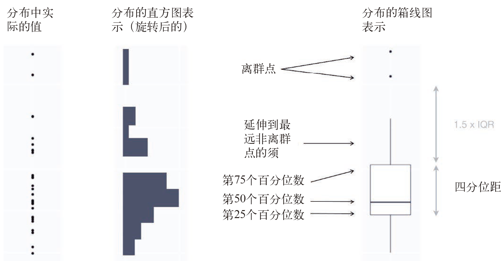

# Exploratory Data Analysis | 探索性数据分析

## Introduction | 简介

This chapter will show you how to use visualisation and transformation to explore your data in a systematic way, a task that statisticians call exploratory data analysis, or EDA for short. EDA is an iterative cycle. You:

本章将展示如何使用可视化方法和数据转换来系统化地探索数据，统计学家将这项任务称为探索性数据分析（exploratory data analysis，EDA）。EDA 是一个可迭代的循环过程，具有以下作用。

1. Generate questions about your data. 对数据提出问题。

1. Search for answers by visualising, transforming, and modelling your data. 对数据进行可视化、转换和建模，进而找出问题的答案。

1. Use what you learn to refine your questions and/or generate new questions. 使用上一个步骤的结果来精炼问题，并提出新问题。

EDA is not a formal process with a strict set of rules. More than anything, EDA is a state of mind. During the initial phases of EDA you should feel free to investigate every idea that occurs to you. Some of these ideas will pan out, and some will be dead ends. As your exploration continues, you will home in on a few particularly productive areas that you'll eventually write up and communicate to others.

EDA 并不是具有严格规则的正式过程，它首先是一种思维状态。在 EDA 的初始阶段，你应该天马行空地发挥想象力，并考察和试验能够想到的所有方法。有些想法是行得通的，有些想法则会无疾而终。当探索更进一步时，你就可以锁定容易产生成果的几个领域，将最终想法整理成文，并与他人进行沟通。

EDA is an important part of any data analysis, even if the questions are handed to you on a platter, because you always need to investigate the quality of your data. Data cleaning is just one application of EDA: you ask questions about whether your data meets your expectations or not. To do data cleaning, you'll need to deploy all the tools of EDA: visualisation, transformation, and modelling.

EDA 是所有数据分析过程中的重要环节，因为总是需要考察一下数据质量，即使你可以不费吹灰之力就找出问题。数据清洗只是 EDA 的一项具体应用，此时你提出的问题是，数据是否符合预期。要想进行数据清洗，需要使用所有的 EDA 工具：可视化、数据转换和建模。

### Prerequisites | 准备工作

In this chapter we'll combine what you've learned about dplyr and ggplot2 to interactively ask questions, answer them with data, and then ask new questions.

本章会将你学到的关于 dplyr 和 ggplot2 的知识综合起来，以交互的方式提出问题、用数据解答问题、再提出新的问题。

```{r setup, message = FALSE}
library(tidyverse)
```

## Questions | 问题

> "There are no routine statistical questions, only questionable statistical
> routines." --- Sir David Cox
> 没有一成不变的统计问题，统计上的一成不变都是有问题的。

> "Far better an approximate answer to the right question, which is often
> vague, than an exact answer to the wrong question, which can always be made
> precise." --- John Tukey
> 正确问题的近似答案通常是模糊的，但它远远胜过错误问题的确切答案，尽管后者总是很精确。

Your goal during EDA is to develop an understanding of your data. The easiest way to do this is to use questions as tools to guide your investigation. When you ask a question, the question focuses your attention on a specific part of your dataset and helps you decide which graphs, models, or transformations to make.

EDA 期间的目标是获取对数据的理解。进行 EDA 的最简单的方式就是将问题作为指导调查研究的工具。提出问题后，这个问题就使得你将注意力集中在数据集中的特定部分，并帮助你进行有关图形、模型和数据转换的决定。

EDA is fundamentally a creative process. And like most creative processes, the key to asking _quality_ questions is to generate a large _quantity_ of questions. It is difficult to ask revealing questions at the start of your analysis because you do not know what insights are contained in your dataset. On the other hand, each new question that you ask will expose you to a new aspect of your data and increase your chance of making a discovery. You can quickly drill down into the most interesting parts of your data---and develop a set of thought-provoking questions---if you follow up each question with a new question based on what you find.

EDA 本质上是一个创造性过程。和多数创造性过程一样，问题的质量关键在于问题的数量。分析过程的开始阶段很难提出有启发性的问题，因为你并不知道数据集中包含了哪些真知灼见。另一方面，你提出的每个新问题都可以揭示数据中的新内容，并增加发现知识的机会。如果在知识发现的基础上不断使用新问题来补充每个老问题，那么你就可以快速地获取数据中最令人感兴趣的部分，并总结出一组发人深省的问题。

There is no rule about which questions you should ask to guide your research. However, two types of questions will always be useful for making discoveries within your data. You can loosely word these questions as:

对于应该提出什么样的问题来指导我们的研究，现在还没有确定的规则。但有两类问题总是有助于我们在数据中发现知识。我们可以粗略地将这两类问题表述如下。

1. What type of variation occurs within my variables? 变量本身会发生何种变动？

1. What type of covariation occurs between my variables? 不同变量之间会发生何种相关变动？

The rest of this chapter will look at these two questions. I'll explain what variation and covariation are, and I'll show you several ways to answer each question. To make the discussion easier, let's define some terms: 

本章剩余部分会继续讨论这两个问题。我们将解释什么是变动，什么是相关变动，并介绍回答这两个问题的几种方法。为了简化讨论，我们先定义几个术语。

*   A __variable__ is a quantity, quality, or property that you can measure. 变量：一种可测量的数量、质量或属性。

*   A __value__ is the state of a variable when you measure it. The value of a
    variable may change from measurement to measurement.
    
    值：变量在测量时的状态。变量值在每次测量之间可以发生改变。
  
*   An __observation__ is a set of measurements made under similar conditions
    (you usually make all of the measurements in an observation at the same 
    time and on the same object). An observation will contain several values, 
    each associated with a different variable. I'll sometimes refer to 
    an observation as a data point.
    
    观测：或称个案，指在相同条件下进行的一组测量（通常，一个观测中的所有测量是在同一时间对同一对象进行的）。一个观测会包含多个值，每个值关联到不同的变量。有时我们会将观测称为数据点。

*   __Tabular data__ is a set of values, each associated with a variable and an
    observation. Tabular data is _tidy_ if each value is placed in its own
    "cell", each variable in its own column, and each observation in its own 
    row. 
    
    表格数据：一组值的集合，其中每个值都关联一个变量和一个观测。如果每个值都有自己所属的“单元”，每个变量都有自己所属的列，每个观测都有自己所属的行，那么表格数据就是整洁的。

So far, all of the data that you've seen has been tidy. In real-life, most data isn't tidy, so we'll come back to these ideas again in [tidy data].

迄今为止，我们见过的数据都是整洁的。但在实际生活中，大多数的数据则是不整洁的。

## Variation | 变动

**Variation** is the tendency of the values of a variable to change from measurement to measurement. You can see variation easily in real life; if you measure any continuous variable twice, you will get two different results. This is true even if you measure quantities that are constant, like the speed of light. Each of your measurements will include a small amount of error that varies from measurement to measurement. Categorical variables can also vary if you measure across different subjects (e.g. the eye colors of different people), or different times (e.g. the energy levels of an electron at different moments). 
Every variable has its own pattern of variation, which can reveal interesting information. The best way to understand that pattern is to visualise the distribution of the variable's values.

变动是每次测量时数据值的变化趋势。实际生活中很容易看到变动。如果对任意连续型变量进行两次测量，那么会得到两个不同的结果，即使测量的是一个常数（如光速），情况也是如此。每次测量的结果都包括少量误差，误差在每次测量间是不同的。如果测量多个项目（如不同人的眼睛颜色）或进行多次测量（如电池在不同时刻的电量），分类变量也会发生变化。所有变量都有自己的变动模式，可以揭示出一些有趣的信息。理解这种模式的最好方法就是对变量值的分布进行可视化表示。

### Visualising distributions | 对分布进行可视化表示

How you visualise the distribution of a variable will depend on whether the variable is categorical or continuous. A variable is **categorical** if it can only take one of a small set of values. In R, categorical variables are usually saved as factors or character vectors. To examine the distribution of a categorical variable, use a bar chart:

对变量分布进行可视化的方法取决于变量是分类变量还是连续变量。如果仅在较小的集合内取值，那么这个变量就是分类变量。分类变量在R 中通常保存为因子或字符向量。要想检查分类变量的分布，可以使用条形图：

```{r}
ggplot(data = diamonds) +
  geom_bar(mapping = aes(x = cut))
```

The height of the bars displays how many observations occurred with each x value. You can compute these values manually with `dplyr::count()`:

对变量分布进行可视化的方法取决于变量是分类变量还是连续变量。如果仅在较小的集合内取值，那么这个变量就是分类变量。分类变量在R 中通常保存为因子或字符向量。要想检查分类变量的分布，可以使用条形图：

```{r}
diamonds %>% 
  count(cut)
```

A variable is **continuous** if it can take any of an infinite set of ordered values. Numbers and date-times are two examples of continuous variables. To examine the distribution of a continuous variable, use a histogram:

如果可以在无限大的有序集合中任意取值，那么这个变量就是连续变量。数值型和日期时间型变量就是连续变量的两个例子。要想检查连续变量的分布，可以使用直方图：

```{r}
ggplot(data = diamonds) +
  geom_histogram(mapping = aes(x = carat), binwidth = 0.5)
```

You can compute this by hand by combining `dplyr::count()` and `ggplot2::cut_width()`:

你可以通过 dplyr::count() 和 ggplot2::cut_width() 函数的组合来手动计算结果：

```{r}
diamonds %>% 
  count(cut_width(carat, 0.5))
```

A histogram divides the x-axis into equally spaced bins and then uses the height of a bar to display the number of observations that fall in each bin. In the graph above, the tallest bar shows that almost 30,000 observations have a `carat` value between 0.25 and 0.75, which are the left and right edges of the bar. 

直方图对 x 轴进行等宽分箱，然后使用条形的高度来表示落入每个分箱的观测的数量。在上图中，最高的条形表示几乎有 30 000 个观测的 carat 值在 0.25 和 0.75 之间，这两个值分别是条形的左侧值和右侧值。

You can set the width of the intervals in a histogram with the `binwidth` argument, which is measured in the units of the `x` variable. You should always explore a variety of binwidths when working with histograms, as different binwidths can reveal different patterns. For example, here is how the graph above looks when we zoom into just the diamonds with a size of less than three carats and choose a smaller binwidth.

你可以使用 binwidth 参数来设定直方图中的间隔的宽度，该参数是用 x 轴变量的单位来度量的。在使用直方图时，你应该试验一下不同的分箱宽度，因为不同的分箱宽度可以揭示不同的模式。例如，如果只考虑重量小于 3 克拉的钻石，并选择一个更小的分箱宽度，那么直方图如下所示：


```{r}
smaller <- diamonds %>% 
  filter(carat < 3)
  
ggplot(data = smaller, mapping = aes(x = carat)) +
  geom_histogram(binwidth = 0.1)
```

If you wish to overlay multiple histograms in the same plot, I recommend using `geom_freqpoly()` instead of `geom_histogram()`. `geom_freqpoly()` performs the same calculation as `geom_histogram()`, but instead of displaying the counts with bars, uses lines instead. It's much easier to understand overlapping lines than bars.

如果想要在同一张图上叠加多个直方图，那么我们建议你使用 geom_freqploy() 函数来代替geom_histogram() 函数。geom_freqploy() 可以执行和 geom_histogram() 同样的计算过程， 但前者不使用条形来显示计数，而是使用折线。叠加的折线远比叠加的条形更容易理解：

```{r}
ggplot(data = smaller, mapping = aes(x = carat, colour = cut)) +
  geom_freqpoly(binwidth = 0.1)
```

There are a few challenges with this type of plot, which we will come back to in [visualising a categorical and a continuous variable](#cat-cont).

这种类型的图存在几个问题，分组和连续性变量 节会对其进行深入讨论。

Now that you can visualise variation, what should you look for in your plots? And what type of follow-up questions should you ask? I've put together a list below of the most useful types of information that you will find in your graphs, along with some follow-up questions for each type of information. The key to asking good follow-up questions will be to rely on your curiosity (What do you want to learn more about?) as well as your skepticism (How could this be misleading?).


### Typical values | 典型值

In both bar charts and histograms, tall bars show the common values of a variable, and shorter bars show less-common values. Places that do not have bars reveal values that were not seen in your data. To turn this information into useful questions, look for anything unexpected:

条形图和直方图都用比较高的条形表示变量中的常见值，而用比较矮的条形表示变量中不常见的值。没有条形的位置表示数据中没有这样的值。为了将这些信息转换为有用的问题，我们看看是否具有意料之外的情况。

* Which values are the most common? Why? 哪些值是最常见的？为什么？

* Which values are rare? Why? Does that match your expectations? 哪些值是非常罕见的？为什么？这和你的预期相符吗？

* Can you see any unusual patterns? What might explain them? 你能发现任何异乎寻常的模式吗？如何解释？

As an example, the histogram below suggests several interesting questions: 
作为示例，可以从以下直方图发现几个有趣的问题。

* Why are there more diamonds at whole carats and common fractions of carats? 为什么重量为整数克拉和常见分数克拉的钻石更多？

* Why are there more diamonds slightly to the right of each peak than there 
  are slightly to the left of each peak? 为什么位于每个峰值稍偏右的钻石比稍偏左的钻石更多？
  
* Why are there no diamonds bigger than 3 carats? 为什么没有重量超过 3 克拉的钻石？s

```{r}
ggplot(data = smaller, mapping = aes(x = carat)) +
  geom_histogram(binwidth = 0.01)
```

Clusters of similar values suggest that subgroups exist in your data. To understand the subgroups, ask:

相似值聚集形成的簇表示数据中存在子组。为了理解子组，我们提出以下问题。

* How are the observations within each cluster similar to each other? 每个簇中的观测是如何相似的？

* How are the observations in separate clusters different from each other? 不同簇之间的观测是如何不相似的？

* How can you explain or describe the clusters? 如何解释或描述各个簇？

* Why might the appearance of clusters be misleading? 为什么有些簇的外观可能具有误导作用？

The histogram below shows the length (in minutes) of 272 eruptions of the Old Faithful Geyser in Yellowstone National Park. Eruption times appear to be clustered into two groups: there are short eruptions (of around 2 minutes) and long eruptions (4-5 minutes), but little in between.

以下的直方图显示了美国黄石国家公园中的老忠实喷泉的 272 次喷发的时长（单位为分钟）。喷发时间似乎聚集成了两组：短喷发（2 分钟左右）和长喷发（4~5 分钟），这两组间几乎没有其他喷发时间：

```{r}
ggplot(data = faithful, mapping = aes(x = eruptions)) + 
  geom_histogram(binwidth = 0.25)
```  

Many of the questions above will prompt you to explore a relationship *between* variables, for example, to see if the values of one variable can explain the behavior of another variable. We'll get to that shortly.

以上很多问题都会促使你探索变量间的关系，例如，查看变量的值是否可以解释另一个变量的行为。我们稍后就会讨论这个问题。

### Unusual values | 异常值

Outliers are observations that are unusual; data points that don't seem to fit the pattern. Sometimes outliers are data entry errors; other times outliers suggest important new science. When you have a lot of data, outliers are sometimes difficult to see in a histogram.  For example, take the distribution of the `y` variable from the diamonds dataset. The only evidence of outliers is the unusually wide limits on the x-axis.

异常值是与众不同的观测或者是模式之外的数据点。有时异常值是由于数据录入错误而产生的；有时异常值则能开辟出一块重要的新科学领域。如果数据量比较大，有时很难在直方图上发现异常值。例如，查看钻石数据集中 y 轴变量的分布，唯一能表示存在异常值的证据是，y 轴的取值范围出奇得宽：

```{r}
ggplot(diamonds) + 
  geom_histogram(mapping = aes(x = y), binwidth = 0.5)
```   

There are so many observations in the common bins that the rare bins are so short that you can't see them (although maybe if you stare intently at 0 you'll spot something). To make it easy to see the unusual values, we need to zoom to small values of the y-axis with `coord_cartesian()`:

正常值分箱中的观测太多了，以致于包括异常值的分箱高度太低，因此我们根本看不见（如果仔细观察 x 轴 0 刻度附近，没准你能发现点什么）。为了更容易发现异常值，我们可以使用 coord_cartesian() 函数将 y 轴靠近 0 的部分放大：

```{r}
ggplot(diamonds) + 
  geom_histogram(mapping = aes(x = y), binwidth = 0.5) +
  coord_cartesian(ylim = c(0, 50))
```   

(`coord_cartesian()` also has an `xlim()` argument for when you need to zoom into the x-axis. ggplot2 also has `xlim()` and `ylim()` functions that work slightly differently: they throw away the data outside the limits.)

（coord_cartesian() 函数中有一个用于放大 x 轴的 xlim() 参数。ggplot2 中也有功能稍有区别的 xlim() 和 ylim() 函数：它们会忽略溢出坐标轴范围的那些数据。）

This allows us to see that there are three unusual values: 0, ~30, and ~60. We pluck them out with dplyr: 

这样一来，我们就可以看出有 3 个异常值，分别位于 0、30 左右和 60 左右。我们使用 dplyr 将它们找出来：

```{r, include = FALSE}
old <- options(tibble.print_max = 10, tibble.print_min = 10)
```

```{r}
unusual <- diamonds %>% 
  filter(y < 3 | y > 20) %>% 
  select(price, x, y, z) %>%
  arrange(y)
unusual
```

```{r, include = FALSE}
options(old)
```

The `y` variable measures one of the three dimensions of these diamonds, in mm. We know that diamonds can't have a width of 0mm, so these values must be incorrect. We might also suspect that measurements of 32mm and 59mm are implausible: those diamonds are over an inch long, but don't cost hundreds of thousands of dollars!

y 变量测量钻石的三个维度之一，单位为毫米。我们知道钻石的宽度不可能是 0 毫米，因此这些值肯定是错误的。我们也完全可以认为 32 毫米和 59 毫米同样是令人难以置信的，这样的钻石长度超过 1 英寸（1 英寸 =2.54 厘米），简直就是无价之宝！

It's good practice to repeat your analysis with and without the outliers. If they have minimal effect on the results, and you can't figure out why they're there, it's reasonable to replace them with missing values, and move on. However, if they have a substantial effect on your results, you shouldn't drop them without justification. You'll need to figure out what caused them (e.g. a data entry error) and disclose that you removed them in your write-up.

使用带有异常值和不带异常值的数据分别进行分析，是一种良好的做法。如果两次分析的结果差别不大，而你又无法说明为什么会有异常值，那么完全可以用缺失值替代异常值， 然后继续进行分析。但如果两次分析的结果有显著差别，那么你就不能在没有正当理由的情况下丢弃它们。你需要弄清出现异常值的原因（如数据输入错误），并在文章中说明丢弃它们的理由。


### Exercises | 练习

1.  Explore the distribution of each of the `x`, `y`, and `z` variables 
    in `diamonds`. What do you learn? Think about a diamond and how you
    might decide which dimension is the length, width, and depth.
    
    研究 x、y 和 z 变量在 diamonds 数据集中的分布。你能发现什么？思考一下，对于一条钻石数据，如何确定表示长、宽和高的变量？

1.  Explore the distribution of `price`. Do you discover anything unusual
    or surprising? (Hint: Carefully think about the `binwidth` and make sure
    you try a wide range of values.)
    
    研究 price 的分布，你能发现不寻常或令人惊奇的事情吗？（提示：仔细考虑一下 binwidth 参数，并确定试验了足够多的取值。）

1.  How many diamonds are 0.99 carat? How many are 1 carat? What
    do you think is the cause of the difference?
    
    0.99 克拉的钻石有多少？ 1 克拉的钻石有多少？造成这种区别的原因是什么？
    
1.  Compare and contrast `coord_cartesian()` vs `xlim()` or `ylim()` when
    zooming in on a histogram. What happens if you leave `binwidth` unset?
    What happens if you try and zoom so only half a bar shows?
    
    比较并对比 coord_cartesina() 和 xlim()/ylim() 在放大直方图时的功能。如果不设置binwidth 参数，会发生什么情况？如果将直方图放大到只显示一半的条形，那么又会发生什么情况？
    
## Missing values | 缺失值

If you've encountered unusual values in your dataset, and simply want to move on to the rest of your analysis, you have two options.

如果在数据集中发现异常值，但只想继续进行其余的分析工作，那么有 2 种选择。

1.  Drop the entire row with the strange values: 将带有可疑值的行全部丢弃：

    ```{r, eval = FALSE}
    diamonds2 <- diamonds %>% 
      filter(between(y, 3, 20))
    ```
    
    I don't recommend this option because just because one measurement
    is invalid, doesn't mean all the measurements are. Additionally, if you
    have low quality data, by time that you've applied this approach to every
    variable you might find that you don't have any data left!
    
    我们不建议使用这种方式，因为一个无效测量不代表所有测量都是无效的。此外，如果数据质量不高，若对每个变量都采取这种做法，那么你最后可能会发现数据已经所剩无几！

1.  Instead, I recommend replacing the unusual values with missing values.
    The easiest way to do this is to use `mutate()` to replace the variable
    with a modified copy. You can use the `ifelse()` function to replace
    unusual values with `NA`:
    
    相反，我们建议使用缺失值来代替异常值。最简单的做法就是使用 mutate() 函数创建一个新变量来代替原来的变量。你可以使用 ifelse() 函数将异常值替换为 NA：

    ```{r}
    diamonds2 <- diamonds %>% 
      mutate(y = ifelse(y < 3 | y > 20, NA, y))
    ```

`ifelse()` has three arguments. The first argument `test` should be a logical vector. The result will contain the value of the second argument, `yes`, when `test` is `TRUE`, and the value of the third argument, `no`, when it is false. Alternatively to ifelse, use `dplyr::case_when()`. `case_when()` is particularly useful inside mutate when you want to create a new variable that relies on a complex combination of existing variables.

ifelse() 函数有 3 个参数。第一个参数 test 应该是一个逻辑向量，如果 test 为 TRUE，函数结果就是第二个参数 yes 的值；如果 test 为 FALSE，函数结果就是第三个参数 no 的值。

Like R, ggplot2 subscribes to the philosophy that missing values should never silently go missing. It's not obvious where you should plot missing values, so ggplot2 doesn't include them in the plot, but it does warn that they've been removed:

和 R 一样，ggplot2 也遵循不能无视缺失值的原则。因为无法明确地绘制出缺失值，所以 ggplot2 在绘图时会忽略缺失值，但会提出警告以通知缺失值被丢弃了：

```{r, dev = "png"}
ggplot(data = diamonds2, mapping = aes(x = x, y = y)) + 
  geom_point()
```

To suppress that warning, set `na.rm = TRUE`:

要想不显示这条警告，可以设置 na.rm = TRUE：s

```{r, eval = FALSE}
ggplot(data = diamonds2, mapping = aes(x = x, y = y)) + 
  geom_point(na.rm = TRUE)
```

Other times you want to understand what makes observations with missing values different to observations with recorded values. For example, in `nycflights13::flights`, missing values in the `dep_time` variable indicate that the flight was cancelled. So you might want to compare the scheduled departure times for cancelled and non-cancelled times. You can do this by making a new variable with `is.na()`.

有时你会想弄清楚造成有缺失值的观测和没有缺失值的观测间的区别的原因。例如，在nycflights13::flights 中，dep_time 变量中的缺失值表示航班取消了。因此，你应该比较一下已取消航班和未取消航班的计划出发时间。可以使用 is.na() 函数创建一个新变量来完成这个操作：

```{r}
nycflights13::flights %>% 
  mutate(
    cancelled = is.na(dep_time),
    sched_hour = sched_dep_time %/% 100,
    sched_min = sched_dep_time %% 100,
    sched_dep_time = sched_hour + sched_min / 60
  ) %>% 
  ggplot(mapping = aes(sched_dep_time)) + 
    geom_freqpoly(mapping = aes(colour = cancelled), binwidth = 1/4)
```

However this plot isn't great because there are many more non-cancelled flights than cancelled flights. In the next section we'll explore some techniques for improving this comparison.

但是这张图的效果并不怎么好，因为未取消航班的数量远远多于已取消航班的数量。我们会在下一节中介绍改善此类比较的一些技巧。

### Exercises | 练习

1.  What happens to missing values in a histogram?  What happens to missing
    values in a bar chart? Why is there a difference?
    
    直方图如何处理缺失值？条形图如何处理缺失值？为什么会有这种区别？

1.  What does `na.rm = TRUE` do in `mean()` and `sum()`?
na.rm = TRUE 在 mean() 和 sum() 函数中的作用是什么？

## Covariation | 相关变动

If variation describes the behavior _within_ a variable, covariation describes the behavior _between_ variables. **Covariation** is the tendency for the values of two or more variables to vary together in a related way. The best way to spot covariation is to visualise the relationship between two or more variables. How you do that should again depend on the type of variables involved.

如果变动描述的是一个变量内部的行为，那么相关变动描述的就是多个变量之间的行为。相关变动是两个或多个变量以相关的方式共同变化所表现出的趋势。查看相关变动的最好方式是将两个或多个变量间的关系以可视化的方式表现出来。如何进行这种可视化表示同样取决于相关变量的类型。

### A categorical and continuous variable | 分类变量与连续变量 {#cat-cont}

It's common to want to explore the distribution of a continuous variable broken down by a categorical variable, as in the previous frequency polygon. The default appearance of `geom_freqpoly()` is not that useful for that sort of comparison because the height is given by the count. That means if one of the groups is much smaller than the others, it's hard to see the differences in shape. For example, let's explore how the price of a diamond varies with its quality:

我们经常需要探索连续变量的分布，这种分布按照一个分类变量的值可以分为几个组，就像前面的频率多边形图一样。geom_freqpoly() 的默认外观不太适合这种比较，因为高度是由计数给出的。这就意味着，如果一组观测的数量明显少于其他组的话，就很难看出形状上的差别。举个例子，我们探索一下钻石价格是如何随着质量而变化的：

```{r}
ggplot(data = diamonds, mapping = aes(x = price)) + 
  geom_freqpoly(mapping = aes(colour = cut), binwidth = 500)
```

It's hard to see the difference in distribution because the overall counts differ so much:

很难看出分布上的差别，因为总体看来各组数量的差别太大了：

```{r, fig.width = "50%", fig.width = 4}
ggplot(diamonds) + 
  geom_bar(mapping = aes(x = cut))
```

To make the comparison easier we need to swap what is displayed on the y-axis. Instead of displaying count, we'll display __density__, which is the count standardised so that the area under each frequency polygon is one.

为了让比较变得更容易，需要改变 y 轴的显示内容，不再显示计数，而是显示密度。密度是对计数的标准化，这样每个频率多边形下边的面积都是 1：

```{r}
ggplot(data = diamonds, mapping = aes(x = price, y = ..density..)) + 
  geom_freqpoly(mapping = aes(colour = cut), binwidth = 500)
```

There's something rather surprising about this plot - it appears that fair diamonds (the lowest quality) have the highest average price!  But maybe that's because frequency polygons are a little hard to interpret - there's a lot going on in this plot.

这张图的部分内容非常令人惊讶，其显示出一般钻石（质量最差）的平均价格是最高的！ 但这可能是因为频率多边形图很难解释，所以这张图还有很多可以改进的地方。

Another alternative to display the distribution of a continuous variable broken down by a categorical variable is the boxplot. A **boxplot** is a type of visual shorthand for a distribution of values that is popular among statisticians. Each boxplot consists of:

按分类变量的分组显示连续变量分布的另一种方式是使用箱线图。箱线图是对变量值分布的一种简单可视化表示，这种图在统计学家中非常流行。每张箱线图都包括以下内容。

* A box that stretches from the 25th percentile of the distribution to the 
  75th percentile, a distance known as the interquartile range (IQR). In the
  middle of the box is a line that displays the median, i.e. 50th percentile,
  of the distribution. These three lines give you a sense of the spread of the
  distribution and whether or not the distribution is symmetric about the
  median or skewed to one side. 
  
  一个长方形箱子，下面的边表示分布的第 25 个百分位数，上面的边表示分布的第 75 个百分位数，上下两边的距离称为四分位距。箱子的中部有一条横线，表示分布的中位数， 也就是分布的第 50 个百分位数。这三条线可以表示分布的分散情况，还可以帮助我们明确数据是关于中位数对称的，还是偏向某一侧。

* Visual points that display observations that fall more than 1.5 times the 
  IQR from either edge of the box. These outlying points are unusual
  so are plotted individually.
  
  圆点表示落在箱子上下两边 1.5 倍四分位距外的观测，这些离群点就是异常值，因此需要单独绘出。

* A line (or whisker) that extends from each end of the box and goes to the   
  farthest non-outlier point in the distribution.
  
  从箱子上下两边延伸出的直线（或称为须）可以到达分布中最远的非离群点处。

```{r, echo = FALSE, out.width = "100%"}
knitr::include_graphics("images/EDA-boxplot.png")
```

```{r, echo = FALSE, out.width = "100%"}

```

Let's take a look at the distribution of price by cut using `geom_boxplot()`:

使用 geom_boxplot() 函数查看按切割质量分类的价格分布：

```{r fig.height = 3}
ggplot(data = diamonds, mapping = aes(x = cut, y = price)) +
  geom_boxplot()
```

We see much less information about the distribution, but the boxplots are much more compact so we can more easily compare them (and fit more on one plot). It supports the counterintuitive finding that better quality diamonds are cheaper on average! In the exercises, you'll be challenged to figure out why.

虽然看不出太多关于分布的信息，但箱线图更加紧凑，因此可以更容易地比较多个类别（也更适合使用一张图来表示）。与前面的图形一样，我们可以从箱线图中发现违反直觉的现象：质量更好的钻石的平均价格更低！你将在练习中接受这一挑战，说明为什么会这样。

`cut` is an ordered factor: fair is worse than good, which is worse than very good and so on. Many categorical variables don't have such an intrinsic order, so you might want to reorder them to make a more informative display. One way to do that is with the `reorder()` function.

cut 是一个有序因子：“一般”不如“较好”、“较好”不如“很好”，以此类推。因为很多分类变量并没有这种内在的顺序，所以有时需要对其重新排序来绘制信息更丰富的图形。重新排序的其中一种方法是使用 reorder() 函数。

For example, take the `class` variable in the `mpg` dataset. You might be interested to know how highway mileage varies across classes:

例如，我们看一下 mpg 数据集中的 class 变量。你可能很想知道公路里程因汽车类别的不同会有怎样的变化：

```{r}
ggplot(data = mpg, mapping = aes(x = class, y = hwy)) +
  geom_boxplot()
```

To make the trend easier to see, we can reorder `class` based on the median value of `hwy`:

为了更容易发现趋势，可以基于 hwy 值的中位数对 class 进行重新排序：

```{r fig.height = 3}
ggplot(data = mpg) +
  geom_boxplot(mapping = aes(x = reorder(class, hwy, FUN = median), y = hwy))
```

If you have long variable names, `geom_boxplot()` will work better if you flip it 90°. You can do that with `coord_flip()`.

如果变量名很长，那么将图形旋转 90 度效果会更好一些。你可以通过 coord_flip() 函数完成这一操作：

```{r}
ggplot(data = mpg) +
  geom_boxplot(mapping = aes(x = reorder(class, hwy, FUN = median), y = hwy)) +
  coord_flip()
```

#### Exercises | 练习

1.  Use what you've learned to improve the visualisation of the departure times
    of cancelled vs. non-cancelled flights.
    
    前面对比了已取消航班和未取消航班的出发时间，使用学习到的知识对这个对比的可视化结果进行改善。

1.  What variable in the diamonds dataset is most important for predicting
    the price of a diamond? How is that variable correlated with cut?
    Why does the combination of those two relationships lead to lower quality
    diamonds being more expensive?
    
    在钻石数据集中，哪个变量对于预测钻石的价格最重要？这个变量与切割质量的关系是怎样的？为什么这两个变量的关系组合会导致质量更差的钻石价格更高呢？

1.  Install the ggstance package, and create a horizontal boxplot.
    How does this compare to using `coord_flip()`?
    
    安装 ggstance 包，并创建一个横向箱线图。这种方法与使用 coord_flip() 函数有何区别？

1.  One problem with boxplots is that they were developed in an era of 
    much smaller datasets and tend to display a prohibitively large
    number of "outlying values". One approach to remedy this problem is
    the letter value plot. Install the lvplot package, and try using
    `geom_lv()` to display the distribution of price vs cut. What
    do you learn? How do you interpret the plots?
    
    箱线图存在的问题是，在小数据集时代开发而成，对于现在的大数据集会显示出数量极其庞大的异常值。解决这个问题的一种方法是使用字母价值图。安装lvplot 包，并尝试使用 geom_lv() 函数来显示价格基于切割质量的分布。你能发现什么问题？如何解释这种图形？

1.  Compare and contrast `geom_violin()` with a facetted `geom_histogram()`,
    or a coloured `geom_freqpoly()`. What are the pros and cons of each 
    method?
    
    比较并对比 geom_violin()、分面的 geom_histogram() 和着色的 geom_freqploy()。每种方法的优缺点是什么？

1.  If you have a small dataset, it's sometimes useful to use `geom_jitter()`
    to see the relationship between a continuous and categorical variable.
    The ggbeeswarm package provides a number of methods similar to 
    `geom_jitter()`. List them and briefly describe what each one does.
    
    对于小数据集，如果要观察连续变量和分类变量间的关系，有时使用 geom_jitter() 函数是特别有用的。ggbeeswarm 包提供了和 geom_jitter() 相似的一些方法。列出这些方法并简单描述每种方法的作用。

### Two categorical variables | 两个分类变量

To visualise the covariation between categorical variables, you'll need to count the number of observations for each combination. One way to do that is to rely on the built-in `geom_count()`:

要想对两个分类变量间的相关变动进行可视化表示，需要计算出每个变量组合中的观测数量。完成这个任务的其中一种方法是使用内置的 geom_count() 函数：

```{r}
ggplot(data = diamonds) +
  geom_count(mapping = aes(x = cut, y = color))
```

The size of each circle in the plot displays how many observations occurred at each combination of values. Covariation will appear as a strong correlation between specific x values and specific y values. 

图中每个圆点的大小表示每个变量组合中的观测数量。相关变动就表示为特定 x 轴变量值与特定 y 轴变量值之间的强相关关系。

Another approach is to compute the count with dplyr:

计算变量组合中的观测数量的另一种方法是使用 dplyr：

```{r}
diamonds %>% 
  count(color, cut)
```

Then visualise with `geom_tile()` and the fill aesthetic:
接着使用 geom_tile() 函数和填充图形属性进行可视化表示：

```{r}
diamonds %>% 
  count(color, cut) %>%  
  ggplot(mapping = aes(x = color, y = cut)) +
    geom_tile(mapping = aes(fill = n))
```

If the categorical variables are unordered, you might want to use the seriation package to simultaneously reorder the rows and columns in order to more clearly reveal interesting patterns. For larger plots, you might want to try the d3heatmap or heatmaply packages, which create interactive plots.

如果分类变量是无序的，那么可以使用 seriation 包对行和列同时进行重新排序，以便更清楚地表示出有趣的模式。对于更大的图形，你可以使用 d3heatmap 或 heatmaply 包，这两个包都可以生成有交互功能的图形。

#### Exercises | 练习

1.  How could you rescale the count dataset above to more clearly show
    the distribution of cut within colour, or colour within cut?
    
    如何调整 count 数据，使其能更清楚地表示出切割质量在颜色间的分布，或者颜色在切割质量间的分布？

1.  Use `geom_tile()` together with dplyr to explore how average flight
    delays vary by destination and month of year.  What makes the 
    plot difficult to read? How could you improve it?
    
    使用 geom_tile() 函数结合 dplyr 来探索平均航班延误数量是如何随着目的地和月份的变化而变化的。为什么这张图难以阅读？如何改进？

1.  Why is it slightly better to use `aes(x = color, y = cut)` rather
    than `aes(x = cut, y = color)` in the example above?
    
    为什么在以上示例中使用 aes(x = color, y = cut) 要比 aes(x = cut, y = color) 更好？

### Two continuous variables | 两个连续变量

You've already seen one great way to visualise the covariation between two continuous variables: draw a scatterplot with `geom_point()`. You can see covariation as a pattern in the points. For example, you can see an exponential relationship between the carat size and price of a diamond.

对于两个连续变量间的相关变动的可视化表示，我们已经介绍了一种非常好的方法：使用geom_point() 画出散点图。你可以将相关变动看作点的模式。例如，你可以看到钻石的克拉数和价值之间存在一种指数关系：

```{r, dev = "png"}
ggplot(data = diamonds) +
  geom_point(mapping = aes(x = carat, y = price))
```

Scatterplots become less useful as the size of your dataset grows, because points begin to overplot, and pile up into areas of uniform black (as above).
You've already seen one way to fix the problem: using the `alpha` aesthetic to add transparency.

随着数据集规模的不断增加，散点图的用处越来越小，因为数据点开始出现过绘制，并堆积在一片黑色区域中（如上面的散点图所示）。我们已经介绍了解决这个问题的一种方法， 即使用 alpha 图形属性添加透明度：

```{r, dev = "png"}
ggplot(data = diamonds) + 
  geom_point(mapping = aes(x = carat, y = price), alpha = 1 / 100)
```

But using transparency can be challenging for very large datasets. Another solution is to use bin. Previously you used `geom_histogram()` and `geom_freqpoly()` to bin in one dimension. Now you'll learn how to use `geom_bin2d()` and `geom_hex()` to bin in two dimensions.

但是很难对特别大的数据集使用透明度。另一种解决方法是使用分箱。我们之前使用了 geom_histogram() 和 geom_freqpoly() 函数在一个维度上进行分箱，现在学习如何使用geom_bin2d() 和 geom_hex() 函数在两个维度上进行分箱。

`geom_bin2d()` and `geom_hex()` divide the coordinate plane into 2d bins and then use a fill color to display how many points fall into each bin. `geom_bin2d()` creates rectangular bins. `geom_hex()` creates hexagonal bins. You will need to install the hexbin package to use `geom_hex()`.

geom_bin2d() 和 geom_hex() 函数将坐标平面分为二维分箱，并使用一种填充颜色表示落入每个分箱的数据点。geom_bin2d() 创建长方形分箱。geom_hex() 创建六边形分箱。要想使用 geom_hex()，需要安装 hexbin 包：

```{r, fig.asp = 1, out.width = "50%", fig.align = "default", message = FALSE}
ggplot(data = smaller) +
  geom_bin2d(mapping = aes(x = carat, y = price))

if(!requireNamespace("hexbin")){
        install.packages("hexbin") 
}
ggplot(data = smaller) +
  geom_hex(mapping = aes(x = carat, y = price))
```

Another option is to bin one continuous variable so it acts like a categorical variable. Then you can use one of the techniques for visualising the combination of a categorical and a continuous variable that you learned about. For example, you could bin `carat` and then for each group, display a boxplot:

另一种方式是对一个连续变量进行分箱，因此这个连续变量的作用就相当于分类变量。接下来就可以使用前面学过的对分类变量和连续变量的组合进行可视化的技术了。例如，你可以对 carat 进行分箱，然后为每个组生成一个箱线图：

```{r}
ggplot(data = smaller, mapping = aes(x = carat, y = price)) + 
  geom_boxplot(mapping = aes(group = cut_width(carat, 0.1)))
```

`cut_width(x, width)`, as used above, divides `x` into bins of width `width`. By default, boxplots look roughly the same (apart from number of outliers) regardless of how many observations there are, so it's difficult to tell that each boxplot summarises a different number of points. One way to show that is to make the width of the boxplot proportional to the number of points with `varwidth = TRUE`.

以上示例使用了 cut_width(x, width) 函数将 x 变量分成宽度为 width 的分箱。默认情况下，不管其中有多少个观测，箱线图看上去都差不多（除了离群点的数量不同），因此很难分辨出每个箱线图是对不同数量的观测进行摘要统计的。如果想要体现这种信息，可以使用参数 varwidth = TRUE 让箱线图的宽度与观测数量成正比。

Another approach is to display approximately the same number of points in each bin. That's the job of `cut_number()`:

另一种方法是近似地显示每个分箱中的数据点的数量，此时可以使用 cut_number() 函数：

```{r}
ggplot(data = smaller, mapping = aes(x = carat, y = price)) + 
  geom_boxplot(mapping = aes(group = cut_number(carat, 20)))
```

#### Exercises | 练习

1.  Instead of summarising the conditional distribution with a boxplot, you
    could use a frequency polygon. What do you need to consider when using
    `cut_width()` vs `cut_number()`? How does that impact a visualisation of
    the 2d distribution of `carat` and `price`?
    
    除了使用箱线图对条件分布进行摘要统计，你还可以使用频率多边形图。使用 cut_ width() 函数或 cut_number() 函数时需要考虑什么问题？这对 carat 和 price 的二维分布的可视化表示有什么影响？

1.  Visualise the distribution of carat, partitioned by price. 按照 price 分类对 carat 的分布进行可视化表示。

1.  How does the price distribution of very large diamonds compare to small 
    diamonds? Is it as you expect, or does it surprise you?
    
    比较特别大的钻石和比较小的钻石的价格分布。结果符合预期吗？还是出乎意料？
    
1.  Combine two of the techniques you've learned to visualise the 
    combined distribution of cut, carat, and price.

组合使用你学习到的两种技术，对 cut、carat 和 price 的组合分布进行可视化表示。

1. Two dimensional plots reveal outliers that are not visible in one 
   dimensional plots. For example, some points in the plot below have an 
   unusual combination of `x` and `y` values, which makes the points outliers 
   even though their `x` and `y` values appear normal when examined separately.
   
   二维图形可以显示一维图形中看不到的离群点。例如，以下图形中的有些点具有异常的x 值和 y 值组合，这使得这些点成为了离群点，即使这些点的 x 值和 y 值在单独检验时似乎是正常的。
  
    ```{r, dev = "png"}
    ggplot(data = diamonds) +
      geom_point(mapping = aes(x = x, y = y)) +
      coord_cartesian(xlim = c(4, 11), ylim = c(4, 11))
    ```
    
    Why is a scatterplot a better display than a binned plot for this case?
    这种情况下，为什么散点图的显示效果比分箱图更好？

## Patterns and models | 模式和模型

Patterns in your data provide clues about relationships. If a systematic relationship exists between two variables it will appear as a pattern in the data. If you spot a pattern, ask yourself:

数据中的模式提供了关系线索。如果两个变量之间存在系统性的关系，那么这种关系就会在数据中表现为一种模式。如果发现了模式，需要问自己以下几个问题。

+ Could this pattern be due to coincidence (i.e. random chance)? 这种模式的出现会不会是一种巧合（也就是随机的偶然因素）？

+ How can you describe the relationship implied by the pattern? 应该如何描述这种模式中隐含的关系？

+ How strong is the relationship implied by the pattern? 这种模式中隐含的关系有多强？

+ What other variables might affect the relationship? 其他变量会如何影响这种关系？

+ Does the relationship change if you look at individual subgroups of the data? 如果对数据的独立分组进行检查，这种关系会有所变化吗？

A scatterplot of Old Faithful eruption lengths versus the wait time between eruptions shows a pattern: longer wait times are associated with longer eruptions. The scatterplot also displays the two clusters that we noticed above.

我们就前面提到的美国黄石国家公园中老忠实喷泉的喷发时长和两次喷发之间的等待时间做出一张散点图，该图会显示出一个模式：较长的等待时间与较长的喷发时间是相关的。图中还显示出两个簇，这个我们之前就发现了：

```{r fig.height = 2}
ggplot(data = faithful) + 
  geom_point(mapping = aes(x = eruptions, y = waiting))
``` 

Patterns provide one of the most useful tools for data scientists because they reveal covariation. If you think of variation as a phenomenon that creates uncertainty, covariation is a phenomenon that reduces it. If two variables covary, you can use the values of one variable to make better predictions about the values of the second. If the covariation is due to a causal relationship (a special case), then you can use the value of one variable to control the value of the second.

模式是数据科学中最有效的工具之一，因为其可以揭示相关变动。如果说变动会生成不确定性，那么相关变动就是减少不确定性。如果两个变量是共同变化的，就可以使用一个变量的值来更好地预测另一个变量的值。如果相关变动可以归因于一种因果关系（一种特殊情况），那么就可以使用一个变量的值来控制另一个变量的值。

Models are a tool for extracting patterns out of data. For example, consider the diamonds data. It's hard to understand the relationship between cut and price, because cut and carat, and carat and price are tightly related. It's possible to use a model to remove the very strong relationship between price and carat so we can explore the subtleties that remain. The following code fits a model that predicts `price` from `carat` and then computes the residuals (the difference between the predicted value and the actual value). The residuals give us a view of the price of the diamond, once the effect of carat has been removed. 

模型是用于从数据中抽取模式的一种工具。例如，我们思考一下钻石数据。切割质量与价格之间的关系是很难理解的，因为切割质量和克拉数以及克拉数和价格之间是紧密相关的。我们可以使用模型去除价格和克拉数之间的强关系，这样就可以继续研究剩余的微妙关系。以下代码拟合了一个模型，可以根据 carat 预测 price，并计算出残差（预测值和实际值之间的差别）。一旦去除克拉数对价格的影响，残差就能反映出钻石的价格：

```{r, dev = "png"}
library(modelr)

mod <- lm(log(price) ~ log(carat), data = diamonds)

diamonds2 <- diamonds %>% 
  add_residuals(mod) %>% 
  mutate(resid = exp(resid))

ggplot(data = diamonds2) + 
  geom_point(mapping = aes(x = carat, y = resid))
```

Once you've removed the strong relationship between carat and price, you can see what you expect in the relationship between cut and price: relative to their size, better quality diamonds are more expensive. 

去除克拉数和价格之间的强关系后，就可以看到预料中的切割质量与价格的关系，对于同样大小的钻石，切割质量更好的钻石更昂贵：

```{r}
ggplot(data = diamonds2) + 
  geom_boxplot(mapping = aes(x = cut, y = resid))
```

You'll learn how models, and the modelr package, work in the final part of the book, [model](#model-intro). We're saving modelling for later because understanding what models are and how they work is easiest once you have tools of data wrangling and programming in hand.

我们会在第四部分中介绍模型和modelr 包的使用方法。之所以将建模保留到后面介绍，是因为一旦掌握了数据处理和编程的工具，理解模型的意义和工作原理就不费吹灰之力了。

## ggplot2 calls | ggplot2调用

As we move on from these introductory chapters, we'll transition to a more concise expression of ggplot2 code. So far we've been very explicit, which is helpful when you are learning:

结束这些入门章节继续学习前，我们还要介绍 ggplot2 代码的一种更精简表示。迄今为止，
ggplot2 的代码已经非常明确，有助于我们的学习。

```{r, eval = FALSE}
ggplot(data = faithful, mapping = aes(x = eruptions)) + 
  geom_freqpoly(binwidth = 0.25)
```

Typically, the first one or two arguments to a function are so important that you should know them by heart. The first two arguments to `ggplot()` are `data` and `mapping`, and the first two arguments to `aes()` are `x` and `y`. In the remainder of the book, we won't supply those names. That saves typing, and, by reducing the amount of boilerplate, makes it easier to see what's different between plots. That's a really important programming concern that we'll come back in [functions].

通常情况下，一个函数的前一个或前两个参数是非常重要的，你应该将它们牢记于心。ggplot() 函数的前两个参数是 data 和 mapping，aes() 函数的前两个参数是 x 和 y。在本书剩余的部分中，我们不再写出这些参数名，这样既可以节省输入时间，也可以让代码样板更精简，以便更容易找出两张图之间的不同之处。这是非常重要的编程注意事项，我们还会在函数章中进行这方面的讨论。

Rewriting the previous plot more concisely yields:

以更精简的方式重写前面的绘图语句，结果如下所示：

```{r, eval = FALSE}
ggplot(faithful, aes(eruptions)) + 
  geom_freqpoly(binwidth = 0.25)
```

Sometimes we'll turn the end of a pipeline of data transformation into a plot. Watch for the transition from `%>%` to `+`. I wish this transition wasn't necessary but unfortunately ggplot2 was created before the pipe was discovered.

有时我们会将数据转换管道操作的最终结果转换为一张图。注意，此时转换是用 + 号实现的，不是 %>%。我也不希望如此，但遗憾的是，ggplot2 是在管道操作方式发明前开发出来的。

```{r, eval = FALSE}
diamonds %>% 
  count(cut, clarity) %>% 
  ggplot(aes(clarity, cut, fill = n)) + 
    geom_tile()
```

## Learning more | 更多学习资源

If you want to learn more about the mechanics of ggplot2, I'd highly recommend grabbing a copy of the ggplot2 book: <https://amzn.com/331924275X>. It's been recently updated, so it includes dplyr and tidyr code, and has much more space to explore all the facets of visualisation. Unfortunately the book isn't generally available for free, but if you have a connection to a university you can probably get an electronic version for free through SpringerLink.

如果想要学习更多关于 ggplot2 内部机制的内容，我们强烈推荐你买一本 ggplot2 参考书
（http://ggplot2.org/book/）。这本书最近进行了更新，因此其中也包括了 dplyr 的代码，还提供了更多内容，让你可以探索数据可视化的方方面面。遗憾的是，这本书不太容易免费获取， 但如果可以在大学内上网的话，那么你可以从 SpringerLink 获得免费的电子版。

Another useful resource is the [_R Graphics Cookbook_](https://amzn.com/1449316956) by Winston Chang. Much of the contents are available online at <http://www.cookbook-r.com/Graphs/>.

另一项非常有用的资源是 Winston Chang 所著的 R Graphic Cookbook，其中多数内容可以在线获得。

I also recommend [_Graphical Data Analysis with R_](https://amzn.com/1498715230), by Antony Unwin. This is a book-length treatment similar to the material covered in this chapter, but has the space to go into much greater depth. 

我们还推荐 Antony Unwin 所著的 Graphical Data Analysis with R。这本书的内容安排和本章差不多，但讨论的深度远远超过了本章。
