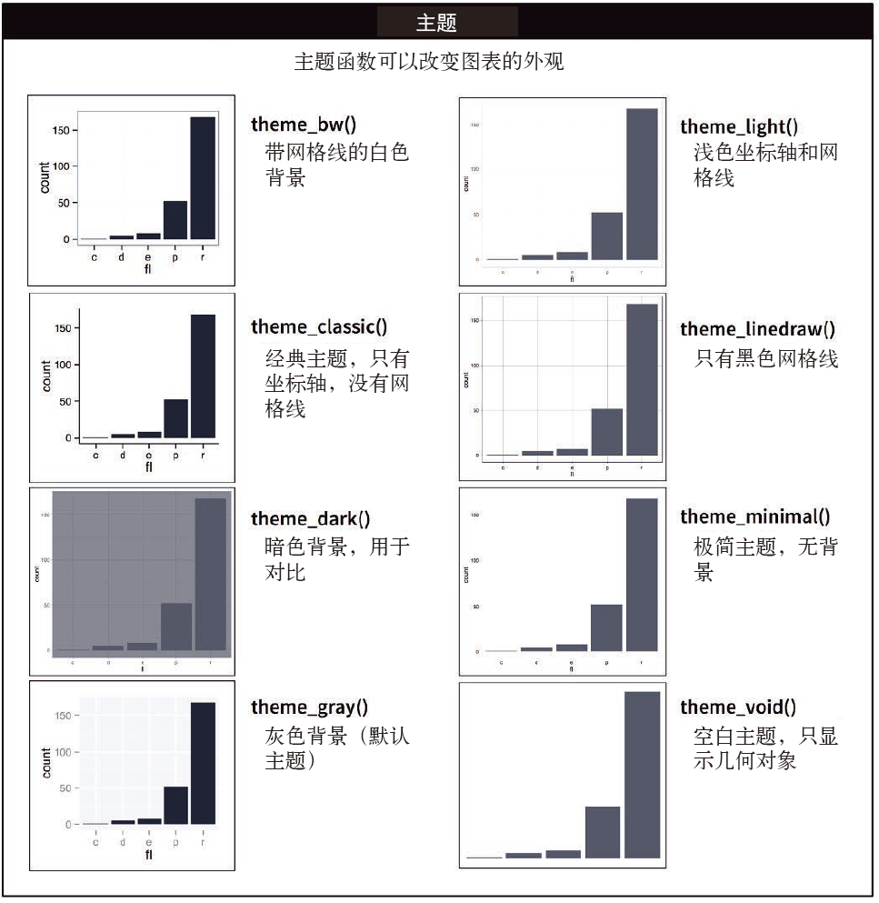

# Graphics for communication | 图形化沟通

## Introduction | 简介

In [exploratory data analysis], you learned how to use plots as tools for _exploration_. When you make exploratory plots, you know---even before looking---which variables the plot will display. You made each plot for a purpose, could quickly look at it, and then move on to the next plot. In the course of most analyses, you'll produce tens or hundreds of plots, most of which are immediately thrown away.

EDA介绍了使用图形进行数据探索的方法。在制作探索性图形时，我们对图形要显示哪些变量已经了然于心。我们出于某种目的制作了一幅图形，快速地对其进行检视， 然后继续下一幅。大多数分析过程都会生成几十或几百幅图形，其中大部分都会被立刻弃之不用。

Now that you understand your data, you need to _communicate_ your understanding to others. Your audience will likely not share your background knowledge and will not be deeply invested in the data. To help others quickly build up a good mental model of the data, you will need to invest considerable effort in making your plots as self-explanatory as possible. In this chapter, you'll learn some of the tools that ggplot2 provides to do so.

理解了数据后，就需要与人们沟通我们的想法。听众很可能不具备我们所拥有的背景知识，也不会对数据投入太多精力。为了帮助人们快速建立一个比较好的数据思维模型，我们需要付出相当大的努力，尽可能让图形通俗易懂。在本章中，我们将学习 ggplot2 中提供的一些方法来完成这个任务。

This chapter focuses on the tools you need to create good graphics. I assume that you know what you want, and just need to know how to do it. For that reason, I highly recommend pairing this chapter with a good general visualisation book. I particularly like [_The Truthful Art_](https://amzn.com/0321934075), by Albert Cairo. It doesn't teach the mechanics of creating visualisations, but instead focuses on what you need to think about in order to create effective graphics.

本章将重点介绍创建良好图形所需的方法。我们假设你已经明确了需求，只是想知道如何来做。因此，强烈建议你在学习本章的同时，再阅读一本比较好的可视化书籍。我们特别喜欢 Albert Cairo 的著作 The Truthful Art，这本书讲述的不是创建可视化图形的技术，而是重点介绍在创建有效图形时需要考虑的因素。

### Prerequisites | 准备工作

In this chapter, we'll focus once again on ggplot2. We'll also use a little dplyr for data manipulation, and a few ggplot2 extension packages, including __ggrepel__ and __viridis__. Rather than loading those extensions here, we'll refer to their functions explicitly, using the `::` notation. This will help make it clear which functions are built into ggplot2, and which come from other packages. Don't forget you'll need to install those packages with `install.packages()` if you don't already have them.

本章将再次重点介绍 ggplot2。我们还会使用 dplyr 包的一些功能来进行数据处理，并介绍ggplot2 的几个扩展包，其中包括 ggrepel 和 viridis。我们不用加载这些扩展包，而是选择使用 :: 表示法显式地引用其中的函数，这样可以更清楚地分辨出哪些函数是 ggplot2 的内置函数，哪些函数来自于其他扩展包。别忘了，如果还没有安装这些扩展包，那么你需要使用 install.packages() 函数进行安装。

```{r, message = FALSE}
library(tidyverse)
```

## Label | 标签

The easiest place to start when turning an exploratory graphic into an expository graphic is with good labels. You add labels with the `labs()` function. This example adds a plot title:

要想将探索性图形转换为解释性图形，最容易的方法就是加上一些合适的标签。我们可以使用 labs() 函数来添加标签，以下示例为图形添加了一个标题：

```{r, message = FALSE}
ggplot(mpg, aes(displ, hwy)) +
  geom_point(aes(color = class)) +
  geom_smooth(se = FALSE) +
  labs(title = "Fuel efficiency generally decreases with engine size")
```

The purpose of a plot title is to summarise the main finding. Avoid titles that just describe what the plot is, e.g. "A scatterplot of engine displacement vs. fuel economy". 

使用图形标题的目的是概括主要成果。尽量不要使用那些只对图形进行描述的标题，如“发动机排量与燃油效率散点图”。

If you need to add more text, there are two other useful labels that you can use in ggplot2 2.2.0 and above (which should be available by the time you're reading this book):

如果想要添加更多文本，ggplot2 2.2.0 及其更高版本（当你读到本书时，更高版本肯定已经可用了）中还提供了另外 2 个非常实用的标签。

*   `subtitle` adds additional detail in a smaller font beneath the title. 可以在标题下以更小的字体添加更多附加信息。

*   `caption` adds text at the bottom right of the plot, often used to describe
    the source of the data. 可以在图形右下角添加文本，常用于描述数据来源：

```{r, message = FALSE}
ggplot(mpg, aes(displ, hwy)) +
  geom_point(aes(color = class)) +
  geom_smooth(se = FALSE) +
  labs(
    title = "Fuel efficiency generally decreases with engine size",
    subtitle = "Two seaters (sports cars) are an exception because of their light weight",
    caption = "Data from fueleconomy.gov"
  )
```

You can also use `labs()` to replace the axis and legend titles. It's usually a good idea to replace short variable names with more detailed descriptions, and to include the units.

我们还可以使用 labs() 函数来替换坐标轴和图例中的标题。将简短的变量名称替换为更详细的描述并加上单位，是一种非常好的做法：

```{r, message = FALSE}
ggplot(mpg, aes(displ, hwy)) +
  geom_point(aes(colour = class)) +
  geom_smooth(se = FALSE) +
  labs(
    x = "Engine displacement (L)",
    y = "Highway fuel economy (mpg)",
    colour = "Car type"
  )
```

It's possible to use mathematical equations instead of text strings. Just switch `""` out for `quote()` and read about the available options in `?plotmath`:

还可以在标题中使用数学公式代替字符串文本，用 quote() 函数代替 ""，再使用 ?plotmath命令查看可用选项：

```{r, fig.asp = 1, out.width = "50%", fig.width = 3}
df <- tibble(
  x = runif(10),
  y = runif(10)
)
ggplot(df, aes(x, y)) +
  geom_point() +
  labs(
    x = quote(sum(x[i] ^ 2, i == 1, n)),
    y = quote(alpha + beta + frac(delta, theta))
  )
```

### Exercises | 练习

1.  Create one plot on the fuel economy data with customised `title`,
    `subtitle`, `caption`, `x`, `y`, and `colour` labels.
    
    使用燃油效率数据创建一幅图形，自定义 title、subtitle、caption、x、y 和 colour 标签。

1.  The `geom_smooth()` is somewhat misleading because the `hwy` for
    large engines is skewed upwards due to the inclusion of lightweight
    sports cars with big engines. Use your modelling tools to fit and display
    a better model.
    
    geom_smooth() 函数具有一定的误导性，因为对于大排量引擎来说，由于包括了车身重量很轻的大引擎跑车，hwy 数据有些偏高。选择合适的建模方法拟合一个更好的模型， 并用图形表示出来。

1.  Take an exploratory graphic that you've created in the last month, and add
    informative titles to make it easier for others to understand.
    
    选择一个你以前制作的探索性图形，添加各种信息丰富的标题，以便更易理解。

## Annotations | 注释

In addition to labelling major components of your plot, it's often useful to label individual observations or groups of observations. The first tool you have at your disposal is `geom_text()`. `geom_text()` is similar to `geom_point()`, but it has an additional aesthetic: `label`. This makes it possible to add textual labels to your plots.

除了为图形中的主要部分添加标签，我们还经常需要为单个观测或分组观测添加标签。可供我们使用的第一个工具是 geom_text() 函数，其用法基本与 geom_point() 函数相同，但具有一个额外的图形属性：label。这使得我们可以向图形中添加文本标签。

There are two possible sources of labels. First, you might have a tibble that provides labels. The plot below isn't terribly useful, but it illustrates a useful approach: pull out the most efficient car in each class with dplyr, and then label it on the plot:

可以使用 2 种方式来提供标签。首先，可以使用 tibble。以下图形的实际用处不大，但可以说明一种非常有用的方法：先使用 dplyr 选取出每类汽车中效率最高的型号，然后在图形中标记出来：

```{r}
best_in_class <- mpg %>%
  group_by(class) %>%
  filter(row_number(desc(hwy)) == 1)

ggplot(mpg, aes(displ, hwy)) +
  geom_point(aes(colour = class)) +
  geom_text(aes(label = model), data = best_in_class)
```

This is hard to read because the labels overlap with each other, and with the points. We can make things a little better by switching to `geom_label()` which draws a rectangle behind the text. We also use the `nudge_y` parameter to move the labels slightly above the corresponding points:

这幅图不太好看，因为标签不但彼此重叠，还与数据点混在一起。改进这个问题的方法是换用 geom_label() 函数，它可以为文本加上方框。我们还可以使用 nudge_y 参数让标签位于相应数据点的正上方：

```{r}
ggplot(mpg, aes(displ, hwy)) +
  geom_point(aes(colour = class)) +
  geom_label(aes(label = model), data = best_in_class, nudge_y = 2, alpha = 0.5)
```

That helps a bit, but if you look closely in the top-left hand corner, you'll notice that there are two labels practically on top of each other. This happens because the highway mileage and displacement for the best cars in the compact and subcompact categories are exactly the same. There's no way that we can fix these by applying the same transformation for every label. Instead, we can use the __ggrepel__ package by Kamil Slowikowski. This useful package will automatically adjust labels so that they don't overlap:

这样效果更好一些。但如果仔细查看左上角，你就会发现有 2 个标签几乎完全重叠。发生这种情况的原因是，对于小型车和微型车中燃油效率最高的汽车来说，它们的公路里程数和引擎排量是完全相同的。我们无法通过对每个标签进行转换来解决这个问题，但是可以使用由 Kamil Slowikowski 开发的 ggrepel 包。这个包非常有用，可以自动调整标签的位置，使它们免于重叠：

```{r}
ggplot(mpg, aes(displ, hwy)) +
  geom_point(aes(colour = class)) +
  geom_point(size = 3, shape = 1, data = best_in_class) +
  ggrepel::geom_label_repel(aes(label = model), data = best_in_class)
```

Note another handy technique used here: I added a second layer of large, hollow points to highlight the points that I've labelled.

注意，我们还做了另一项很贴心的改动：添加了一个图层，用较大的空心圆来强调添加了标签的数据点。

You can sometimes use the same idea to replace the legend with labels placed directly on the plot. It's not wonderful for this plot, but it isn't too bad. (`theme(legend.position = "none"`) turns the legend off --- we'll talk about it more shortly.)

有时你可以通过同样的方式将标签直接放在图形上，以替代图例。这种方式不适合本示例中的图形，但有时效果还是不错的。（theme(legend.positon = "none") 可以不显示图例， 稍后我们将进行更多讨论。）

```{r}
class_avg <- mpg %>%
  group_by(class) %>%
  summarise(
    displ = median(displ),
    hwy = median(hwy)
  )

ggplot(mpg, aes(displ, hwy, colour = class)) +
  ggrepel::geom_label_repel(aes(label = class),
    data = class_avg,
    size = 6,
    label.size = 0,
    segment.color = NA
  ) +
  geom_point() +
  theme(legend.position = "none")
```

Alternatively, you might just want to add a single label to the plot, but you'll still need to create a data frame. Often, you want the label in the corner of the plot, so it's convenient to create a new data frame using `summarise()` to compute the maximum values of x and y.

其次，即使只想向图中添加唯一的一个标签，也需要创建一个数据框。通常来说，你会希望标签在图的角落，因此，应该使用 summarize() 函数计算出 x 和 y 的最大值，并保存在数据框中：

```{r}
label <- mpg %>%
  summarise(
    displ = max(displ),
    hwy = max(hwy),
    label = "Increasing engine size is \nrelated to decreasing fuel economy."
  )

ggplot(mpg, aes(displ, hwy)) +
  geom_point() +
  geom_text(aes(label = label), data = label, vjust = "top", hjust = "right")
```

If you want to place the text exactly on the borders of the plot, you can use `+Inf` and `-Inf`. Since we're no longer computing the positions from `mpg`, we can use `tibble()` to create the data frame:

如果想让标签紧贴着图形的边界，那么你可以使用 +Inf 和 -Inf 值。这样我们就无须再从mpg 数据集中计算位置了，因此可以使用 tibble() 函数直接创建数据框：

```{r}
label <- tibble(
  displ = Inf,
  hwy = Inf,
  label = "Increasing engine size is \nrelated to decreasing fuel economy."
)

ggplot(mpg, aes(displ, hwy)) +
  geom_point() +
  geom_text(aes(label = label), data = label, vjust = "top", hjust = "right")
```

In these examples, I manually broke the label up into lines using `"\n"`. Another approach is to use `stringr::str_wrap()` to automatically add line breaks, given the number of characters you want per line:

在这些示例中，我们使用 "\n" 手动为标签文本换行。另一种方法是使用 stringr::str_ wrap() 函数来自动换行，此时需要给出每行的字符数：

```{r}
"Increasing engine size is related to decreasing fuel economy." %>%
  stringr::str_wrap(width = 40) %>%
  writeLines()
```

Note the use of `hjust` and `vjust` to control the alignment of the label. Figure \@ref(fig:just) shows all nine possible combinations.

注意，hjust 和 vjust 是用于控制标签的对齐方式。下图给出了所有 9 种可能的组合。

```{r just, echo = FALSE, fig.cap = "All nine combinations of `hjust` and `vjust`. hjust 和 vjust 的所有 9 种组合", fig.asp = 0.5, fig.width = 4.5, out.width = "60%"}
vjust <- c(bottom = 0, center = 0.5, top = 1)
hjust <- c(left = 0, center = 0.5, right = 1)

df <- tidyr::crossing(hj = names(hjust), vj = names(vjust)) %>%
  mutate(
    y = vjust[vj],
    x = hjust[hj],
    label = paste0("hjust = '", hj, "'\n", "vjust = '", vj, "'")
  )

ggplot(df, aes(x, y)) +
  geom_point(colour = "grey70", size = 5) +
  geom_point(size = 0.5, colour = "red") +
  geom_text(aes(label = label, hjust = hj, vjust = vj), size = 4) +
  labs(x = NULL, y = NULL) 
```

Remember, in addition to `geom_text()`, you have many other geoms in ggplot2 available to help annotate your plot. A few ideas:

记住，除了 geom_text()，ggplot2 中还有很多其他函数可以在图形中添加注释，具体如下。

*   Use `geom_hline()` and `geom_vline()` to add reference lines. I often make
    them thick (`size = 2`) and white (`colour = white`), and draw them
    underneath the primary data layer. That makes them easy to see, without
    drawing attention away from the data.
    
    •	可以使用geom_hline() 和 geom_vline() 函数添加参考线。我们经常使用加粗（size = 2） 和白色（color = white）的直线作为参考线，并将它们绘制在基本数据层的下面。这样的参考线既清晰可见，又不至于喧宾夺主，影响我们查看数据。

*   Use `geom_rect()` to draw a rectangle around points of interest. The
    boundaries of the rectangle are defined by aesthetics `xmin`, `xmax`,
    `ymin`, `ymax`.
    
    •	可以使用 geom_rect() 函数在我们感兴趣的数据点周围绘制一个矩形。矩形的边界由图形属性 xmin、xmax、ymin 和 ymax 确定。

*   Use `geom_segment()` with the `arrow` argument to draw attention
    to a point with an arrow. Use aesthetics `x` and `y` to define the
    starting location, and `xend` and `yend` to define the end location.
    
    •	可以使用 geom_segment() 函数及 arrow 参数绘制箭头，指向需要关注的数据点。使用图形属性 x 和 y 来定义开始位置，使用 xend 和 yend 来定义结束位置。

The only limit is your imagination (and your patience with positioning annotations to be aesthetically pleasing)!

使用这些技术的唯一限制就是你的想象力（以及调整注释位置让图形更美观所需要的耐心）！

### Exercises | 练习

1.  Use `geom_text()` with infinite positions to place text at the
    four corners of the plot.
    
    使用 geom_text() 函数和无穷大参数值将文本标签放置在图形的 4 个角落。

1.  Read the documentation for `annotate()`. How can you use it to add a text
    label to a plot without having to create a tibble?
    
    阅读 annotate() 函数的文档。不创建 tibble 的情况下，如何使用这个函数为图形添加一个文本标签？

1.  How do labels with `geom_text()` interact with faceting? How can you
    add a label to a single facet? How can you put a different label in
    each facet? (Hint: think about the underlying data.)
    
    使用 geom_text() 创建的标签与分面是如何相互影响的？如何在一个分面中添加标签？ 如何在每个分面中添加不同标签？（提示：思考一下基础数据。）

1.  What arguments to `geom_label()` control the appearance of the background
    box?
    
    geom_label() 函数的哪个参数可以控制背景框的外观？

1.  What are the four arguments to `arrow()`? How do they work? Create a series
    of plots that demonstrate the most important options.
    
    arrow() 函数的 4 个参数是什么？它们有什么作用？创建一组图形来展示这几个参数中最重要的几个选项。

## Scales | 标度

The third way you can make your plot better for communication is to adjust the scales. Scales control the mapping from data values to things that you can perceive. Normally, ggplot2 automatically adds scales for you. For example, when you type:

使得图表更适合沟通的第三种方法是调整标度。标度控制着从数据值到图形属性的映射， 它可以将数据转换为视觉上可以感知的东西。一般情况下，ggplot2 会自动向图表中添加标度。例如，如果输入以下代码：

```{r default-scales, fig.show = "hide"}
ggplot(mpg, aes(displ, hwy)) +
  geom_point(aes(colour = class))
```

ggplot2 automatically adds default scales behind the scenes:

ggplot2 会自动在后台为代码添加默认标度：

```{r, fig.show = "hide"}
ggplot(mpg, aes(displ, hwy)) +
  geom_point(aes(colour = class)) +
  scale_x_continuous() +
  scale_y_continuous() +
  scale_colour_discrete()
```

Note the naming scheme for scales: `scale_` followed by the name of the aesthetic, then `_`, then the name of the scale. The default scales are named according to the type of variable they align with: continuous, discrete, datetime, or date. There are lots of non-default scales which you'll learn about below.

注意标度的命名模式：scale_ 后面是图形属性的名称，然后是 _，再然后是标度的名称。默认情况下，标度是以变量最可能的类型来命名的：连续型、离散型、日期时间型或日期型。还有很多非默认标度，我们会在后面的内容中进行介绍。

The default scales have been carefully chosen to do a good job for a wide range of inputs. Nevertheless, you might want to override the defaults for two reasons:

默认标度是精心选择的，适合多种输入。但基于以下两种原因，你可以不使用默认标度。

*   You might want to tweak some of the parameters of the default scale.
    This allows you to do things like change the breaks on the axes, or the
    key labels on the legend.
    
    • 你或许要对默认标度的一些参数进行调整。例如，当想要修改坐标轴刻度或图例中的项目标签时，就需要进行这些调整。

*   You might want to replace the scale altogether, and use a completely
    different algorithm. Often you can do better than the default because
    you know more about the data.
    
    • 你或许想要整体替换默认标度，从而使用一种完全不同的算法。因为你对数据更加了解， 所以使用与默认方式不同的标度通常能达到更好的效果。

### Axis ticks and legend keys | 坐标轴刻度与图例项目

There are two primary arguments that affect the appearance of the ticks on the axes and the keys on the legend: `breaks` and `labels`. Breaks controls the position of the ticks, or the values associated with the keys. Labels controls the text label associated with each tick/key. The most common use of `breaks` is to override the default choice:

影响坐标轴刻度与图例项目外观的主要参数有两个：breaks 和 labels。breaks 控制坐标轴刻度的位置，以及与图例项目相关的数值显示。labels 控制与每个坐标轴刻度或图例项目相关的文本标签。breaks 的最常见用途是替换默认的刻度：

```{r}
ggplot(mpg, aes(displ, hwy)) +
  geom_point() +
  scale_y_continuous(breaks = seq(15, 40, by = 5))
```

You can use `labels` in the same way (a character vector the same length as `breaks`), but you can also set it to `NULL` to suppress the labels altogether. This is useful for maps, or for publishing plots where you can't share the absolute numbers.

你可以用同样的方式来使用 labels（与 breaks 长度相同的字符向量）。你还可以将其设置为 NULL，这样可以不显示刻度标签，对于地图或不适合展示数值的图表来说，这种方式是非常有用的：

```{r}
ggplot(mpg, aes(displ, hwy)) +
  geom_point() +
  scale_x_continuous(labels = NULL) +
  scale_y_continuous(labels = NULL)
```

You can also use `breaks` and `labels` to control the appearance of legends. Collectively axes and legends are called __guides__. Axes are used for x and y aesthetics; legends are used for everything else.

你还可以使用 breaks 和 labels 控制图例的外观。坐标轴和图例统称为引导元素。坐标轴用于表示 x 和y 图形属性；图例则用于表示其他的引导性信息。

Another use of `breaks` is when you have relatively few data points and want to highlight exactly where the observations occur. For example, take this plot that shows when each US president started and ended their term.

需要使用 breaks 的另一种情况是，数据点相对较少，而你又想要强调观测的确切位置。例如，以下图形展示了每位美国总统任期的开始时间和结束时间：

```{r}
presidential %>%
  mutate(id = 33 + row_number()) %>%
  ggplot(aes(start, id)) +
    geom_point() +
    geom_segment(aes(xend = end, yend = id)) +
    scale_x_date(NULL, breaks = presidential$start, date_labels = "'%y")
```

Note that the specification of breaks and labels for date and datetime scales is a little different:

注意，对于日期型和日期时间型标度来说，刻度和标签的格式有一些不同。

* `date_labels` takes a format specification, in the same form as
  `parse_datetime()`.
  
  • date_labels 接受一个格式说明，说明的形式与 parse_datetime() 函数中的相同。

* `date_breaks` (not shown here), takes a string like "2 days" or "1 month".

• date_breaks（这个示例中没有出现）则使用类似“2 天”或“1 个月”这样的字符串。

### Legend layout | 图例布局

You will most often use `breaks` and `labels` to tweak the axes. While they both also work for legends, there are a few other techniques you are more likely to use.

breaks 和 labels 最常用于调整坐标轴。然而，它们也可以用于调整图例，我们再介绍几种你很可能会用到的技术。

To control the overall position of the legend, you need to use a `theme()` setting. We'll come back to themes at the end of the chapter, but in brief, they control the non-data parts of the plot. The theme setting `legend.position` controls where the legend is drawn:

如果要控制图例的整体位置，你需要使用 theme() 函数进行设置。本章末尾将介绍关于主题的知识，简而言之，主题的作用就是控制图形中与数据无关的部分。主题设置中的legend.position 可以控制图例的位置：

```{r fig.asp = 1, fig.align = "default", out.width = "50%", fig.width = 4}
base <- ggplot(mpg, aes(displ, hwy)) +
  geom_point(aes(colour = class))

base + theme(legend.position = "left")
base + theme(legend.position = "top")
base + theme(legend.position = "bottom")
base + theme(legend.position = "right") # the default
```

You can also use `legend.position = "none"` to suppress the display of the legend altogether.

你还可以使用 legend.positon = "none" 来取消整个图例的显示。

To control the display of individual legends, use `guides()` along with `guide_legend()` or `guide_colourbar()`. The following example shows two important settings: controlling the number of rows the legend uses with `nrow`, and overriding one of the aesthetics to make the points bigger. This is particularly useful if you have used a low `alpha` to display many points on a plot.

要想控制单个图例的显示， 可以配合 guide_legend() 或 guide_colorbar() 函数来使用guides() 函数。在以下示例中，我们给出了两个重要设置：使用 nrow 设定图例项目的行数，并覆盖一个图形属性，以便数据点更大一些。如果想要在一张图表上使用较低的alpha 值显示多个数据点，那么这些设置尤为重要：

```{r}
ggplot(mpg, aes(displ, hwy)) +
  geom_point(aes(colour = class)) +
  geom_smooth(se = FALSE) +
  theme(legend.position = "bottom") +
  guides(colour = guide_legend(nrow = 1, override.aes = list(size = 4)))
```

### Replacing a scale | 标度替换

Instead of just tweaking the details a little, you can instead replace the scale altogether. There are two types of scales you're mostly likely to want to switch out: continuous position scales and colour scales. Fortunately, the same principles apply to all the other aesthetics, so once you've mastered position and colour, you'll be able to quickly pick up other scale replacements.

除了对标度的细节略做调整，我们还可以替换整体标度。最经常进行替换的两种标度是连续型位置标度和颜色标度。好在其中原理适用于其他图形属性，因此一旦掌握了位置和颜色的替换方法，就可以迅速学会其他各种标度替换。

It's very useful to plot transformations of your variable. For example, as we've seen in [diamond prices](diamond-prices) it's easier to see the precise relationship between `carat` and `price` if we log transform them:

绘制出变量转换是非常有用的。例如，正如我们在[diamond prices](diamond-prices) 中看到的，如果对 carat 和 price 进行对数转换，就更容易看出二者间的确切关系：

```{r, fig.align = "default", out.width = "50%"}
ggplot(diamonds, aes(carat, price)) +
  geom_bin2d()

ggplot(diamonds, aes(log10(carat), log10(price))) +
  geom_bin2d()
```

However, the disadvantage of this transformation is that the axes are now labelled with the transformed values, making it hard to interpret the plot. Instead of doing the transformation in the aesthetic mapping, we can instead do it with the scale. This is visually identical, except the axes are labelled on the original data scale.

但这种变换的缺点是，因为坐标轴是以转换后的值来标记的，所以很难解释图表。除了在图形属性映射中进行转换，我们还可以使用标度进行转换。二者的视觉效果是一样的，只是进行了标度变换后，坐标轴还是以原始数据标度进行标记的：

```{r}
ggplot(diamonds, aes(carat, price)) +
  geom_bin2d() + 
  scale_x_log10() + 
  scale_y_log10()
```

Another scale that is frequently customised is colour. The default categorical scale picks colours that are evenly spaced around the colour wheel. Useful alternatives are the ColorBrewer scales which have been hand tuned to work better for people with common types of colour blindness. The two plots below look similar, but there is enough difference in the shades of red and green that the dots on the right can be distinguished even by people with red-green colour blindness.

经常需要修改定制的另一种标度是颜色。默认分类标度以一种非常均匀的方式在色环上选择颜色。常用的另一种配色方式是使用 ColorBrewer 标度，经过手工调整后，这种方式更适合那些有色盲症的人。以下的两幅图非常相似，但是右边图中的红色和绿色的对比更加强烈，即使是患有红绿色盲症的人也可以区别出来：

```{r, fig.align = "default", out.width = "50%"}
ggplot(mpg, aes(displ, hwy)) +
  geom_point(aes(color = drv))

ggplot(mpg, aes(displ, hwy)) +
  geom_point(aes(color = drv)) +
  scale_colour_brewer(palette = "Set1")
```

Don't forget simpler techniques. If there are just a few colours, you can add a redundant shape mapping. This will also help ensure your plot is interpretable in black and white.

别小看简单的技术。如果只有很少几种颜色，那么你完全可以再添加一种形状映射。虽然有些冗余，但这样可以确保图表在黑白方式下也是可以为人所理解的：

```{r}
ggplot(mpg, aes(displ, hwy)) +
  geom_point(aes(color = drv, shape = drv)) +
  scale_colour_brewer(palette = "Set1")
```

The ColorBrewer scales are documented online at <http://colorbrewer2.org/> and made available in R via the __RColorBrewer__ package, by Erich Neuwirth. Figure \@ref(fig:brewer) shows the complete list of all palettes. The sequential (top) and diverging (bottom) palettes are particularly useful if your categorical values are ordered, or have a "middle". This often arises if you've used `cut()` to make a continuous variable into a categorical variable.

ColorBrewer 标度的在线文档地址是 http://colorbrew2.org，在 R 中可以通过 RColorBrewer 包实现，这个包的作者是 Erich Neuwirth。图 21-2 给出了所有调色板的完整列表。如果分类变量的值是有顺序的或者有一个“中间值”，那么上面的顺序调色板和下面的发散调色板就尤为重要。在使用 cut() 函数将连续型变量转换为分类变量时，这两种情况经常出现。

```{r brewer, fig.asp = 2.5, echo = FALSE, fig.cap = "All ColourBrewer scales. ColorBrewer 中的全部配色方案"}
par(mar = c(0, 3, 0, 0))
RColorBrewer::display.brewer.all()
```

When you have a predefined mapping between values and colours, use `scale_colour_manual()`. For example, if we map presidential party to colour, we want to use the standard mapping of red for Republicans and blue for Democrats:

如果预先确定了数据值和颜色间的映射，那么可以使用 scale_color_manual() 函数。例如，我们可以将总统的党派映射到颜色，使用红色表示共和党，蓝色表示民主党：

```{r}
presidential %>%
  mutate(id = 33 + row_number()) %>%
  ggplot(aes(start, id, colour = party)) +
    geom_point() +
    geom_segment(aes(xend = end, yend = id)) +
    scale_colour_manual(values = c(Republican = "red", Democratic = "blue"))
```

For continuous colour, you can use the built-in `scale_colour_gradient()` or `scale_fill_gradient()`. If you have a diverging scale, you can use `scale_colour_gradient2()`. That allows you to give, for example, positive and negative values different colours. That's sometimes also useful if you want to distinguish points above or below the mean.

对于连续的颜色标度，我们可以使用内置函数 scale_color_gradient() 或 scale_fill_ gradient() 来表示。如果想要表示发散性的颜色标度，可以使用 scale_color_gradient2() 函数，它可以使用正数和负数来表示不同的颜色。如果想要区分出位于平均值以上和以下的点，那么这个函数是非常合适的。

Another option is `scale_colour_viridis()` provided by the __viridis__ package. It's a continuous analog of the categorical ColorBrewer scales. The designers, Nathaniel Smith and Stéfan van der Walt, carefully tailored a continuous colour scheme that has good perceptual properties. Here's an example from the viridis vignette.

另一个可以选用的函数是由 viridis 包提供的 scale_color_viridis()，它是对 ColorBrewer 分类标度的一种连续模拟，包作者 Nathaniel Smith 和 Stéfan van der Walt 精心设计了一种具有优秀感知特性的连续型颜色模式。以下是来自于 viridis 使用指南中的一个示例：

```{r, fig.align = "default", fig.asp = 1, out.width = "50%", fig.width = 4}
df <- tibble(
  x = rnorm(10000),
  y = rnorm(10000)
)
ggplot(df, aes(x, y)) +
  geom_hex() +
  coord_fixed()

ggplot(df, aes(x, y)) +
  geom_hex() +
  viridis::scale_fill_viridis() +
  coord_fixed()
```

Note that all colour scales come in two variety: `scale_colour_x()` and `scale_fill_x()` for the `colour` and `fill` aesthetics respectively (the colour scales are available in both UK and US spellings).

注意，所有的颜色标度都可以分为两类：scale_color_x() 对应于 color 图形属性，scale_ fill_x() 则对应于 fill 图形属性（颜色标度既可以使用美式英语，也可以使用英式英语）。

### Exercises | 练习

1.  Why doesn't the following code override the default scale?
为什么以下代码没有覆盖默认标度？

    ```{r fig.show = "hide"}
    ggplot(df, aes(x, y)) +
      geom_hex() +
      scale_colour_gradient(low = "white", high = "red") +
      coord_fixed()
    ```

1.  What is the first argument to every scale? How does it compare to `labs()`?
每个标度函数中的第一个参数的意义是什么？与 labs() 函数相比有什么不同？

1.  Change the display of the presidential terms by:
按照以下要求修改 presidential 图形的显示。

    1. Combining the two variants shown above. 组合使用前面介绍过的两类颜色标度进行改进。
    1. Improving the display of the y axis. 美化 y 轴的显示。
    1. Labelling each term with the name of the president. 使用总统的姓名标注每个图形项目。
    1. Adding informative plot labels. 添加各种说明性标签。
    1. Placing breaks every 4 years (this is trickier than it seems!). 每隔 4 年添加一个刻度线（这比想象的要难！）。

1.  Use `override.aes` to make the legend on the following plot easier to see.
使用 override.aes 让下图中的图例更加一目了然。

    ```{r, dev = "png", out.width = "50%"}
    ggplot(diamonds, aes(carat, price)) +
      geom_point(aes(colour = cut), alpha = 1/20)
    ```

## Zooming | 缩放

There are three ways to control the plot limits: 控制图形范围的方法有 3 种：

1. Adjusting what data are plotted 调整绘图所用数据；
1. Setting the limits in each scale 设置标度范围；
1. Setting `xlim` and `ylim` in `coord_cartesian()` 在 coord_cartesian() 函数中设置 xlim 和 ylim 参数值。

To zoom in on a region of the plot, it's generally best to use `coord_cartesian()`. Compare the following two plots:

如果想要放大图形的一片区域，最好使用 coord_cartesian() 函数。比较以下这两个图形：

```{r out.width = "50%", fig.align = "default", message = FALSE}
ggplot(mpg, mapping = aes(displ, hwy)) +
  geom_point(aes(color = class)) +
  geom_smooth() +
  coord_cartesian(xlim = c(5, 7), ylim = c(10, 30))

mpg %>%
  filter(displ >= 5, displ <= 7, hwy >= 10, hwy <= 30) %>%
  ggplot(aes(displ, hwy)) +
  geom_point(aes(color = class)) +
  geom_smooth()
```

You can also set the `limits` on individual scales. Reducing the limits is basically equivalent to subsetting the data. It is generally more useful if you want _expand_ the limits, for example, to match scales across different plots. For example, if we extract two classes of cars and plot them separately, it's difficult to compare the plots because all three scales (the x-axis, the y-axis, and the colour aesthetic) have different ranges.

你也可以设置单个标度的范围。缩小标度范围的效果基本等同于对数据取子集。如果想要扩大图形范围，比如在不同图形间使用相同的标度，那么最好通过设置标度范围来实现。举例来说，如果提取两种不同类型汽车的数据，并想分别绘制出来，但因为这两份数据的 3 种标度（x 轴、y 轴和颜色图形属性）范围都不一样，所以很难进行比较：

```{r out.width = "50%", fig.align = "default", fig.width = 4}
suv <- mpg %>% filter(class == "suv")
compact <- mpg %>% filter(class == "compact")

ggplot(suv, aes(displ, hwy, colour = drv)) +
  geom_point()

ggplot(compact, aes(displ, hwy, colour = drv)) +
  geom_point()
```

One way to overcome this problem is to share scales across multiple plots, training the scales with the `limits` of the full data.

解决这个问题的一种方法是，先使用全部数据找出标度的 limits，然后在两张图形中使用同样的标度：

```{r out.width = "50%", fig.align = "default", fig.width = 4}
x_scale <- scale_x_continuous(limits = range(mpg$displ))
y_scale <- scale_y_continuous(limits = range(mpg$hwy))
col_scale <- scale_colour_discrete(limits = unique(mpg$drv))

ggplot(suv, aes(displ, hwy, colour = drv)) +
  geom_point() +
  x_scale +
  y_scale +
  col_scale

ggplot(compact, aes(displ, hwy, colour = drv)) +
  geom_point() +
  x_scale +
  y_scale +
  col_scale
```

In this particular case, you could have simply used faceting, but this technique is useful more generally, if for instance, you want spread plots over multiple pages of a report.

对于这个特定的示例，我们可以简单地使用分面来解决，但以上方法适用范围更广，例如，可以在报告中加入横跨多页的图形。

## Themes | 主题

Finally, you can customise the non-data elements of your plot with a theme:

最后，我们还可以使用主题来定制图形中的非数据元素：

```{r, message = FALSE}
ggplot(mpg, aes(displ, hwy)) +
  geom_point(aes(color = class)) +
  geom_smooth(se = FALSE) +
  theme_bw()
```

ggplot2 includes eight themes by default, as shown in Figure \@ref(fig:themes). Many more are included in add-on packages like __ggthemes__ (<https://github.com/jrnold/ggthemes>), by Jeffrey Arnold.

ggplot2 默认可以使用 8 种主题，如图 21-3 所示。在 Jeffrey Arnold 开发的 ggthemes 扩展包（https://github.com/jrnold/ggthemes）中，还可以使用更多主题。

```{r themes, echo = FALSE, fig.cap = "The eight themes built-in to ggplot2."}
knitr::include_graphics("images/visualization-themes.png")
```

```{r themes-cn, echo = FALSE, fig.cap = "ggplot2 内置的 8 种主题."}

```

Many people wonder why the default theme has a grey background. This was a deliberate choice because it puts the data forward while still making the grid lines visible. The white grid lines are visible (which is important because they significantly aid position judgements), but they have little visual impact and we can easily tune them out. The grey background gives the plot a similar typographic colour to the text, ensuring that the graphics fit in with the flow of a document without jumping out with a bright white background. Finally, the grey background creates a continuous field of colour which ensures that the plot is perceived as a single visual entity.

很多人会感到诧异，为什么默认主题要使用灰色背景。这是有意为之，因为这样可以在网格线可见的情况下更加突出数据。白色网格线既是可见的（这非常重要，因为它们非常有助于位置判定），又对视觉没有什么严重影响，我们完全可以对其视而不见。图表的灰色背景不像白色背景那么突兀，与文本印刷颜色非常相近，保证了图形与文档其他部分浑然一体。最后，灰色背景可以创建一片连续的颜色区域，使得图形成为形象鲜明的一个独立视觉实体。

It's also possible to control individual components of each theme, like the size and colour of the font used for the y axis. Unfortunately, this level of detail is outside the scope of this book, so you'll need to read the [ggplot2 book](https://amzn.com/331924275X) for the full details. You can also create your own themes, if you are trying to match a particular corporate or journal style.

我们还可以控制每种主题中的独立成分，比如 y 轴字体的大小和颜色。遗憾的是，这些细节已经超出了本书的讨论范围，因此你需要学习关于 ggplot2 的图书（http://ggplot2.org/ book/）才能掌握全部细节。如果为了满足公司或期刊的具体要求，你也可以创建属于自己的主题。

## Saving your plots | 保存图形

There are two main ways to get your plots out of R and into your final write-up: `ggsave()` and knitr. `ggsave()` will save the most recent plot to disk:

要想将图形从 R 导入你的最终报告，主要有两种方法：ggsave() 和 knitr。ggsave() 可以将最近生成的图形保存到磁盘：

```{r, fig.show = "none"}
ggplot(mpg, aes(displ, hwy)) + geom_point()
ggsave("my-plot.pdf")
```
```{r, include = FALSE}
file.remove("my-plot.pdf")
```

If you don't specify the `width` and `height` they will be taken from the dimensions of the current plotting device. For reproducible code, you'll want to specify them.

如果没有指定 width 和 height，那么 ggsave() 就会使用当前绘图设备的尺寸。出于代码重用性的考虑，最好还是指定图形的这些参数。

Generally, however, I think you should be assembling your final reports using R Markdown, so I want to focus on the important code chunk options that you should know about for graphics. You can learn more about `ggsave()` in the documentation.

然而，我们认为你通常会通过 R Markdown 生成最终报告，因此我们将重点介绍你在生成图形时应该了解的一些重要代码段选项。你可以通过说明文档来了解更多关于 ggsave() 的知识。

### Figure sizing | 图形大小

The biggest challenge of graphics in R Markdown is getting your figures the right size and shape. There are five main options that control figure sizing: `fig.width`, `fig.height`, `fig.asp`, `out.width` and `out.height`. Image sizing is challenging because there are two sizes (the size of the figure created by R and the size at which it is inserted in the output document), and multiple ways of specifying the size (i.e., height, width, and aspect ratio: pick two of three).

在 R Markdown 中，关于图形的最大问题是如何确定其大小和形状。控制图形大小的选项主要有 5 个：fig.width、fig.height、fig.asp、out.width 和 out.height。之所以说图形大小是一个难题，是因为图形大小有两种（R 生成的图形的大小，以及插入到输出文档中的图形的大小），而且指定图形大小的方法也有多种（即高度、宽度和高宽比：三者任选其二）。

I only ever use three of the five options:
我们只使用以上 5 种选项中的 3 种。

* I find it most aesthetically pleasing for plots to have a consistent
  width. To enforce this, I set `fig.width = 6` (6") and `fig.asp = 0.618`
  (the golden ratio) in the defaults. Then in individual chunks, I only
  adjust `fig.asp`.
  
  •	我们发现，宽度一致的图形是最令人赏心悦目的。为了使图形宽度保持一致，我们设置图形的默认参数为 fig.width = 6（6 英寸）和 fig.asp = 0.618（黄金分割）。在单个代码段中，我们只调整 fig.asp。

* I control the output size with `out.width` and set it to a percentage
  of the line width. I default to `out.width = "70%"`
  and `fig.align = "center"`. That give plots room to breathe, without taking
  up too much space.
  
  •	我们使用 out.width 控制输出图形的大小，并将其设置为行宽的百分比。默认设置为out.width = "70%" 和 fig.align = "center"。这样一来，图形既不会占用过多空间，也不会显得太拥挤。

* To put multiple plots in a single row I set the `out.width` to
  `50%` for two plots, `33%` for 3 plots, or `25%` to 4 plots, and set
  `fig.align = "default"`. Depending on what I'm trying to illustrate (e.g.
  show data or show plot variations), I'll also tweak `fig.width`, as
  discussed below.
  
  •	如果想在一行中放置多个图形，可以将 out.width 设置为 50% 以放置 2 个图形、设置为 33% 以放置 3 个图形，或者设置为 25% 以放置 4 个图形，同时还要设置 fig.align = "default"。按照具体的说明方式（例如，是要展示数据还是要展示图形），我们也会根据情况调整 fig.width，后面还会继续讨论这点。

If you find that you're having to squint to read the text in your plot, you need to tweak `fig.width`. If `fig.width` is larger than the size the figure is rendered in the final doc, the text will be too small; if `fig.width` is smaller, the text will be too big. You'll often need to do a little experimentation to figure out the right ratio between the `fig.width` and the eventual width in your document. To illustrate the principle, the following three plots have `fig.width` of 4, 6, and 8 respectively:

如果你发现必须眯起眼睛才能看清图形上的文本，那么就需要调整 fig.width 参数。如果fig.width 大于最终文档中的图形的尺寸，那么文本就会显得过小；如果 fig.width 小于最终文档中的图形的尺寸，那么文本就会显得过大。一般来说，你需要试验几次才能找到fig.width 和最终文档中的图形的最佳比例。为了说明这个问题，我们可以看看以下 3 幅图形，它们的 fig.width 分别是 4、6 和 8。

```{r, include = FALSE}
plot <- ggplot(mpg, aes(displ, hwy)) + geom_point()
```
```{r, fig.width = 4, echo = FALSE}
plot
```
```{r, fig.width = 6, echo = FALSE}
plot
```
```{r, fig.width = 8, echo = FALSE}
plot
```

If you want to make sure the font size is consistent across all your figures, whenever you set `out.width`, you'll also need to adjust `fig.width` to maintain the same ratio with your default `out.width`. For example, if your default `fig.width` is 6 and `out.width` is 0.7, when you set `out.width = "50%"` you'll need to set `fig.width` to 4.3 (6 * 0.5 / 0.7).

如果想要让所有图形中的字体都保持一致大小，那么只要设置了 out.width，就同时还需要调整 fig.width，使其与默认 out.width 保持同样的比例。例如，如果默认 fig.width 为6，out.width 为 0.7，那么当设置 out.width = "50%" 时，你需要同时将 fig.width 设置为4.3（6*0.5/0.7）。

### Other important options | 其他重要选项

When mingling code and text, like I do in this book, I recommend setting `fig.show = "hold"` so that plots are shown after the code. This has the pleasant side effect of forcing you to break up large blocks of code with their explanations.

当代码和文本混合时，就像本书一样，我们建议你设置 fig.show = "hold"，以使图形显示在代码后面。这样做的好处是，可以强制使用解释性图形将大块代码分解成更小的部分。

To add a caption to the plot, use `fig.cap`. In R Markdown this will change the figure from inline to "floating".

如果想要为图形添加说明文字，可以使用 fig.cap。在 R Markdown 中，这样做会将图形从“内联”模式修改为“浮动”模式。

If you're producing PDF output, the default graphics type is PDF. This is a good default because PDFs are high quality vector graphics. However, they can produce very large and slow plots if you are displaying thousands of points. In that case, set `dev = "png"` to force the use of PNGs. They are slightly lower quality, but will be much more compact.

如果想要生成 PDF 格式的输出文件，使用默认的图形格式即可，因为默认格式就是 PDF。PDF 是一种良好的默认格式，因为它是一种高质量的向量化图形。但是，如果图形中包括几千个数据点，那么生成的图形就会很大，速度也会非常慢。这时可以设置 dev = "png" 来强制使用 PNG 图形格式。这种格式的图形质量稍差，但体积更小。

It's a good idea to name code chunks that produce figures, even if you don't routinely label other chunks. The chunk label is used to generate the file name of the graphic on disk, so naming your chunks makes it much easier to pick out plots and reuse in other circumstances (i.e. if you want to quickly drop a single plot into an email or a tweet).

即使通常不为代码段添加标签，但为生成图形的代码段取名也是一种非常好的做法。代码段标签可以作为保存在磁盘上的图形文件的名称，因此如果为代码段取了名字，你就可以更容易地找出需要的图形，并在其他环境中继续使用（换言之，你可以非常迅速地将一个图形放入电子邮件或推文中）。

## Learning more | 更多学习资源

The absolute best place to learn more is the ggplot2 book: [_ggplot2: Elegant graphics for data analysis_](https://amzn.com/331924275X). It goes into much more depth about the underlying theory, and has many more examples of how to combine the individual pieces to solve practical problems. Unfortunately, the book is not available online for free, although you can find the source code at <https://github.com/hadley/ggplot2-book>.

学习更多相关知识的最好去处绝对是 ggplot2 教材：《ggplot2：数据分析与图形艺术》。这本书更加深入地介绍了基础理论，而且使用了更多的示例来介绍如何组合多个图形以解决实际问题。遗憾的是，这本书没有免费的在线版本，但你可以在 https://github.com/hadley/ ggplot2-book 找到其源代码。

Another great resource is the ggplot2 extensions gallery <https://exts.ggplot2.tidyverse.org/gallery/>. This site lists many of the packages that extend ggplot2 with new geoms and scales. It's a great place to start if you're trying to do something that seems hard with ggplot2.

另一个绝好资源是 ggplot2 扩展指南网站（http://www.ggplot2-exts.org/）。这个站点列举了很多 ggplot2 扩展包，它们实现了新的几何对象和新的标度。如果想要做一些 ggplot2 难以实现的事情，不妨从这里开始。
