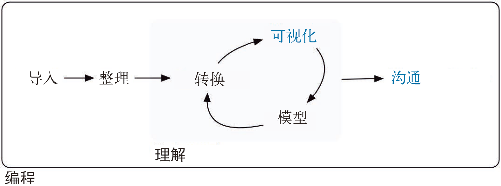

# (PART) Communicate | 沟通 {-}

# Introduction {#communicate-intro}

So far, you've learned the tools to get your data into R, tidy it into a form convenient for analysis, and then understand your data through transformation, visualisation and modelling. However, it doesn't matter how great your analysis is unless you can explain it to others: you need to __communicate__ your results.

到目前为止，我们已经学习了如何将数据导入R、如何将数据整理为方便分析的形式，以及如何通过转换、可视化与建模来理解数据。但除非能向他人解释结果，否则无论你的数据分析做得多么精彩，都没什么用处。因此，你需要与他人沟通工作成果。

```{r echo = FALSE, out.width = "75%"}
knitr::include_graphics("diagrams/data-science-communicate.png")
```

```{r echo = FALSE, out.width = "75%"}

```

Communication is the theme of the following four chapters:

沟通是这一部分 4 章内容的主题。

* In [R Markdown], you will learn about R Markdown, a tool for integrating
  prose, code, and results. You can use R Markdown in notebook mode for 
  analyst-to-analyst communication, and in report mode for 
  analyst-to-decision-maker communication. Thanks to the power of R Markdown
  formats, you can even use the same document for both purposes.
  
  R Markdown是一种集成文本、代码和结果的工具。R Markdown 提供了笔记本模式供不同的分析者进行沟通与交流，还提供了报告模式供分析者和决策者进行沟通与交流。由于 R Markdown 文件的强大功能，你甚至可以使用同一个文档来同时实现上述两种目的。
  
* In [Graphics for communication], you will learn how to take your exploratory
  graphics and turn them into expository graphics, graphics that help the
  newcomer to your analysis understand what's going on as quickly and 
  easily as possible.
  
  介绍如何将探索性图形转换为解释性图形。解释性图形可以帮助人们尽可能快速又轻松地理解你的分析工作。
  
* In [R Markdown formats], you'll learn a little about the many other varieties
  of outputs you can produce using R Markdown, including dashboards, websites,
  and books.
  
  介绍使用 R Markdown 可生成的多种输出，其中包括仪表盘、网站和书籍。
  
* We'll finish up with [R Markdown workflow], where you'll learn about the
  "analysis notebook" and how to systematically record your successes and 
  failures so that you can learn from them.
  
  本书的最后一章，将介绍如何制作“分析式笔记本”，以及如何系统地记录工作中的成功和失败，以便总结经验和教训。

Unfortunately, these chapters focus mostly on the technical mechanics of communication, not the really hard problems of communicating your thoughts to other humans. However, there are lot of other great books about communication, which we'll point you to at the end of each chapter.

遗憾的是，以上各章重点关注的是沟通的技术机制，而不是人与人之间想法的实际沟通。但是，我们将在每章末尾介绍一些关于实际沟通的优秀著作。
