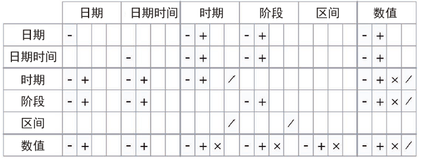

# Dates and times | 日期和时间

## Introduction | 简介

This chapter will show you how to work with dates and times in R. At first glance, dates and times seem simple. You use them all the time in your regular life, and they don't seem to cause much confusion. However, the more you learn about dates and times, the more complicated they seem to get. To warm up, try these three seemingly simple questions:

本章将介绍如何在 R 中处理日期和时间。乍看起来，日期和时间非常容易。日常生活的每时每刻都在使用它们，而且它们似乎也不会引起很多混淆。但是，随着对日期和时间了解得越来越多，我们就会越来越发现其复杂之处。我们先热热身，思考以下 3 个似乎非常简单的问题。

* Does every year have 365 days? •	每一年都是 365 天吗？
* Does every day have 24 hours? •	每一天都是 24 小时吗？
* Does every minute have 60 seconds? •	每分钟都是 60 秒吗？

I'm sure you know that not every year has 365 days, but do you know the full rule for determining if a year is a leap year? (It has three parts.) You might have remembered that many parts of the world use daylight savings time (DST), so that some days have 23 hours, and others have 25. You might not have known that some minutes have 61 seconds because every now and then leap seconds are added because the Earth's rotation is gradually slowing down.

你肯定知道不是每一年都是 365 天，但你知道确定某年是否为闰年的完整规则（包含 3 个 部分）吗？你应该知道世界上很多地区使用夏时制，因此有些天是 23 个小时，有些天则是 25 个小时。但你可能根本不知道，有些分钟是 61 秒，因为地球自转正在逐渐变慢，所以我们有时候要增加 1 个闰秒。

Dates and times are hard because they have to reconcile two physical phenomena (the rotation of the Earth and its orbit around the sun) with a whole raft of geopolitical phenomena including months, time zones, and DST. This chapter won't teach you every last detail about dates and times, but it will give you a solid grounding of practical skills that will help you with common data analysis challenges.

日期和时间非常复杂，因为它们要兼顾两种物理现象（地球的自转以及围绕太阳的公转） 和一系列地理政治现象（包括月份、时区和夏时制）。虽然本章不会介绍关于日期和时间的所有细节，但提供了处理日期和时间的实用技能的坚实基础，以帮助你解决常见的有关日期和时间的分析问题。

### Prerequisites | 准备工作

This chapter will focus on the __lubridate__ package, which makes it easier to work with dates and times in R. lubridate is not part of core tidyverse because you only need it when you're working with dates/times. We will also need nycflights13 for practice data.

本章主要讨论 lubridate 包，它可以使得 R 对日期和时间的处理更加容易。lubridate 不是tidyverse 的核心 R 包，因为只有在处理日期和时间时才需要它。我们还需要将 nycflights13 包作为练习数据。

```{r setup, message = FALSE}
library(tidyverse)

library(lubridate)
library(nycflights13)
```

## Creating date/times | 创建日期或时间

There are three types of date/time data that refer to an instant in time:

表示日期或时间的数据有 3 种类型。

* A __date__. Tibbles print this as `<date>`. •	日期：在 tibble 中显示为 <date>。

* A __time__ within a day. Tibbles print this as `<time>`. •	时间：一天中的某个时刻，在 tibble 中显示为 <time>。

* A __date-time__ is a date plus a time: it uniquely identifies an
  instant in time (typically to the nearest second). Tibbles print this
  as `<dttm>`. Elsewhere in R these are called POSIXct, but I don't think
  that's a very useful name.
  
  •	日期时间：可以唯一标识某个时刻（通常精确到秒）的日期加时间，在tibble 中显示为<dttm>。而这种类型在 R 语言的其他地方称为 POSIXct，但我们认为这个名称不是非常合适。
  
In this chapter we are only going to focus on dates and date-times as R doesn't have a native class for storing times. If you need one, you can use the __hms__ package.

在本章中，我们将重点讨论日期和日期时间型数据，因为R 中没有保存时间的原生类。如果需要处理时间数据，那么你可以使用 hms 包。

You should always use the simplest possible data type that works for your needs. That means if you can use a date instead of a date-time, you should. Date-times are substantially more complicated because of the need to handle time zones, which we'll come back to at the end of the chapter.

只要能够满足需要，你就应该使用最简单的数据类型。这意味着只要能够使用日期型数据，那么就不应该使用日期时间型数据。日期时间型数据要复杂得多，因为它需要处理时区，我们会在本章末尾继续讨论这个问题。

To get the current date or date-time you can use `today()` or `now()`:

要想得到当前日期或当前日期时间，你可以使用 today() 或 now() 函数：

```{r}
today()
now()
```

Otherwise, there are three ways you're likely to create a date/time:
除此之外，以下 3 种方法也可以创建日期或时间。

* From a string. 通过字符串创建。
* From individual date-time components. 通过日期时间的各个成分创建。
* From an existing date/time object. 通过现有的日期时间对象创建。

They work as follows. 接下来我们将分别介绍这 3 种方法。

### From strings | 通过字符串创建

Date/time data often comes as strings. You've seen one approach to parsing strings into date-times in [date-times](#readr-datetimes). Another approach is to use the helpers provided by lubridate. They automatically work out the format once you specify the order of the component. To use them, identify the order in which year, month, and day appear in your dates, then arrange "y", "m", and "d" in the same order. That gives you the name of the lubridate function that will parse your date. For example:

日期时间数据经常用字符串来表示。8.3.4 节中已经介绍了将字符串解析为日期时间数据的一种方法。通过字符串创建日期时间数据的另一种方法是使用 lubridate 中提供的辅助函数。如果确定了各个组成部分的顺序，那么这些函数可以自动将字符串转换为日期时间格式。要想使用这些函数，需要先确定年、月和日在日期数据中的顺序，然后按照同样的顺序排列 y、m 和 d，这样就可以组成能够解析日期的 lubridate 函数名称。例如：

```{r}
ymd("2017-01-31")
mdy("January 31st, 2017")
dmy("31-Jan-2017")
```

These functions also take unquoted numbers. This is the most concise way to create a single date/time object, as you might need when filtering date/time data. `ymd()` is short and unambiguous:

这些函数也可以接受不带引号的数值。这是创建单个日期时间对象的最简方法，在筛选日期时间数据时，你就可以使用这种方法。ymd() 是个非常简单明了的函数：

```{r}
ymd(20170131)
```

`ymd()` and friends create dates. To create a date-time, add an underscore and one or more of "h", "m", and "s" to the name of the parsing function:

ymd() 和类似的其他函数可以创建日期。要想创建日期时间型数据，可以在后面加一个下划线，以及 h、m 和 s 之中的一个或多个字母，这样就可以得到解析日期时间的函数了：

```{r}
ymd_hms("2017-01-31 20:11:59")
mdy_hm("01/31/2017 08:01")
```

You can also force the creation of a date-time from a date by supplying a timezone:

通过添加一个时区参数，你可以将一个日期强制转换为日期时间：

```{r}
ymd(20170131, tz = "UTC")
```

### From individual components | 通过各个成分创建

Instead of a single string, sometimes you'll have the individual components of the date-time spread across multiple columns. This is what we have in the flights data:

除了单个字符串，日期时间数据的各个成分还经常分布在表格的多个列中。航班数据就是这样的：

```{r}
flights %>% 
  select(year, month, day, hour, minute)
```

To create a date/time from this sort of input, use `make_date()` for dates, or `make_datetime()` for date-times:

如果想要按照这种表示方法来创建日期或时间，可以使用 make_date() 函数创建日期，使用 make_datetime() 函数创建日期时间：

```{r}
flights %>% 
  select(year, month, day, hour, minute) %>% 
  mutate(departure = make_datetime(year, month, day, hour, minute))
```

Let's do the same thing for each of the four time columns in `flights`. The times are represented in a slightly odd format, so we use modulus arithmetic to pull out the hour and minute components. Once I've created the date-time variables, I focus in on the variables we'll explore in the rest of the chapter.

我们对 flights 中的 4 个时间列进行相同的操作。因为时间的表示方法有点奇怪，所以我们先使用模运算将小时成分与分钟成分分离。一旦建立了日期时间变量，我们就在本章剩余部分使用这些变量进行讨论：

```{r}
make_datetime_100 <- function(year, month, day, time) {
  make_datetime(year, month, day, time %/% 100, time %% 100)
}

flights_dt <- flights %>% 
  filter(!is.na(dep_time), !is.na(arr_time)) %>% 
  mutate(
    dep_time = make_datetime_100(year, month, day, dep_time),
    arr_time = make_datetime_100(year, month, day, arr_time),
    sched_dep_time = make_datetime_100(year, month, day, sched_dep_time),
    sched_arr_time = make_datetime_100(year, month, day, sched_arr_time)
  ) %>% 
  select(origin, dest, ends_with("delay"), ends_with("time"))

flights_dt
```

With this data, I can visualise the distribution of departure times across the year:

我们可以使用这些数据做出一年间出发时间的可视化分布：

```{r}
flights_dt %>% 
  ggplot(aes(dep_time)) + 
  geom_freqpoly(binwidth = 86400) # 86400 seconds = 1 day
# 86400秒 = 1天
```

Or within a single day: 或者一天内的分布：

```{r}
flights_dt %>% 
  filter(dep_time < ymd(20130102)) %>% 
  ggplot(aes(dep_time)) + 
  geom_freqpoly(binwidth = 600) # 600 s = 10 minutes
# 600秒 = 10分钟
```

Note that when you use date-times in a numeric context (like in a histogram), 1 means 1 second, so a binwidth of 86400 means one day. For dates, 1 means 1 day.

注意，当将日期时间型数据作为数值使用时（比如在直方图中），1 表示 1 秒，因此分箱宽度 86 400 才能够表示 1 天。对于日期型数据，1 则表示 1 天。

### From other types | 通过其他类型数据创建

You may want to switch between a date-time and a date. That's the job of `as_datetime()` and `as_date()`:

有时你需要在日期时间型数据和日期型数据之间进行转换，这正是 as_datetime() 和 as_ date() 函数的功能：

```{r}
as_datetime(today())
as_date(now())
```

Sometimes you'll get date/times as numeric offsets from the "Unix Epoch", 1970-01-01. If the offset is in seconds, use `as_datetime()`; if it's in days, use `as_date()`.

有时我们会使用“Unix 时间戳”（即 1970-01-01）的偏移量来表示日期时间。如果偏移量单位是秒，那么就使用 as_datetime() 函数来转换；如果偏移量单位是天，则使用 as_ date() 函数来转换：

```{r}
as_datetime(60 * 60 * 10)
as_date(365 * 10 + 2)
```

### Exercises | 练习

1.  What happens if you parse a string that contains invalid dates?
如果解析包含无效日期的一个字符串，那么会发生什么情况？

    ```{r, eval = FALSE}
    ymd(c("2010-10-10", "bananas"))
    ```

1.  What does the `tzone` argument to `today()` do? Why is it important?
today() 函数中的 tzone 参数的作用是什么？为什么它很重要？

1.  Use the appropriate lubridate function to parse each of the following dates:
使用恰当的 lubridate 函数来解析以下每个日期。

    ```{r}
    d1 <- "January 1, 2010"
    d2 <- "2015-Mar-07"
    d3 <- "06-Jun-2017"
    d4 <- c("August 19 (2015)", "July 1 (2015)")
    d5 <- "12/30/14" # Dec 30, 2014
    ```

## Date-time components | 日期时间成分

Now that you know how to get date-time data into R's date-time data structures, let's explore what you can do with them. This section will focus on the accessor functions that let you get and set individual components. The next section will look at how arithmetic works with date-times.

现在你已经知道了如何将日期时间型数据保存在 R 的相应数据结构中。接下来我们研究一下能够对这些数据进行何种处理。本节将重点介绍获取和设置日期时间成分的访问器函数。下一节将介绍如何对日期时间进行数学运算。

### Getting components | 获取成分

You can pull out individual parts of the date with the accessor functions `year()`, `month()`, `mday()` (day of the month), `yday()` (day of the year), `wday()` (day of the week), `hour()`, `minute()`, and `second()`. 

如果想要提取出日期中的独立成分，可以使用以下访问器函数：year()、month()、mday()（一个月中的第几天）、yday()（一年中的第几天）、wday()（一周中的第几天）、hour()、minute() 和 second()：

```{r}
datetime <- ymd_hms("2016-07-08 12:34:56")

year(datetime)
month(datetime)
mday(datetime)

yday(datetime)
wday(datetime)
```

For `month()` and `wday()` you can set `label = TRUE` to return the abbreviated name of the month or day of the week. Set `abbr = FALSE` to return the full name.

对于 month() 和 wday() 函数，你可以设置 label = TRUE 来返回月份名称和星期数的缩写， 还可以设置 abbr = FALSE 来返回全名：

```{r}
month(datetime, label = TRUE)
wday(datetime, label = TRUE, abbr = FALSE)
```

We can use `wday()` to see that more flights depart during the week than on the weekend:
通过 wday() 函数，我们可以知道在工作日出发的航班要多于周末出发的航班：

```{r}
flights_dt %>% 
  mutate(wday = wday(dep_time, label = TRUE)) %>% 
  ggplot(aes(x = wday)) +
    geom_bar()
```

There's an interesting pattern if we look at the average departure delay by minute within the hour. It looks like flights leaving in minutes 20-30 and 50-60 have much lower delays than the rest of the hour!

如果查看一小时内每分钟的平均出发延误，我们可以发现一个有趣的模式。似乎在第20~30 分钟和第 50~60 分钟内出发的航班的延误时间远远低于其他时间出发的航班！

```{r}
flights_dt %>% 
  mutate(minute = minute(dep_time)) %>% 
  group_by(minute) %>% 
  summarise(
    avg_delay = mean(arr_delay, na.rm = TRUE),
    n = n()) %>% 
  ggplot(aes(minute, avg_delay)) +
    geom_line()
```

Interestingly, if we look at the _scheduled_ departure time we don't see such a strong pattern:
有趣的是，如果检查计划出发时间，我们就会发现其中没有这么明显的模式：

```{r}
sched_dep <- flights_dt %>% 
  mutate(minute = minute(sched_dep_time)) %>% 
  group_by(minute) %>% 
  summarise(
    avg_delay = mean(arr_delay, na.rm = TRUE),
    n = n())

ggplot(sched_dep, aes(minute, avg_delay)) +
  geom_line()
```

So why do we see that pattern with the actual departure times? Well, like much data collected by humans, there's a strong bias towards flights leaving at "nice" departure times. Always be alert for this sort of pattern whenever you work with data that involves human judgement!

那么，为什么我们会在实际的出发时间中看到这种模式呢？好吧，与人工收集的很多数据一样，航班数据也严重倾向于在“美妙的”时间出发的那些航班。只要处理的数据涉及人工判断，那么你就要对这种模式保持警惕！

```{r}
ggplot(sched_dep, aes(minute, n)) +
  geom_line()
```

### Rounding | 舍入

An alternative approach to plotting individual components is to round the date to a nearby unit of time, with `floor_date()`, `round_date()`, and `ceiling_date()`. Each function takes a vector of dates to adjust and then the name of the unit round down (floor), round up (ceiling), or round to. This, for example, allows us to plot the number of flights per week:

绘制独立日期成分的另一种方法是，通过 floor_date()、round_date() 和 ceiling_date() 函数将日期舍入到临近的一个时间单位。这些函数的参数都包括一个待调整的时间向量， 以及时间单位名称，函数会将这个向量舍下、入上或四舍五入到这个时间单位。例如，以下代码可以绘制出每周的航班数量：

```{r}
flights_dt %>% 
  count(week = floor_date(dep_time, "week")) %>% 
  ggplot(aes(week, n)) +
    geom_line()
```

Computing the difference between a rounded and unrounded date can be particularly useful.

计算舍入日期和未舍入日期间的差别是非常有用的。

### Setting components | 设置成分

You can also use each accessor function to set the components of a date/time:
你还可以使用每个访问器函数来设置日期时间中的成分：

```{r}
(datetime <- ymd_hms("2016-07-08 12:34:56"))

year(datetime) <- 2020
datetime
month(datetime) <- 01
datetime
hour(datetime) <- hour(datetime) + 1
datetime
```

Alternatively, rather than modifying in place, you can create a new date-time with `update()`. This also allows you to set multiple values at once.

除了原地修改，你还可以通过 update() 函数创建一个新日期时间。这样也可以同时设置多个成分：

```{r}
update(datetime, year = 2020, month = 2, mday = 2, hour = 2)
```

If values are too big, they will roll-over:

如果设置的值过大，那么可以自动向后滚动：

```{r}
ymd("2015-02-01") %>% 
  update(mday = 30)
ymd("2015-02-01") %>% 
  update(hour = 400)
```

You can use `update()` to show the distribution of flights across the course of the day for every day of the year: 

你可以使用 update() 函数来显示这一年中所有航班的出发时间在一天内的分布：

```{r}
flights_dt %>% 
  mutate(dep_hour = update(dep_time, yday = 1)) %>% 
  ggplot(aes(dep_hour)) +
    geom_freqpoly(binwidth = 300)
```

Setting larger components of a date to a constant is a powerful technique that allows you to explore patterns in the smaller components.

将日期中较大的成分设定为常数是探索其中较小成分模式的一种有效手段。

### Exercises | 练习

1.  How does the distribution of flight times within a day change over the 
    course of the year?
    
    在一年的范围内，航班时间在一天中的分布是如何变化的？
    
1.  Compare `dep_time`, `sched_dep_time` and `dep_delay`. Are they consistent?
    Explain your findings.
    
    比较 dep_time、sched_dep_time 和 dep_delay。它们是一致的吗？解释一下你的结论。

1.  Compare `air_time` with the duration between the departure and arrival.
    Explain your findings. (Hint: consider the location of the airport.)
    
    比较航班出发时间与到达时间之间的间隔和 air_time。解释一下你的结论。（提示：考虑一下机场所在地点。）
    
1.  How does the average delay time change over the course of a day?
    Should you use `dep_time` or `sched_dep_time`? Why?
    
    平均延误时间在一天范围内是如何变化的？应该使用 dep_time 还是 sched_dep_time ？ 为什么？

1.  On what day of the week should you leave if you want to minimise the
    chance of a delay?
    
    如果想要将延误的几率降至最低，那么应该在星期几搭乘航班？

1.  What makes the distribution of `diamonds$carat` and 
    `flights$sched_dep_time` similar?
    
    什么因素使得 diamonds$carat 和 flights$sched_dep_time 的分布很相似？

1.  Confirm my hypothesis that the early departures of flights in minutes
    20-30 and 50-60 are caused by scheduled flights that leave early. 
    Hint: create a binary variable that tells you whether or not a flight 
    was delayed.
    
    确认假设：在第 20~30 分钟和第 50~60 分钟内，航班能提前起飞的原因是其他航班提前起飞了。提示：创建一个二值变量来表明航班是否有延误。

## Time spans | 时间间隔

Next you'll learn about how arithmetic with dates works, including subtraction, addition, and division. Along the way, you'll learn about three important classes that represent time spans:

接下来你将学习如何对日期进行数学运算，其中包括减法、加法和除法。本节将介绍 3 种用于表示时间间隔的重要类。

* __durations__, which represent an exact number of seconds. 时期：以秒为单位表示一段精确的时间。
* __periods__, which represent human units like weeks and months. 阶段：表示由人工定义的一段时间，如几周或几个月。
* __intervals__, which represent a starting and ending point. 区间：表示从起点到终点的一段时间。

### Durations | 时期

In R, when you subtract two dates, you get a difftime object:
在 R 中，如果将两个日期相减，那么你会得到不同的对象：

```{r}
# How old is Hadley?
# Hadley多大了？
h_age <- today() - ymd(19791014)
h_age
```

A difftime class object records a time span of seconds, minutes, hours, days, or weeks. This ambiguity can make difftimes a little painful to work with, so lubridate provides an alternative which always uses seconds: the __duration__.

表示时间差别的对象记录时间间隔的单位可以是秒、分钟、小时、日或周。因为这种模棱两可的对象处理起来非常困难，所以 lubridate 提供了总是使用秒为单位的另一种计时对象——时期：

```{r}
as.duration(h_age)
```

Durations come with a bunch of convenient constructors:
可以使用很多方便的构造函数来创建时期：

```{r}
dseconds(15)
dminutes(10)
dhours(c(12, 24))
ddays(0:5)
dweeks(3)
dyears(1)
```

Durations always record the time span in seconds. Larger units are created by converting minutes, hours, days, weeks, and years to seconds at the standard rate (60 seconds in a minute, 60 minutes in an hour, 24 hours in day, 7 days in a week, 365 days in a year).

时期总是以秒为单位来记录时间间隔。使用标准比率（1 分钟为 60 秒、1 小时为 60 分钟、1 天为 24 小时、1 周为 7 天、1 年为 365 天）将分钟、小时、日、周和年转换为秒，从而建立具有更大值的对象。

You can add and multiply durations:
可以对时期进行加法和乘法操作：

```{r}
2 * dyears(1)
dyears(1) + dweeks(12) + dhours(15)
```

You can add and subtract durations to and from days:
时期可以和日期型数据相加或相减：

```{r}
tomorrow <- today() + ddays(1)
last_year <- today() - dyears(1)
```

However, because durations represent an exact number of seconds, sometimes you might get an unexpected result:

然而，因为时期表示的是以秒为单位的一段精确时间，所以有时你会得到意想不到的结果：

```{r}
one_pm <- ymd_hms("2016-03-12 13:00:00", tz = "America/New_York")

one_pm
one_pm + ddays(1)
```

Why is one day after 1pm on March 12, 2pm on March 13?! If you look carefully at the date you might also notice that the time zones have changed. Because of DST, March 12 only has 23 hours, so if we add a full days worth of seconds we end up with a different time.

为什么 3 月 12 日下午 1 点的 1 天后变成了 3 月 13 日的下午 2 点？如果仔细观察，你就会发现时区发生了变化。因为夏时制，3 月 12 日只有 23 个小时，因此如果我们加上一整天的秒数，那么就会得到一个不正确的时间。

### Periods | 阶段

To solve this problem, lubridate provides __periods__. Periods are time spans but don't have a fixed length in seconds, instead they work with "human" times, like days and months. That allows them to work in a more intuitive way:

为了解决这个问题，lubridate 提供了阶段对象。阶段也是一种时间间隔，但它不以秒为单位；相反，它使用“人工”时间，比如日和月。这使得它们使用起来更加直观：

```{r}
one_pm
one_pm + days(1)
```

Like durations, periods can be created with a number of friendly constructor functions. 

和时期一样，我们也可以使用很多友好的构造函数来创建阶段：

```{r}
seconds(15)
minutes(10)
hours(c(12, 24))
days(7)
months(1:6)
weeks(3)
years(1)
```

You can add and multiply periods:
可以对阶段进行加法和乘法操作：

```{r}
10 * (months(6) + days(1))
days(50) + hours(25) + minutes(2)
```

And of course, add them to dates. Compared to durations, periods are more likely to do what you expect:
当然，阶段可以和日期相加。与时期相比，阶段更容易符合我们的预期：

```{r}
# A leap year
# 闰年
ymd("2016-01-01") + dyears(1)
ymd("2016-01-01") + years(1)

# Daylight Savings Time
# 夏时制
one_pm + ddays(1)
one_pm + days(1)
```

Let's use periods to fix an oddity related to our flight dates. Some planes appear to have arrived at their destination _before_ they departed from New York City.

下面我们使用阶段来解决与航班日期有关的一个怪现象。有些飞机似乎在从纽约市起飞前就到达了目的地：

```{r}
flights_dt %>% 
  filter(arr_time < dep_time) 
```

These are overnight flights. We used the same date information for both the departure and the arrival times, but these flights arrived on the following day. We can fix this by adding `days(1)` to the arrival time of each overnight flight.

这些都是过夜航班。我们使用了同一种日期来表示出发时间和到达时间，但这些航班是在第二天到达的。将每个过夜航班的到达时间加上一个 days(1)，就可以解决这个问题了：

```{r}
flights_dt <- flights_dt %>% 
  mutate(
    overnight = arr_time < dep_time,
    arr_time = arr_time + days(overnight * 1),
    sched_arr_time = sched_arr_time + days(overnight * 1)
  )
```

Now all of our flights obey the laws of physics. 这样一来，航班数据就符合常理了：

```{r}
flights_dt %>% 
  filter(overnight, arr_time < dep_time) 
```

### Intervals | 区间

It's obvious what `dyears(1) / ddays(365)` should return: one, because durations are always represented by a number of seconds, and a duration of a year is defined as 365 days worth of seconds.

显然，dyears(1) / ddays(365) 应该返回 1，因为时期总是以秒来表示的，表示 1 年的时期就定义为相当于 365 天的秒数。

What should `years(1) / days(1)` return? Well, if the year was 2015 it should return 365, but if it was 2016, it should return 366! There's not quite enough information for lubridate to give a single clear answer. What it does instead is give an estimate, with a warning:

那么 years(1) / days(1) 应该返回什么呢？如果年份是 2015 年，那么结果就是 365，但如果年份是 2016 年，那么结果就是 366 ！没有足够的信息让 lubridate 返回一个明确的结果。lubridate 的做法是给出一个估计值，同时给出一条警告：

```{r}
years(1) / days(1)
```

If you want a more accurate measurement, you'll have to use an __interval__. An interval is a duration with a starting point: that makes it precise so you can determine exactly how long it is:

如果需要更精确的测量方式，那么你就必须使用区间。区间是带有起点的时期，这使得其非常精确，你可以确切地知道它的长度：

```{r}
next_year <- today() + years(1)
(today() %--% next_year) / ddays(1)
```

To find out how many periods fall into an interval, you need to use integer division:

要想知道一个区间内有多少个阶段，你需要使用整数除法：

```{r}
(today() %--% next_year) %/% days(1)
```

### Summary | 小结

How do you pick between duration, periods, and intervals? As always, pick the simplest data structure that solves your problem. If you only care about physical time, use a duration; if you need to add human times, use a period; if you need to figure out how long a span is in human units, use an interval.

如何在时期、阶段和区间中进行选择呢？一如既往，选择能够解决问题的最简单的数据结构。如果只关心物理时间，那么就使用时期；如果还需要考虑人工时间，那么就使用阶段；如果需要找出人工时间范围内有多长的时间间隔，那么就使用区间。

Figure \@ref(fig:dt-algebra) summarises permitted arithmetic operations between the different data types.
总结了不同数据类型之间可以进行的数学运算

```{r dt-algebra, echo = FALSE, fig.cap = "The allowed arithmetic operations between pairs of date/time classes."}
knitr::include_graphics("diagrams/datetimes-arithmetic.png")
```

```{r dt-algebra-cn, echo = FALSE, fig.cap = "不同日期 / 时间类之间可以进行的数学运算"}

```

### Exercises | 练习

1.  Why is there `months()` but no `dmonths()`? 为什么存在 months() 函数，但没有 dmonths() 函数？

1.  Explain `days(overnight * 1)` to someone who has just started 
    learning R. How does it work?
    
    向刚开始学习 R 的人解释 days(overnight * 1) 的意义。它的作用是什么？

1.  Create a vector of dates giving the first day of every month in 2015.
    Create a vector of dates giving the first day of every month
    in the _current_ year.
    
    创建一个日期向量来给出 2015 年每个月的第一天；创建一个日期向量来给出今年每个月的第一天。

1.  Write a function that given your birthday (as a date), returns 
    how old you are in years.
    
    编写一个函数，输入你的生日（日期型），使其返回你的年龄（以年为单位）。

1.  Why can't `(today() %--% (today() + years(1))) / months(1)` work?

为什么 (today() %--% (today() + years(1)) / months(1) 这段代码不能正常运行？

## Time zones | 时区

Time zones are an enormously complicated topic because of their interaction with geopolitical entities. Fortunately we don't need to dig into all the details as they're not all important for data analysis, but there are a few challenges we'll need to tackle head on.

时区是个非常复杂的主题，因为其受很多地理政治因素的影响。好在我们无须对其细节进行过多研究，因为它对数据分析来说不是特别重要，但还是有一些问题需要我们解决。

The first challenge is that everyday names of time zones tend to be ambiguous. For example, if you're American you're probably familiar with EST, or Eastern Standard Time. However, both Australia and Canada also have EST! To avoid confusion, R uses the international standard IANA time zones. These use a consistent naming scheme "<area>/<location>", typically in the form "\<continent\>/\<city\>" (there are a few exceptions because not every country lies on a continent). Examples include "America/New_York", "Europe/Paris", and "Pacific/Auckland".

第一个问题是，时区的名称有些含糊不清。例如，如果你是美国人，那么一定很熟悉 EST（Eastern Standard Time，东部标准时间）。但是，澳大利亚和加拿大也都有 EST ！为了避免混淆，R 使用国际标准 IANA 时区。这些时区使用统一带有“/”的命名方式，一般的形式为“< 大陆 >/< 城市 >”（存在例外，因为不是所有城市都位于一块大陆）。如“America/ New_York”、“Europe/Paris”和“Pacific/Auckland”。

You might wonder why the time zone uses a city, when typically you think of time zones as associated with a country or region within a country. This is because the IANA database has to record decades worth of time zone rules. In the course of decades, countries change names (or break apart) fairly frequently, but city names tend to stay the same. Another problem is that name needs to reflect not only to the current behaviour, but also the complete history. For example, there are time zones for both "America/New_York" and "America/Detroit". These cities both currently use Eastern Standard Time but in 1969-1972 Michigan (the state in which Detroit is located), did not follow DST, so it needs a different name. It's worth reading the raw time zone database (available at <http://www.iana.org/time-zones>) just to read some of these stories!

你可能很想知道，为什么时区使用城市来表示，通常我们都会认为时区应该使用国家或地区来表示。这是因为 IANA 数据库必须记录十年间的时区，而在十年时间中，国家更名（或分裂）的情况非常多，但城市名是基本保持不变的。另一个问题是，时区名称要反映的不仅是现在的情况，还有整个历史。例如，有两个名为“America/New_York”和“America/Detroit”的时区。这两个城市现在都使用东部标准时间，但在 1969~1972 年，密歇根（底特律所在的州）不使用夏时制，因此它需要一个不同的时区名称。仅仅是这些故事，就值得你阅读一下原始时区数据库！

You can find out what R thinks your current time zone is with `Sys.timezone()`:

在 R 中，可以使用 Sys.timezone() 函数找出你的当前时区：

```{r}
Sys.timezone()
```

(If R doesn't know, you'll get an `NA`.)
（如果 R 找不到时区，那么就会返回 NA。）

And see the complete list of all time zone names with `OlsonNames()`:

你还可以使用 OlsonNames() 函数来查看完整的时区名称列表：

```{r}
length(OlsonNames())
head(OlsonNames())
```

In R, the time zone is an attribute of the date-time that only controls printing. For example, these three objects represent the same instant in time:

在 R 中，时区是日期时间型数据的一个属性，仅用于控制输出。例如，以下 3 个对象表示的是同一时刻：

```{r}
(x1 <- ymd_hms("2015-06-01 12:00:00", tz = "America/New_York"))
(x2 <- ymd_hms("2015-06-01 18:00:00", tz = "Europe/Copenhagen"))
(x3 <- ymd_hms("2015-06-02 04:00:00", tz = "Pacific/Auckland"))
```

You can verify that they're the same time using subtraction:
你可以使用减法操作来验证它们都是同一时刻：

```{r}
x1 - x2
x1 - x3
```

Unless otherwise specified, lubridate always uses UTC. UTC (Coordinated Universal Time) is the standard time zone used by the scientific community and roughly equivalent to its predecessor GMT (Greenwich Mean Time). It does not have DST, which makes a convenient representation for computation. Operations that combine date-times, like `c()`, will often drop the time zone. In that case, the date-times will display in your local time zone:

除非使用了其他设置，lubridate 总是使用 UTC（Coordinated Universal Time，国际标准时间）。UTC 是科技界使用的时区标准，基本等价于它的前身 GMT（Greenwich Mean Time， 格林尼治标准时间）。因为没有夏时制，所以它非常适合计算。涉及日期时间的操作（比如 c()）经常会丢弃时区信息。在这种情况下，日期时间会显示你的本地时区：

```{r}
x4 <- c(x1, x2, x3)
x4
```

You can change the time zone in two ways:
你可以使用两种方法来改变时区。

*   Keep the instant in time the same, and change how it's displayed.
    Use this when the instant is correct, but you want a more natural
    display.
    
    •	保持时间不变，修改其显示方式。当时间正确，但需要更直观的表示时，可以使用这种方法：
  
    ```{r}
    x4a <- with_tz(x4, tzone = "Australia/Lord_Howe")
    x4a
    x4a - x4
    ```
    
    (This also illustrates another challenge of times zones: they're not
    all integer hour offsets!)
    （这同时反映出时区的另一个问题：它们的偏移小时数不全是整数！）

*   Change the underlying instant in time. Use this when you have an
    instant that has been labelled with the incorrect time zone, and you
    need to fix it.
    
    •	修改内部时间。当时间数据被标注了错误的时区，而想要改正过来时，你就可以使用这种方法：

    ```{r}
    x4b <- force_tz(x4, tzone = "Australia/Lord_Howe")
    x4b
    x4b - x4
    ```
