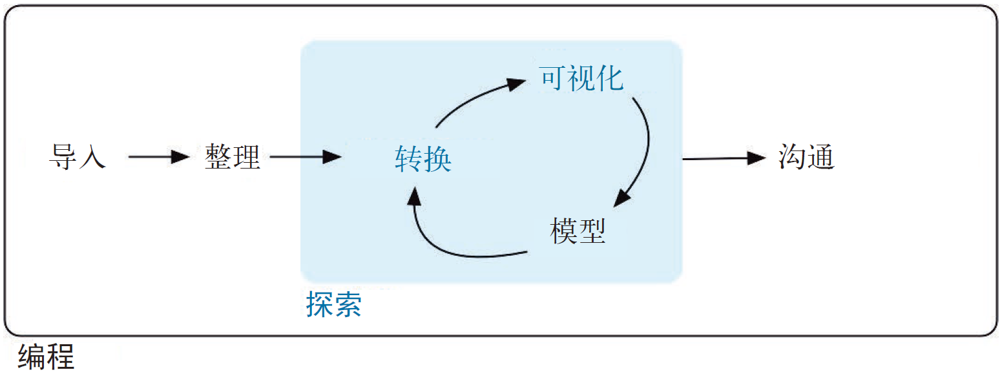

# (PART) Explore {-}

# Introduction {#explore-intro}

The goal of the first part of this book is to get you up to speed with the basic tools of __data exploration__ as quickly as possible. Data exploration is the art of looking at your data, rapidly generating hypotheses, quickly testing them, then repeating again and again and again. The goal of data exploration is to generate many promising leads that you can later explore in more depth.

本书第一部分的目的是让你尽快掌握数据探索的基本工具。数据探索是一门艺术，它可以审视数据，快速生成假设并进行检验，接着重复、重复、再重复。数据探索的目的是生成多个有分析价值的线索，以供后续进行更深入的研究。

```{r echo = FALSE, out.width = "75%"}
knitr::include_graphics("diagrams/data-science-explore.png")
```

```{r echo = FALSE, out.width = "75%"}

```

In this part of the book you will learn some useful tools that have an immediate payoff: 

你将在本部分中学习一些非常有用的工具，它们的效果立竿见影。

*   Visualisation is a great place to start with R programming, because the 
    payoff is so clear: you get to make elegant and informative plots that help 
    you understand data. In [data visualisation] you'll dive into visualisation, 
    learning the basic structure of a ggplot2 plot, and powerful techniques for 
    turning data into plots. 

* 可视化是开始 R 编程的一个非常好的起点，因为其回报非常明确：你可以做出样式优雅且信息丰富的图形来帮助自己理解数据。在第 1 章中，你将深入钻研数据可视化，学习 ggplot2 图形的基本结构以及将数据转换为图形的强大技术。

*   Visualisation alone is typically not enough, so in [data transformation] 
    you'll learn the key verbs that allow you to select important variables, 
    filter out key observations, create new variables, and compute summaries.
  
* 只进行可视化通常是不够的，因此你将在数据转换中学习一些非常重要的操作，其中包括选取重要变量、筛选关键观测、创建新变量，以及计算摘要统计量。

*   Finally, in [exploratory data analysis], you'll combine visualisation and
    transformation with your curiosity and scepticism to ask and answer 
    interesting questions about data.
    
* 最后，在第 5 章中，你将利用数据可视化技术和数据转换技术，结合你的好奇心和怀疑精神，对数据提出有趣的问题并试图找到答案。

Modelling is an important part of the exploratory process, but you don't have the skills to effectively learn or apply it yet. We'll come back to it in [modelling](#model-intro), once you're better equipped with more data wrangling and programming tools.

建模是数据探索过程中非常重要的环节，但你现在还没有掌握有效学习和应用模型的技能。一旦你掌握了更多的数据处理工具和编程工具，我们将在第四部分继续讨论建模技术。

Nestled among these three chapters that teach you the tools of exploration are three chapters that focus on your R workflow. In [workflow: basics], [workflow: scripts], and [workflow: projects] you'll learn good practices for writing and organising your R code. These will set you up for success in the long run, as they'll give you the tools to stay organised when you tackle real projects.

在讲授数据探索工具的 3 章间，我们穿插了介绍 R 工作流的 3 章内容。你将学习编写和组织 R 代码的最佳实践。从长远来看，这会为你的成功打下坚实的基础，因为这几章介绍的工具可以让你井井有条地处理实际项目。
