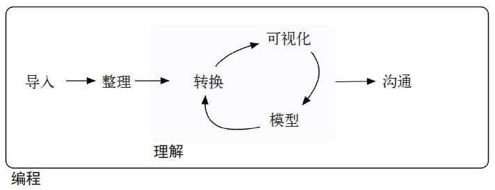
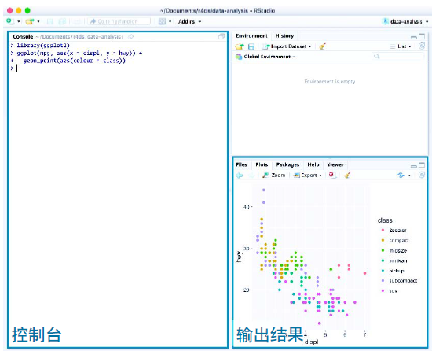

# Introduction

Data science is an exciting discipline that allows you to turn raw data into understanding, insight, and knowledge. The goal of "R for Data Science" is to help you learn the most important tools in R that will allow you to do data science. After reading this book, you'll have the tools to tackle a wide variety of data science challenges, using the best parts of R. 

数据科学是一门激动人心的学科，它可以将原始数据转化为认识、见解和知识。本书的目标是帮助你学习使用R语言中最重要的数据科学工具。读完本书后，你将掌握R语言的精华，并能够熟练使用多种工具来解决各种数据科学难题。

## What you will learn | 你将学到什么 

Data science is a huge field, and there's no way you can master it by reading a single book. The goal of this book is to give you a solid foundation in the most important tools. Our model of the tools needed in a typical data science project looks something like this:

数据科学是一个极其广阔的领域，仅靠一本书是不可能登堂入室的。本书的目标是教会你使用最重要的数据科学工具。在一个典型的数据科学项目中，需要的工具模型大体如下图所示。

```{r echo = FALSE, out.width = "75%"}
knitr::include_graphics("diagrams/data-science.png")
```

```{r echo = FALSE, out.width = "75%"}

```

First you must __import__ your data into R. This typically means that you take data stored in a file, database, or web application programming interface (API), and load it into a data frame in R. If you can't get your data into R, you can't do data science on it!

首先，你必须将数据导入R。这实际上就是读取保存在文件、数据库或 Web API 中的数据，再加载到R的数据框中。如果不能将数据导入R，那么数据科学就根本无从谈起。

Once you've imported your data, it is a good idea to __tidy__ it. Tidying your data means storing it in a consistent form that matches the semantics of the dataset with the way it is stored. In brief, when your data is tidy, each column is a variable, and each row is an observation. Tidy data is important because the consistent structure lets you focus your struggle on questions about the data, not fighting to get the data into the right form for different functions.

导入数据后，就应该对数据进行整理。数据整理就是将数据保存为一致的形式，以满足其所在数据集在语义上的要求。简而言之，如果数据是整洁的，那么每列都是一个变量，每行都是一个观测。整洁的数据非常重要，因为一致的数据结构可以让你将工作重点放在与数据有关的问题上，而不用再费尽心思地将数据转换为各种形式以适应不同的函数。

Once you have tidy data, a common first step is to __transform__ it. Transformation includes narrowing in on observations of interest (like all people in one city, or all data from the last year), creating new variables that are functions of existing variables (like computing speed from distance and time), and calculating a set of summary statistics (like counts or means). Together, tidying and transforming are called __wrangling__, because getting your data in a form that's natural to work with often feels like a fight!

一旦拥有了整洁的数据，通常下一步就是对数据进行转换。数据转换包括选取出感兴趣的观测（如居住在某个城市里的所有人，或者去年的所有数据）、使用现有变量创建新变量（如根据距离和时间计算出速度），以及计算一些摘要统计量（如计数或均值）。数据整理和数据转换统称为数据处理。

Once you have tidy data with the variables you need, there are two main engines of knowledge generation: visualisation and modelling. These have complementary strengths and weaknesses so any real analysis will iterate between them many times.

一旦使用需要的变量完成了数据整理，那么生成知识的方式主要有两种：可视化与建模。这两种方式各有利弊，相辅相成。因此，所有实际的数据分析过程都要在这两种方式间多次重复。

__Visualisation__ is a fundamentally human activity. A good visualisation will show you things that you did not expect, or raise new questions about the data. A good visualisation might also hint that you're asking the wrong question, or you need to collect different data. Visualisations can surprise you, but don't scale particularly well because they require a human to interpret them.

可视化本质上是人类活动。良好的可视化会让你发现意料之外的现象，或对数据提出新的问题。你还可以从良好的可视化中意识到自己提出了错误的问题，或者需要收集不同的数据。可视化能够带给你惊喜，但不要期望过高，因为毕竟还是需要人来对其进行解释。

__Models__ are complementary tools to visualisation. Once you have made your questions sufficiently precise, you can use a model to answer them. Models are a fundamentally mathematical or computational tool, so they generally scale well. Even when they don't, it's usually cheaper to buy more computers than it is to buy more brains! But every model makes assumptions, and by its very nature a model cannot question its own assumptions. That means a model cannot fundamentally surprise you.

模型是弥补可视化缺点的一种工具。如果已经将问题定义得足够清晰，那么你就可以使用一个模型来回答问题。因为模型本质上是一种数学工具或计算工具，所以它们的扩展性一般非常好。即使扩展性出现问题，购买更多计算机也比雇用更多聪明的人便宜！但是每个模型都有前提假设，而且模型本身不会对自己的前提假设提出疑问，这就意味着模型本质上不能给你带来惊喜。

The last step of data science is __communication__, an absolutely critical part of any data analysis project. It doesn't matter how well your models and visualisation have led you to understand the data unless you can also communicate your results to others.

数据科学的最后一个步骤就是沟通。对于任何数据分析项目来说，沟通绝对是一个极其重要的环节。如果不能与他人交流分析结果，那么不管模型和可视化让你对数据理解得多么透彻，这都是没有任何实际意义的。

Surrounding all these tools is __programming__. Programming is a cross-cutting tool that you use in every part of the project. You don't need to be an expert programmer to be a data scientist, but learning more about programming pays off because becoming a better programmer allows you to automate common tasks, and solve new problems with greater ease.

围绕在这些技能之外的是编程。编程是贯穿数据科学项目各个环节的一项技能。数据科学家不一定是编程专家，但掌握更多的编程技能总是有好处的，因为这样你就能够对日常任务进行自动处理，并且非常轻松地解决新的问题。

You'll use these tools in every data science project, but for most projects they're not enough. There's a rough 80-20 rule at play; you can tackle about 80% of every project using the tools that you'll learn in this book, but you'll need other tools to tackle the remaining 20%. Throughout this book we'll point you to resources where you can learn more.

你将在所有的数据科学项目中用到这些工具，但对于多数项目来说，这些工具还不够。这大致符合80/20定律：你可以使用从本书中学到的工具来解决每个项目中80%的问题，但你还需要其他工具来解决其余 20% 的问题。我们将在本书中为你提供资源，让你能够学到更多的技能。

## How this book is organised | 本书的组织结构

The previous description of the tools of data science is organised roughly according to the order in which you use them in an analysis (although of course you'll iterate through them multiple times). In our experience, however, this is not the best way to learn them:

前面对数据科学工具的描述大致是按照我们在分析中使用它们的顺序来组织的（尽管你肯定会多次使用它们）。然而，根据我们的经验，这并不是学习它们的最佳方式，具体原因如下。

* Starting with data ingest and tidying is sub-optimal because 80% of the time 
  it's routine and boring, and the other 20% of the time it's weird and
  frustrating. That's a bad place to start learning a new subject! Instead, 
  we'll start with visualisation and transformation of data that's already been
  imported and tidied. That way, when you ingest and tidy your own data, your
  motivation will stay high because you know the pain is worth it.
  
* 从数据导入和数据整理开始学习并不是最佳方式，因为对于导入和整理数据来说，80%的时间是乏味和无聊的，其余20%的时间则是诡异和令人沮丧的。在学习一项新技术时，这绝对是一个糟糕的开始！相反，我们将从数据可视化和数据转换开始，此时的数据已经导入并且是整理完毕的。这样一来，当导入和整理自己的数据时，你就会始终保持高昂的斗志，因为你知道这种痛苦终有回报。
  
* Some topics are best explained with other tools. For example, we believe that
  it's easier to understand how models work if you already know about 
  visualisation, tidy data, and programming.
  
* 有些主题最好结合其他工具来解释。例如，如果你已经了解可视化、数据整理和编程，那么我们认为你会更容易理解模型是如何工作的。
  
* Programming tools are not necessarily interesting in their own right, 
  but do allow you to tackle considerably more challenging problems. We'll
  give you a selection of programming tools in the middle of the book, and 
  then you'll see how they can combine with the data science tools to tackle 
  interesting modelling problems.
  
* 编程工具本身不一定很有趣，但它们确实可以帮助你解决更多非常困难的问题。在本书的中间部分，我们会介绍一些编程工具，它们可以与数据科学工具结合起来以解决非常有趣的建模问题。

Within each chapter, we try and stick to a similar pattern: start with some motivating examples so you can see the bigger picture, and then dive into the details. Each section of the book is paired with exercises to help you practice what you've learned. While it's tempting to skip the exercises, there's no better way to learn than practicing on real problems.

我们尽量在每一章中使用同一种模式：先给出一些引人入胜的示例，以便你大体了解这一章的内容，然后再深入细节。本书的每一节都配有习题，以帮助你实践所学到的知识。虽然跳过这些习题是个非常有诱惑力的想法，但使用真实问题进行练习绝对是最好的学习方式。

## What you won't learn ｜ 本书未包含的内容

There are some important topics that this book doesn't cover. We believe it's important to stay ruthlessly focused on the essentials so you can get up and running as quickly as possible. That means this book can't cover every important topic.

本书并未涉及一些重要主题。我们深信，重要的是将注意力坚定地集中在最基本的内容上，这样你就可以尽快入门并开展实际工作。这也就是说，本书不会涵盖每一个重要主题。

### Big data | 大数据

This book proudly focuses on small, in-memory datasets. This is the right place to start because you can't tackle big data unless you have experience with small data. The tools you learn in this book will easily handle hundreds of megabytes of data, and with a little care you can typically use them to work with 1-2 Gb of data. If you're routinely working with larger data (10-100 Gb, say), you should learn more about [data.table](https://github.com/Rdatatable/data.table). This book doesn't teach data.table because it has a very concise interface which makes it harder to learn since it offers fewer linguistic cues. But if you're working with large data, the performance payoff is worth the extra effort required to learn it.

本书主要讨论那些小规模的、能够驻留在内存中的数据集。这是开始学习数据科学的正确方式，因为只有处理过小数据集，你才能处理大数据集。你从本书中学到的工具可以轻松地处理几百兆字节的数据，处理 1~2 GB 的数据也不会有什么大问题。如果你的日常工作是处理更大的数据（如 10~100  GB），那么你应该更多地学习一下 data.table（https://github.com/Rdatatable/data.table ）。本书不会介绍data.table，因为它的界面太过简洁，几乎没有语言提示，这使得学习起来很困难。但是如果你需要处理大数据，为了获得性能上的回报， 多付出一些努力来学习它还是值得的。

If your data is bigger than this, carefully consider if your big data problem might actually be a small data problem in disguise. While the complete data might be big, often the data needed to answer a specific question is small. You might be able to find a subset, subsample, or summary that fits in memory and still allows you to answer the question that you're interested in. The challenge here is finding the right small data, which often requires a lot of iteration.

如果你的数据比这还大，那么就需要仔细思考一下了，这个大数据问题是否其实就是一个小数据问题。虽然整体数据非常大，但回答特定问题所需要的数据通常较小。你可以找出一个子集、子样本或者摘要数据，该数据既适合在内存中处理，又可以回答你感兴趣的问题。此时的挑战就是如何找到合适的小数据，这通常需要多次迭代。

Another possibility is that your big data problem is actually a large number of small data problems. Each individual problem might fit in memory, but you have millions of them. For example, you might want to fit a model to each person in your dataset. That would be trivial if you had just 10 or 100 people, but instead you have a million. Fortunately each problem is independent of the others (a setup that is sometimes called embarrassingly parallel), so you just need a system (like Hadoop or Spark) that allows you to send different datasets to different computers for processing. Once you've figured out how to answer the question for a single subset using the tools described in this book, you learn new tools like sparklyr, rhipe, and ddr to solve it for the full dataset.

另外一种可能是，你的大数据问题实际上就是大量的小数据问题。每一个问题都可以在内存中处理，但你有数百万个这样的问题。举例来说，假设你想为数据集中的每个人都拟合一个模型。如果只有 10 人或 100 人，那这是小菜一碟，但如果有100万人，情况就完全不同了。好在每个问题都是独立于其他问题的（这种情况有时称为高度并行， embarrassingly parallel），因此你只需要一个可以将不同数据集发送到不同计算机上进行处理的系统（如 Hadoop 或 Spark）即可。如果已经知道如何使用本书中介绍的工具来解决独立子集的问题，那么你就可以学习一下新的工具（比如sparklyr、rhipe 和 ddr）来解决整个数据集的问题。

### Python, Julia, and friends | Python、Julia以及类似的语言

In this book, you won't learn anything about Python, Julia, or any other programming language useful for data science. This isn't because we think these tools are bad. They're not! And in practice, most data science teams use a mix of languages, often at least R and Python.

在本书中，你不会学到有关 Python、Julia 以及其他用于数据科学的编程语言的任何内容。这并不是因为我们认为这些工具不好，它们都很不错！实际上，多数数据科学团队都会使用多种语言，至少会同时使用 R 和 Python。

However, we strongly believe that it's best to master one tool at a time. You will get better faster if you dive deep, rather than spreading yourself thinly over many topics. This doesn't mean you should only know one thing, just that you'll generally learn faster if you stick to one thing at a time. You should strive to learn new things throughout your career, but make sure your understanding is solid before you move on to the next interesting thing.

但是，我们认为最好每次只学习并精通一种工具。如果你潜心研究一种工具，那么会比同时泛泛地学习多个工具掌握得更快。这并不是说你只应该精通一种工具，而是说每次专注于一件事情时，通常你会进步得更快。在整个职业生涯中，你都应该努力学习新事物，但是一定要在充分理解原有知识后，再去学习感兴趣的新知识。

We think R is a great place to start your data science journey because it is an environment designed from the ground up to support data science. R is not just a programming language, but it is also an interactive environment for doing data science. To support interaction, R is a much more flexible language than many of its peers. This flexibility comes with its downsides, but the big upside is how easy it is to evolve tailored grammars for specific parts of the data science process. These mini languages help you think about problems as a data scientist, while supporting fluent interaction between your brain and the computer.

我们认为 R 是你开始数据科学旅程的一个非常好的起点，因为它从根本上说就是一种用来支持数据科学的环境。R不仅仅是一门编程语言，它还是进行数据科学工作的一种交互式环境。为了支持交互性，R比多数同类语言灵活得多。虽然会导致一些缺点，但这种灵活性的一大好处是，可以非常容易地为数据科学过程中的某些环节量身定制语法。这些微型语言有助于你从数据科学家的角度来思考问题，还可以在你的大脑和计算机之间建立流畅的交流方式。

### Non-rectangular data | 非矩形数据

This book focuses exclusively on rectangular data: collections of values that are each associated with a variable and an observation. There are lots of datasets that do not naturally fit in this paradigm, including images, sounds, trees, and text. But rectangular data frames are extremely common in science and industry, and we believe that they are a great place to start your data science journey.

本书仅关注矩形数据。矩形数据是值的集合，集合中的每个值都与一个变量和一个观测相关。很多数据集天然地不符合这种规范，比如图像、声音、树结构和文本。但是矩形数据框架在科技与工业领域是非常普遍的。我们认为它是开始数据科学旅途的一个非常好的起点。

### Hypothesis confirmation | 假设验证

It's possible to divide data analysis into two camps: hypothesis generation and hypothesis confirmation (sometimes called confirmatory analysis). The focus of this book is unabashedly on hypothesis generation, or data exploration. Here you'll look deeply at the data and, in combination with your subject knowledge, generate many interesting hypotheses to help explain why the data behaves the way it does. You evaluate the hypotheses informally, using your scepticism to challenge the data in multiple ways.

数据分析可以分为两类：假设生成和假设验证（有时称为验证性分析）。无须掩饰，本书的重点就在于假设生成，或者说是数据探索。我们将对数据进行深入研究，并结合专业知识生成多种有趣的假设来帮助你对数据的行为方式作出解释。你可以对这些假设进行非正式的评估，凭借自己的怀疑精神从多个方面向数据发起挑战。

The complement of hypothesis generation is hypothesis confirmation. Hypothesis confirmation is hard for two reasons:

假设验证与假设生成是互补的。假设验证比较困难，原因如下。

1.  You need a precise mathematical model in order to generate falsifiable
    predictions. This often requires considerable statistical sophistication.

你需要一个精确的数学模型来生成可证伪的预测，这通常需要深厚的统计学修养。

1.  You can only use an observation once to confirm a hypothesis. As soon as
    you use it more than once you're back to doing exploratory analysis. 
    This means to do hypothesis confirmation you need to "preregister" 
    (write out in advance) your analysis plan, and not deviate from it
    even when you have seen the data. We'll talk a little about some 
    strategies you can use to make this easier in [modelling](#model-intro).
    
为了验证假设，每个观测只能使用一次。一旦使用观测的次数超过了一次，那么就回到了探索性分析。这意味着，若要进行假设验证，你需要“预先注册”（事先拟定好）自己的分析计划，而且看到数据后也不能改变计划。在本书的第四部分中，我们将讨论一些相关的策略，你可以使用它们让假设验证变得更容易。

It's common to think about modelling as a tool for hypothesis confirmation, and visualisation as a tool for hypothesis generation. But that's a false dichotomy: models are often used for exploration, and with a little care you can use visualisation for confirmation. The key difference is how often do you look at each observation: if you look only once, it's confirmation; if you look more than once, it's exploration.

经常有人认为建模是用来进行假设验证的工具，而可视化是用来进行假设生成的工具。这种简单的二分法是错误的：模型经常用于数据探索；只需稍作处理，可视化也可以用来进行假设验证。核心区别在于你使用每个观测的频率：如果只用一次，那么就是假设验证；如果多于一次，那么就是数据探索。

## Prerequisites | 准备工作

We've made a few assumptions about what you already know in order to get the most out of this book. You should be generally numerically literate, and it's helpful if you have some programming experience already. If you've never programmed before, you might find [Hands on Programming with R](http://amzn.com/1449359019) by Garrett to be a useful adjunct to this book.

为了最有效地利用本书，我们对你的知识结构做了一些假设。你应该具有一定的数学基础，如果有一些编程经验也会有所帮助。如果从来没有编写过程序，那么你应该学习一下Garrett 所著的《R 语言入门与实践》（有关本书的详细信息，请参见图灵社区：http://www.ituring.com.cn/book/1540。），它可以作为本书的有益补充。

There are four things you need to run the code in this book: R, RStudio, a collection of R packages called the __tidyverse__, and a handful of other packages. Packages are the fundamental units of reproducible R code. They include reusable functions, the documentation that describes how to use them, and sample data. 

为了运行本书中的代码，你需要 4 个工具：R、RStudio、一个称为 tidyverse 的 R 包集合， 以及另外几个R 包。包是可重用R 代码的基本单位，它们包括可重用的函数、描述函数使用方法的文档以及示例数据。

### R 

To download R, go to CRAN, the **c**omprehensive **R** **a**rchive **n**etwork. CRAN is composed of a set of mirror servers distributed around the world and is used to distribute R and R packages. Don't try and pick a mirror that's close to you: instead use the cloud mirror, <https://cloud.r-project.org>, which automatically figures it out for you.

可以在 CRAN（comprehensive R archive network）下载 R。CRAN 由分布在世界各地的很多镜像服务器组成，用于分发R 和 R 包。不要尝试选择离你近的服务器，而应该使用云镜像：https://cloud.r-project.org，它会自动找出离你最近的服务器。

A new major version of R comes out once a year, and there are 2-3 minor releases each year. It's a good idea to update regularly. Upgrading can be a bit of a hassle, especially for major versions, which require you to reinstall all your packages, but putting it off only makes it worse.

R 的主版本一年发布一次，每年也会发布两三个次版本，因此你应该定期更新。更新 R有一点麻烦，特别是更新主版本会要求你重新安装所有的R 包，但是如果不更新的话，麻烦会更多。

### RStudio

RStudio is an integrated development environment, or IDE, for R programming. Download and install it from <http://www.rstudio.com/download>. RStudio is updated a couple of times a year. When a new version is available, RStudio will let you know. It's a good idea to upgrade regularly so you can take advantage of the latest and greatest features. For this book, make sure you have at least RStudio 1.0.0.

RStudio 是用于 R 编程的一种集成开发环境（integrated development environment，IDE）。你可以从 http://www.rstudio.com/download 下载并安装。RStudio 每年会更新多次。当有新版本时， RStudio 会进行通知。应该定期更新，这样你就可以使用其最新、最强大的功能。为了运行本书中的代码，请确认安装了 RStudio 1.0.0。

When you start RStudio, you'll see two key regions in the interface:

启动 RStudio 后，你会看到界面有以下两个关键区域。

```{r echo = FALSE, out.width = "75%"}
knitr::include_graphics("diagrams/rstudio-console.png")
```

```{r echo = FALSE, out.width = "75%"}

```

For now, all you need to know is that you type R code in the console pane, and press enter to run it. You'll learn more as we go along!

现在，你只要知道可以在控制台窗格中输入R 代码，然后按回车键运行就够了。在学习本书的过程中，你会学到 RStudio 的更多使用方法。

### The tidyverse

You'll also need to install some R packages. An R __package__ is a collection of functions, data, and documentation that extends the capabilities of base R. Using packages is key to the successful use of R. The majority of the packages that you will learn in this book are part of the so-called tidyverse. The packages in the tidyverse share a common philosophy of data and R programming, and are designed to work together naturally. 

你还需要安装一些 R 包。R 包是函数、数据和文档的集合，是对 R 基础功能的扩展。只有学会如何使用 R 包，才能真正掌握 R 语言的精华。你在本书中学习的大多数 R 包都是tidyverse 的一部分。tidyverse 中的 R 包有着同样的数据处理与编程理念，它们的设计从根本上就是为了协同工作。

You can install the complete tidyverse with a single line of code:

你可以用一行代码完整地安装 tidyverse：

```{r, eval = FALSE}
if(!requireNamespace("tidyverse", quietly = TRUE)){
  install.packages("tidyverse")
}
```

On your own computer, type that line of code in the console, and then press enter to run it. R will download the packages from CRAN and install them on to your computer. If you have problems installing, make sure that you are connected to the internet, and that <https://cloud.r-project.org/> isn't blocked by your firewall or proxy. 

在计算机上启动 RStudio 并在控制台中输入这行代码，然后按回车键来运行。R 会从CRAN 下载这个包并将其安装在你的计算机上。如果安装有问题，请先确认你连接了互联网，再确认 https://cloud.r-project.org 没有被你的防火墙或代理服务器阻拦。

You will not be able to use the functions, objects, and help files in a package until you load it with `library()`. Once you have installed a package, you can load it with the `library()` function:

如果没有使用 library() 函数加载R 包，那么你就不能使用其中的函数、对象和帮助文件。一旦 R 包安装完成，你就可以使用 library() 函数进行加载：

```{r}
library(tidyverse)
```

This tells you that tidyverse is loading the ggplot2, tibble, tidyr, readr, purrr, and dplyr packages. These are considered to be the __core__ of the tidyverse because you'll use them in almost every analysis. 

以上结果表明，tidyverse 正在加载 R 包 ggplot2、tibble、readr、purrr 和 dplyr。这些包被视为 tidyverse 的核心，因为几乎在所有的分析中都会用到它们。

Packages in the tidyverse change fairly frequently. You can see if updates are available, and optionally install them, by running `tidyverse_update()`.

tidyverse 中的包修改得相当频繁。你可以通过运行tidyverse_update() 函数来检查是否有更新，并选择是否进行更新。

### Other packages | 其他包

There are many other excellent packages that are not part of the tidyverse, because they solve problems in a different domain, or are designed with a different set of underlying principles. This doesn't make them better or worse, just different. In other words, the complement to the tidyverse is not the messyverse, but many other universes of interrelated packages. As you tackle more data science projects with R, you'll learn new packages and new ways of thinking about data. 

还有很多优秀的 R 包没有包含在 tidyverse 中，这是因为它们解决的是其他领域中的问题，或者它们遵循的是另外一套基本设计原则。它们不分优劣，只是不同而已。换句话说，与tidyverse 互补的不是 messyverse，而是其他所有相互关联的 R 包。在使用 R 完成越来越多的数据科学项目的过程中，你会不断发现新的包，也会不断更新对数据的认识。

In this book we'll use three data packages from outside the tidyverse:

```{r, eval = FALSE}
install.packages(c("nycflights13", "gapminder", "Lahman"))
```

These packages provide data on airline flights, world development, and baseball that we'll use to illustrate key data science ideas.

## Running R code | 运行R代码

The previous section showed you a couple of examples of running R code. Code in the book looks like this:

前面展示了运行 R 代码的几个示例。本书以如下方式展示 R 代码：

```{r, eval = TRUE}
1 + 2
```

If you run the same code in your local console, it will look like this:

如果在本地控制台中运行同样的代码，将得到如下结果：

```
> 1 + 2
[1] 3
```

There are two main differences. In your console, you type after the `>`, called the __prompt__; we don't show the prompt in the book. In the book, output is commented out with `#>`; in your console it appears directly after your code. These two differences mean that if you're working with an electronic version of the book, you can easily copy code out of the book and into the console.

这里有两处主要区别。在控制台中，需要在>（提示符）后面输入代码，但本书不显示提示符。书中的输出结果被#>注释掉了，但是控制台中的输出结果则直接显示在代码后面。这样一来，如果你阅读的是本书电子版，你就可以轻松地将代码从书中复制到控制台。

Throughout the book we use a consistent set of conventions to refer to code:

全书使用一致的规则来表示代码。

* Functions are in a code font and followed by parentheses, like `sum()`, 
  or `mean()`.

* 函数与代码的字体相同，并且其后有圆括号，如 sum() 或 mean()。

* Other R objects (like data or function arguments) are in a code font,
  without parentheses, like `flights` or `x`.
  
* 其他 R 对象（比如数据或函数参数）也使用代码字体，但其后没有圆括号，如 flights 或 x。
  
* If we want to make it clear what package an object comes from, we'll use
  the package name followed by two colons, like `dplyr::mutate()`, or   
  `nycflights13::flights`. This is also valid R code.
  
* 如果想要明确指出对象来自于哪个 R 包，那么我们会在包的名称后面加两个冒号，如`dplyr::mutate()` 或 `nycflights13::flights`；R 代码也支持这种形式。

## Getting help and learning more ｜ 获取帮助及更多学习资源

This book is not an island; there is no single resource that will allow you to master R. As you start to apply the techniques described in this book to your own data you will soon find questions that we do not answer. This section describes a few tips on how to get help, and to help you keep learning.

本书并非知识孤岛，单单利用一种资源是无法精通R语言的。当开始将本书介绍的技术应用于自己的数据时，你很快就会发现本书并未解答所有问题。本节将介绍几个获取帮助的小技巧，以帮助你持续地学习。

If you get stuck, start with Google. Typically adding "R" to a query is enough to restrict it to relevant results: if the search isn't useful, it often means that there aren't any R-specific results available. Google is particularly useful for error messages. If you get an error message and you have no idea what it means, try googling it! Chances are that someone else has been confused by it in the past, and there will be help somewhere on the web. (If the error message isn't in English, run `Sys.setenv(LANGUAGE = "en")` and re-run the code; you're more likely to find help for English error messages.)

如果遇到问题，首先应该求助于Google。通常来说，在查询内容时加上一个“R”，就足以得到与R相关的结果。如果查不到有用的结果，这意味着目前还没有特定的 R 解决方案。Google特别适合查询错误消息。如果收到一条错误消息，但根本不知道其含义，那就用Google 搜索一下吧！很可能有人遇到过这种错误，而答案就在网上。（如果错误消息不是英文，可以运行 Sys.setenv(LANGUAGE ="en")，接着重新运行代码；使用英文错误消息进行查询更可能获得帮助。）

If Google doesn't help, try [stackoverflow](http://stackoverflow.com). Start by spending a little time searching for an existing answer, including `[R]` to restrict your search to questions and answers that use R. If you don't find anything useful, prepare a minimal reproducible example or __reprex__.  A good reprex makes it easier for other people to help you, and often you'll figure out the problem yourself in the course of making it.

如果 Google 没有奏效，那么可以试试 Stack Overflow。先花点时间搜索一下现成的答案； 使用 [R] 可以将搜索范围限定在与 R 相关的问题和答案中。如果没有发现任何有用的内容，那么就准备一个最简单的可重现实例，即 reprex。良好的 reprex 让你更容易从他人那里获得帮助，而且在准备 reprex 时，你往往自己就能发现问题所在。

There are three things you need to include to make your example reproducible: required packages, data, and code.

reprex 的准备工作应该包括 3 项内容：所需 R 包、数据和代码。

1.  **Packages** should be loaded at the top of the script, so it's easy to
    see which ones the example needs. This is a good time to check that you're
    using the latest version of each package; it's possible you've discovered
    a bug that's been fixed since you installed the package. For packages
    in the tidyverse, the easiest way to check is to run `tidyverse_update()`.

应该在脚本开头就加载 R 包，这样就会很容易知道 reprex 都需要哪些 R 包。应该趁机检查自己是否使用了每个 R 包的最新版本；你可能会发现，当安装了某个 R 包的最新版本后，问题就解决了。对于 tidyverse 中的 R 包来说，检查版本的最简单方式是运行tidyverse_update() 函数。

1.  The easiest way to include **data** in a question is to use `dput()` to 
    generate the R code to recreate it. For example, to recreate the `mtcars` 
    dataset in R, I'd perform the following steps:

在 reprex 中包含数据的最简单方法是使用 dput() 函数生成重建数据的 R 代码。例如， 要想在 R 中重建 mtcars 数据集，可以遵循以下步骤：
  
    1. Run `dput(mtcars)` in R
    在 R 中运行 dput(mtcars)
    2. Copy the output
    复制输出结果
    3. In my reproducible script, type `mtcars <- ` then paste.
    在可重现脚本中输入 mtcars <-，然后粘贴输出结果。
    
    Try and find the smallest subset of your data that still reveals
    the problem.
    应该努力找出依然能够反映问题的数据最小子集。

1.  Spend a little bit of time ensuring that your **code** is easy for others to
    read:
花一点时间确保别人可以轻松理解你的代码：

    * Make sure you've used spaces and your variable names are concise, yet
      informative.
    确保使用了空格，并且变量名简明扼要
    
    * Use comments to indicate where your problem lies.
    用注释来说明你的问题所在
    
    * Do your best to remove everything that is not related to the problem.  
    尽最大努力去除所有与问题不相关的内容。
      The shorter your code is, the easier it is to understand, and the 
      easier it is to fix.
      代码越短，越容易理解，问题也就越容易解决。
    

Finish by checking that you have actually made a reproducible example by starting a fresh R session and copying and pasting your script in. 

启动一个新的 R 会话，将你的脚本复制并粘贴进去，检查 reprex 是否已经准备完毕。

You should also spend some time preparing yourself to solve problems before they occur. Investing a little time in learning R each day will pay off handsomely in the long run. One way is to follow what Hadley, Garrett, and everyone else at RStudio are doing on the [RStudio blog](https://blog.rstudio.org). This is where we post announcements about new packages, new IDE features, and in-person courses. You might also want to follow Hadley ([\@hadleywickham](https://twitter.com/hadleywickham)) or Garrett ([\@statgarrett](https://twitter.com/statgarrett)) on Twitter, or follow [\@rstudiotips](https://twitter.com/rstudiotips) to keep up with new features in the IDE.

你还应该花些时间来防患于未然。每天花一点时间学习 R，长远来看你将获得丰厚的回报。可以在 RStudio 博客上关注 Hadley、Garrett 和其他 RStudio 开发人员的动态。我们会在博客上发布有关新 R 包、新 IDE 功能和面授课程的一些公告。你还可以在 Twitter 上关注 Hadley（@hadleywickham）和 Garrett（@statgarrett），也可以关注 @rstudiotips 来了解 RStudio 的新功能。

To keep up with the R community more broadly, we recommend reading <http://www.r-bloggers.com>: it aggregates over 500 blogs about R from around the world. If you're an active Twitter user, follow the ([`#rstats`](https://twitter.com/search?q=%23rstats)) hashtag. Twitter is one of the key tools that Hadley uses to keep up with new developments in the community.

为了更好地掌握 R 社区的最新动态，我们建议你关注 R-bloggers 这个网站，该网站汇集了世界各地 500 多个关于 R 的博客。如果你是活跃的 Twitter 用户，可以关注 #rstats 这个主题标签。Twitter 是 Hadley 跟踪 R 社区最新发展的一个关键工具。

## Acknowledgements | 致谢

This book isn't just the product of Hadley and Garrett, but is the result of many conversations (in person and online) that we've had with the many people in the R community. There are a few people we'd like to thank in particular, because they have spent many hours answering our dumb questions and helping us to better think about data science:

本书不仅是 Hadley 和 Garrett 的作品，还是我们与 R 社区很多用户（面对面和线上）对话的结果。我们要特别感谢一些人，因为他们花费了很多时间来回答我们的问题，并帮助我们更加深刻地理解了数据科学。

* Jenny Bryan and Lionel Henry for many helpful discussions around working
  with lists and list-columns.
感谢 Jenny Bryan 和 Lionel Henry 就列表和列表列的使用与我们进行了多次有益的讨论。
  
* The three chapters on workflow were adapted (with permission), from
  <http://stat545.com/block002_hello-r-workspace-wd-project.html> by 
  Jenny Bryan.
感谢 Jenny Bryan 允许我们改编其文章“R basics, workspace and working directory, RStudio projects”，进而形成了本书关于工作流的 3 章内容。

* Genevera Allen for discussions about models, modelling, the statistical
  learning perspective, and the difference between hypothesis generation and 
  hypothesis confirmation.
感谢 Genevera Allen 与我们讨论模型、建模、统计学习前景以及假设生成和假设验证的区别。

* Yihui Xie for his work on the [bookdown](https://github.com/rstudio/bookdown) 
  package, and for tirelessly responding to my feature requests.
感谢谢益辉为 R 包 bookdown 所做的工作，同时还要感谢他不断满足我们的功能需求。

* Bill Behrman for his thoughtful reading of the entire book, and for trying 
  it out with his data science class at Stanford.
感谢 Bill Behrman 仔细通读了全书，并在其斯坦福数据科学课堂中试用了本书。

* The \#rstats twitter community who reviewed all of the draft chapters
  and provided tons of useful feedback.
感谢使用 #rstats 主题标签的所有 Twitter 用户，他们审阅了本书全部章节的草稿，并提供了大量有用的反馈。

* Tal Galili for augmenting his dendextend package to support a section on clustering that did not make it into the final draft.
感谢 Tal Galili 扩展了其 R 包 dendextend 以支持与聚类相关的一节，虽然最终稿中并未包含这项内容。

This book was written in the open, and many people contributed pull requests to fix minor problems. Special thanks goes to everyone who contributed via GitHub: 

本书是以开源方式写成的，很多人提出了修改意见并帮助改正了各种小问题。特别感谢所有通过 GitHub 为本书做出贡献的人们：

```{r, results = "asis", echo = FALSE, message = FALSE}
library(dplyr)
# git --no-pager shortlog -ns > contribs.txt
contribs <- readr::read_tsv("contribs.txt", col_names = c("n", "name"))

contribs <- contribs %>% 
  filter(!name %in% c("hadley", "Garrett", "Hadley Wickham",
                      "Garrett Grolemund")) %>% 
  arrange(name) %>% 
  mutate(uname = ifelse(!grepl(" ", name), paste0("@", name), name))

cat("Thanks go to all contributers in alphabetical order: ")
cat(paste0(contribs$uname, collapse = ", "))
cat(".\n")
```

## Colophon | 生成环境

An online version of this book is available at <http://r4ds.had.co.nz>. It will continue to evolve in between reprints of the physical book. The source of the book is available at <https://github.com/hadley/r4ds>. The book is powered by <https://bookdown.org> which makes it easy to turn R markdown files into HTML, PDF, and EPUB.

This book was built with:

本书的生成环境如下所示

```{r}
sessioninfo::session_info(c("tidyverse"))
```
