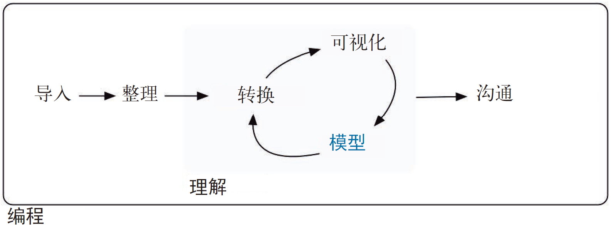

# (PART) Model | 模型 {-}

# Introduction | 简介 {#model-intro}

Now that you are equipped with powerful programming tools we can finally return to modelling. You'll use your new tools of data wrangling and programming, to fit many models and understand how they work. The focus of this book is on exploration, not confirmation or formal inference. But you'll learn a few basic tools that help you understand the variation within your models.

我们已经掌握了强大的编程工具，现在终于可以开始建模了。在这一部分中，我们将使用新的数据处理和编程工具来拟合多种模型，并理解其工作原理。本书的重点在于数据探索，而不是假设验证或正式推断，但你还是可以学到几种基本工具，以帮助你理解模型中的变化。

```{r echo = FALSE, out.width = "75%"}
knitr::include_graphics("diagrams/data-science-model.png")
```

```{r echo = FALSE, out.width = "75%"}

```

The goal of a model is to provide a simple low-dimensional summary of a dataset. Ideally, the model will capture true "signals" (i.e. patterns generated by the phenomenon of interest), and ignore "noise" (i.e. random variation that you're not interested in). Here we only cover "predictive" models, which, as the name suggests, generate predictions. There is another type of model that we're not going to discuss: "data discovery" models. These models don't make predictions, but instead help you discover interesting relationships within your data. (These two categories of models are sometimes called supervised and unsupervised, but I don't think that terminology is particularly illuminating.)

模型的作用是提供一个简单的、低维度的数据集摘要。理想情况下，模型可以捕获真正的“信号”（即由我们感兴趣的现象生成的模式），并忽略“噪声”（即我们不感兴趣的随机变动）。这里我们只介绍“预测”模型，顾名思义，也就是能够生成预测的模型。我们不打 算在本书中讨论另一类模型，即“数据发现”模型。这种模型的目标不是进行预测，而是 帮助我们发现数据中有趣的关系。（这两类模型有时分别称为监督式模型和非监督式模型， 但我们认为这两个术语不是很有启发性。）

This book is not going to give you a deep understanding of the mathematical theory that underlies models. It will, however, build your intuition about how statistical models work, and give you a family of useful tools that allow you to use models to better understand your data:

本书不会使得你对模型背后的数学理论有更深刻的理解，但会帮助你建立对统计模型工作原理的直观认识，并且会向你介绍一整套有用的工具，以便帮助你使用模型来更深刻地理解数据。

* In [model basics], you'll learn how models work mechanistically, focussing on
  the important family of linear models. You'll learn general tools for gaining
  insight into what a predictive model tells you about your data, focussing on
  simple simulated datasets.
  
  •	[model basics]将介绍模型的运行机制，重点在于一些重要的线性模型。你将掌握一些通用工具， 以深刻理解预测模型如何对数据进行预测。我们将主要使用简单的模拟数据集进行介绍。

* In [model building], you'll learn how to use models to pull out known
  patterns in real data. Once you have recognised an important pattern
  it's useful to make it explicit in a model, because then you can
  more easily see the subtler signals that remain.
  
  •	[model building]将介绍如何使用模型从真实数据中提取已知模式。一旦识别出一种重要模式， 那你就应该用一个模型将其明确表示出来，因为随后你就可以更容易地发现剩余的微妙信号。

* In [many models], you'll learn how to use many simple models to help 
  understand complex datasets. This is a powerful technique, but to access
  it you'll need to combine modelling and programming tools.
  
  •	[many models]将介绍如何使用多个简单模型来帮助理解复杂数据集。这是一种非常强大的技术， 但需要结合使用建模工具和编程工具才能掌握这种技术。

These topics are notable because of what they don't include: any tools for quantitatively assessing models. That is deliberate: precisely quantifying a model requires a couple of big ideas that we just don't have the space to cover here. For now, you'll rely on qualitative assessment and your natural scepticism. In [Learning more about models], we'll point you to other resources where you can learn more.

这些内容都非常重要，因为我们没有对定量评估模型工具做任何介绍。我们这样做是经过深思熟虑的：精确地量化模型需要大量背景知识，而本书无法一一介绍。现在，你能依靠的只有定性评估技术和自己的怀疑精神。[Learning more about models]会介绍一些其他资源，以供你进一步学习。

## Hypothesis generation vs. hypothesis confirmation | 假设生成和假设验证

In this book, we are going to use models as a tool for exploration, completing the trifecta of the tools for EDA that were introduced in Part 1. This is not how models are usually taught, but as you will see, models are an important tool for exploration. Traditionally, the focus of modelling is on inference, or for confirming that an hypothesis is true. Doing this correctly is not complicated, but it is hard. There is a pair of ideas that you must understand in order to do inference correctly:

在本书中，我们将模型作为一种数据探索工具，这样就补全了第一部分中介绍过的 EDA 三工具。这不是常用的模型学习方式，但正如你将看到的，模型确实是一种重要的数据探索工具。通常来说，建模的重点在于推断或验证假设是否为真。正确地完成这些任务并不复杂，但相当困难。为了正确进行推断，你必须明确以下两点。

1. Each observation can either be used for exploration or confirmation, 
   not both.
   
   •	每个观测都可以用于数据探索，也可以用于假设验证，但不能同时在二者中使用。

1. You can use an observation as many times as you like for exploration,
   but you can only use it once for confirmation. As soon as you use an 
   observation twice, you've switched from confirmation to exploration.
   
   •	在进行数据探索时，一个观测可以使用任意多次，但进行假设验证时，一个观测只能使用一次。一旦使用两次观测，假设验证就会变成数据探索。
   
This is necessary because to confirm a hypothesis you must use data independent of the data that you used to generate the hypothesis. Otherwise you will be over optimistic. There is absolutely nothing wrong with exploration, but you should never sell an exploratory analysis as a confirmatory analysis because it is fundamentally misleading. 

这两点是非常必要的，因为要想验证假设，你必须使用与生成假设的数据无关的数据。否则，你就过于乐观了。在进行数据探索时，没有完全错误的结论，但永远不能将探索性分析与验证性分析混为一谈，因为这样做肯定会让你误入歧途。

If you are serious about doing an confirmatory analysis, one approach is to split your data into three pieces before you begin the analysis:

如果想要严肃认真地进行验证性分析，一种方法是在进行分析前将数据分成 3 个部分。

1.  60% of your data goes into a __training__ (or exploration) set. You're 
    allowed to do anything you like with this data: visualise it and fit tons 
    of models to it.
    
    •	将 60% 的数据作为训练集，或称探索集。你可以对这部分数据进行任意操作，比如可视化，或者用数据拟合多个模型。
  
1.  20% goes into a __query__ set. You can use this data to compare models 
    or visualisations by hand, but you're not allowed to use it as part of
    an automated process.
    
    •	将 20% 的数据作为查询集。你可以使用这部分数据来比较模型或者进行手动可视化， 但不能将其用于自动化过程。

1.  20% is held back for a __test__ set. You can only use this data ONCE, to 
    test your final model. 
    
    •	将 20% 的数据留作测试集。这部分数据只能使用一次，用于测试最终模型。
    
This partitioning allows you to explore the training data, occasionally generating candidate hypotheses that you check with the query set. When you are confident you have the right model, you can check it once with the test data.

通过这种数据划分方法，你可以使用训练集数据进行探索，偶尔生成候选假设，并使用查询集数据进行验证。确信已经得到正确的模型后，你就可以使用测试集数据进行一次验证了。

(Note that even when doing confirmatory modelling, you will still need to do EDA. If you don't do any EDA you will remain blind to the quality problems with your data.)

（注意，即使正在进行验证性建模，你还是需要做 EDA。如果不做任何 EDA，那么你就会对数据的质量问题一无所知。）
