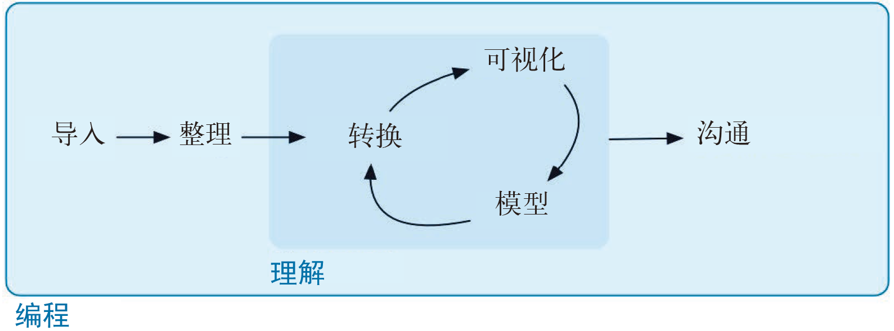

# (PART) Program | 编程 {-}

# Introduction | 简介 {#program-intro}

In this part of the book, you'll improve your programming skills. Programming is a cross-cutting skill needed for all data science work: you must use a computer to do data science; you cannot do it in your head, or with pencil and paper. 

这一部分致力于提高你的编程技能。编程是所有数据科学工作都不可或缺的一项技能：你必须使用计算机来进行数据科学工作，不可能在头脑中或使用纸和笔来进行。

```{r echo = FALSE, out.width = "75%"}
knitr::include_graphics("diagrams/data-science-program.png")
```

```{r echo = FALSE, out.width = "75%"}

```

Programming produces code, and code is a tool of communication. Obviously code tells the computer what you want it to do. But it also communicates meaning to other humans. Thinking about code as a vehicle for communication is important because every project you do is fundamentally collaborative. Even if you're not working with other people, you'll definitely be working with future-you! Writing clear code is important so that others (like future-you) can understand why you tackled an analysis in the way you did. That means getting better at programming also involves getting better at communicating. Over time, you want your code to become not just easier to write, but easier for others to read. 

编程产出代码，代码是一种沟通工具。很显然，代码可以告诉计算机你想要做什么，同时也可以用于人与人之间的交流。将代码当作一种沟通工具是非常重要的，因为现在所有项目基本上都要靠协作才能完成。即使你现在单枪匹马地工作，也肯定要与未来的自己进行交流！代码清晰易懂特别重要，这样其他人（包括未来的你）才能理解你为什么要使用这种方式进行分析。因此，提高编程能力的同时也要提高沟通能力。随着时间的推移，你不仅会希望代码更易于编写，还会希望它更容易为他人所理解。

Writing code is similar in many ways to writing prose. One parallel which I find particularly useful is that in both cases rewriting is the key to clarity. The first expression of your ideas is unlikely to be particularly clear, and you may need to rewrite multiple times. After solving a data analysis challenge, it's often worth looking at your code and thinking about whether or not it's obvious what you've done. If you spend a little time rewriting your code while the ideas are fresh, you can save a lot of time later trying to recreate what your code did. But this doesn't mean you should rewrite every function: you need to balance what you need to achieve now with saving time in the long run. (But the more you rewrite your functions the more likely your first attempt will be clear.)

写代码和写文章在很多方面是非常相似的。我们发现二者特别重要的一个共同之处是，要想让代码或文章更加清晰易懂，关键是重写。你对自己想法的第一次表达往往不是特别清晰，因此需要多次重写。解决一个数据分析难题后，我们通常应该再审视一下代码，思考一下它是否真正实现了我们的要求。当产生新想法时，如果花一点时间重写代码，就可以节省以后重构代码所需的大量时间。但这并不是说你应该重写所有功能。是尽快实现当前功能，还是从长远来看节约时间，你需要权衡一下。（不过，功能重写得越多，就越可能将最初想法表达得更清楚。）

In the following four chapters, you'll learn skills that will allow you to both tackle new programs and to solve existing problems with greater clarity and ease: 

以下 4 章中介绍的技能既可以帮助你编写新的程序，又能够让你更清晰、更容易地解决现有问题。

1.  In [pipes], you will dive deep into the __pipe__, `%>%`, and learn more 
    about how it works, what the alternatives are, and when not to use it.
    深入介绍管道操作，即 %>%，你将学习更多关于管道操作的工作原理和替代方式，以及不适合使用管道的情形。

1.  Copy-and-paste is a powerful tool, but you should avoid doing it more than
    twice. Repeating yourself in code is dangerous because it can easily lead 
    to errors and inconsistencies. Instead, in [functions], you'll learn
    how to write __functions__ which let you extract out repeated code so that 
    it can be easily reused.
    
    •	复制粘贴确实功能强大，但这种操作不应该超过两次。代码中的重复内容是非常危险的， 因为这样很容易导致错误和不一致。第 14 章会介绍如何编写函数，这是重复使用代码的一种方式，它可以让你提取出重复代码，然后轻松地进行重用。

1.  As you start to write more powerful functions, you'll need a solid
    grounding in R's __data structures__, provided by [vectors]. You must master 
    the four common atomic vectors, the three important S3 classes built on 
    top of them, and understand the mysteries of the list and data frame. 
    
    •	当开始编写功能更强大的函数时，你需要深刻理解 R 的数据结构，这就是第 15 章的内容。你必须掌握 4 种常用的原子向量，以及以此为基础构建的 3 种重要 S3 类，并理解列表和数据框背后的奥秘。

1.  Functions extract out repeated code, but you often need to repeat the
    same actions on different inputs. You need tools for __iteration__ that
    let you do similar things again and again. These tools include for loops 
    and functional programming, which you'll learn about in [iteration].
    
    •	函数可以提取出重复代码，但你经常需要对不同的输入重复相同的操作。你需要可以多次执行相同操作的迭代工具，这些工具包括 for 循环和函数式编程，这就是第 16 章将要介绍的内容。

## Learning more | 更多学习资源

The goal of these chapters is to teach you the minimum about programming that you need to practice data science, which turns out to be a reasonable amount. Once you have mastered the material in this book, I strongly believe you should invest further in your programming skills. Learning more about programming is a long-term investment: it won't pay off immediately, but in the long term it will allow you to solve new problems more quickly, and let you reuse your insights from previous problems in new scenarios.

以上各章的目的是让你掌握实践数据科学所必需的编程技能，其中的内容还是相当多的。如果你已经完全掌握了本书中的内容，我们坚信你还应该进一步拓展你的编程技能。学习更多编程技能是一项长期投资，虽然其效果不是立竿见影，但从长期来看，它可以让你更高效地解决新问题，也可以让你将从以前问题中获得的知识和经验应用于新的场景。

To learn more you need to study R as a programming language, not just an interactive environment for data science. We have written two books that will help you do so:

为了学到更多知识，你需要将 R 当作一门编程语言，而不只是数据科学的一种交互环境。我们已经出版了两本书来帮助你学习 R 编程。

* [_Hands on Programming with R_](https://amzn.com/1449359019),
  by Garrett Grolemund. This is an introduction to R as a programming language 
  and is a great place to start if R is your first programming language. It 
  covers similar material to these chapters, but with a different style and
  different motivation examples (based in the casino). It's a useful complement 
  if you find that these four chapters go by too quickly.
  
  •	《R 语言入门与实践》，Garrett Grolemund 著。这是 R 编程语言的一本入门书，如果 R 是你的第一门编程语言，那么从该书开始是非常合适的。该书的内容与上述各章非常相似，但使用了不同的风格和示例。如果你觉得这 4 章的内容过于简略，那么该书是一项重要补充。
  
* [_Advanced R_](https://amzn.com/1466586966) by Hadley Wickham. This dives into the
  details of R the programming language. This is a great place to start if you
  have existing programming experience. It's also a great next step once you've 
  internalised the ideas in these chapters. You can read it online at
  <http://adv-r.had.co.nz>.
  
  •	Advanced R，Hadley Wickham 著。该书深入介绍了 R 作为编程语言的各种细节。如果你已有编程经验，那么该书非常适合你。如果你已经掌握了上述 4 章的内容，那么该书也非常适合你继续学习。该书有在线版本。
