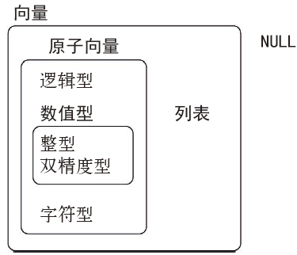

# Vectors | 向量

## Introduction | 简介

So far this book has focussed on tibbles and packages that work with them. But as you start to write your own functions, and dig deeper into R, you need to learn about vectors, the objects that underlie tibbles. If you've learned R in a more traditional way, you're probably already familiar with vectors, as most R resources start with vectors and work their way up to tibbles. I think it's better to start with tibbles because they're immediately useful, and then work your way down to the underlying components.

到目前为止，我们已经介绍过了 tibble 以及支持 tibble 的 R 包。但是，当开始编写函数或者更加深入地学习 R 时，你就会发现需要使用构成 tibble 的基础对象，即向量。如果曾经以更加传统的方式学习过 R，那么你应该已经对向量非常熟悉，因为多数 R 学习资源都是先介绍向量，然后才扩展到 tibble 的。我们则认为应该从 tibble 开始，因为它是即学即用的，熟悉 tibble 后，再来学习构成它的基础成分比较好。

Vectors are particularly important as most of the functions you will write will work with vectors. It is possible to write functions that work with tibbles (like ggplot2, dplyr, and tidyr), but the tools you need to write such functions are currently idiosyncratic and immature. I am working on a better approach, <https://github.com/hadley/lazyeval>, but it will not be ready in time for the publication of the book. Even when complete, you'll still need to understand vectors, it'll just make it easier to write a user-friendly layer on top.

向量特别重要，因为绝大多数自定义函数都要使用向量。也可以直接编写使用tibble 的函数（比如 ggplot2 和 dplyr 中的函数），但从目前来看，支持这种函数编写方式的工具还很不成熟。我们正在开发一种更好的工具，参见 https://github.com/hadley/lazyeval。即使有了更好的工具，你还是需要理解向量，因为使用向量更容易开发出用户友好的高阶函数。

### Prerequisites | 准备工作

The focus of this chapter is on base R data structures, so it isn't essential to load any packages. We will, however, use a handful of functions from the __purrr__ package to avoid some inconsistencies in base R.

本章的重点在于介绍 R 基础包中的数据结构，因此无须加载任何 R 包。但是，为了避免 R 基础包中的一些不一致现象，我们会使用 purrr 包中的少量函数。

```{r setup, message = FALSE}
library(tidyverse)
```

## Vector basics | 向量基础

There are two types of vectors: 向量的类型主要有两种。

1. __Atomic__ vectors, of which there are six types:
  __logical__, __integer__, __double__,  __character__, __complex__, and 
  __raw__. Integer and double vectors are collectively known as
  __numeric__ vectors. 
  
  •	原子向量，其共有 6 种类型：逻辑型、整型、双精度型、字符型、复数型和原始型。整型和双精度型向量又统称为数值型向量。

1. __Lists__,  which are sometimes called recursive vectors because lists can 
  contain other lists. 
  
  •	列表，有时又称为递归向量，因为列表中也可以包含其他列表。

The chief difference between atomic vectors and lists is that atomic vectors are __homogeneous__, while lists can be __heterogeneous__. There's one other related object: `NULL`. `NULL` is often used to represent the absence of a vector (as opposed to `NA` which is used to represent the absence of a value in a vector). `NULL` typically behaves like a vector of length 0. Figure \@ref(fig:datatypes) summarises the interrelationships. 

原子向量与列表之间的主要区别是，原子向量中的各个值都是同种类型的，而列表中的各个值可以是不同类型的。NULL 是一个与向量相关的对象，用于表示空向量（与表示向量中的一个值为空的 NA 不同），通常指长度为 0 的向量。图 15-1 总结了各种向量之间的联系。

```{r datatypes, echo = FALSE, out.width = "50%", fig.cap = "The hierarchy of R's vector types"}
knitr::include_graphics("diagrams/data-structures-overview.png")
```

```{r datatypes-cn, echo = FALSE, out.width = "50%", fig.cap = "R 向量类型的层次图"}

```

Every vector has two key properties: 每个向量都有两个关键属性。

1.  Its __type__, which you can determine with `typeof()`. •	类型。你可以使用 typeof() 函数来确定向量的类型：

    ```{r}
    typeof(letters)
    typeof(1:10)
    ```

1. Its __length__, which you can determine with `length()`. •	长度。你可以使用 length() 函数来确定向量的长度：

    ```{r}
    x <- list("a", "b", 1:10)
    length(x)
    ```

Vectors can also contain arbitrary additional metadata in the form of attributes. These attributes are used to create __augmented vectors__ which build on additional behaviour. There are three important types of augmented vector:

还可以向向量中任意添加额外的元数据，这些元数据称为特性。特性可以用来创建扩展向量，以执行一些新的操作。比较重要的扩展向量有 4 种类型。

* Factors are built on top of integer vectors. •	基于整型向量构建的因子。
* Dates and date-times are built on top of numeric vectors. •	基于数值型向量构建的日期和日期时间。
* Data frames and tibbles are built on top of lists. •	基于列表构建的数据框和 tibble。

This chapter will introduce you to these important vectors from simplest to most complicated. You'll start with atomic vectors, then build up to lists, and finish off with augmented vectors.

本章将由浅入深地介绍这些重要向量。首先是原子向量、然后是列表，最后是扩展向量。

## Important types of atomic vector | 重要的原子向量

The four most important types of atomic vector are logical, integer, double, and character. Raw and complex are rarely used during a data analysis, so I won't discuss them here.

4 种最重要的原子向量类型是逻辑型、整型、双精度型和字符型。原始型与复数型很少在数据分析中使用，因此不做介绍。

### Logical | 逻辑型

Logical vectors are the simplest type of atomic vector because they can take only three possible values: `FALSE`, `TRUE`, and `NA`. Logical vectors are usually constructed with comparison operators, as described in [comparisons]. You can also create them by hand with `c()`:

逻辑型向量是最简单的一种原子向量，因为它们只有 3 个可能的取值：FALSE、TRUE 和 NA。一般可以通过比较运算符来构建逻辑向量，我们已经在 3.2.1 节中介绍过这种运算符。你还可以通过 c() 函数来手工创建逻辑向量：

```{r}
1:10 %% 3 == 0

c(TRUE, TRUE, FALSE, NA)
```

### Numeric | 数值型

Integer and double vectors are known collectively as numeric vectors. In R, numbers are doubles by default. To make an integer, place an `L` after the number:

整型与双精度型向量统称为数值型向量。R 中默认数值是双精度型的。如果想要创建整型数值，可以在数字后面加一个 L：

```{r}
typeof(1)
typeof(1L)
1.5L
```

The distinction between integers and doubles is not usually important, but there are two important differences that you should be aware of:

整型和双精度型之间的区别一般并不重要，但你需要注意其中两个重要区别。

1.  Doubles are approximations. Doubles represent floating point numbers that 
    can not always be precisely represented with a fixed amount of memory. 
    This means that you should consider all doubles to be approximations. 
    For example, what is square of the square root of two?
    
    •	双精度型是近似值。双精度型表示的是浮点数，不能由固定数量的内存精确表示。这意味着你应该将所有双精度数当成近似值。例如，2 的平方根的平方是多少？

    ```{r}
    x <- sqrt(2) ^ 2
    x
    x - 2
    ```

    This behaviour is common when working with floating point numbers: most
    calculations include some approximation error. Instead of comparing floating
    point numbers using `==`, you should use `dplyr::near()` which allows for 
    some numerical tolerance.
    
    在处理浮点数时，这种现象非常普遍：多数计算都包括一些近似误差。在比较浮点数时，不能使用 ==，而应该使用 dplyr::near()，后者可以容忍一些数据误差。

1.  Integers have one special value: `NA`, while doubles have four:
    `NA`, `NaN`, `Inf` and `-Inf`. All three special values `NaN`, `Inf` and `-Inf` can arise during division:
    
    •	整型数据有 1 个特殊值 NA，而双精度型数据则有 4 个特殊值：NA、NaN、Inf 和 -Inf。其他 3 个特殊值都可以由除法产生：
   
    ```{r}
    c(-1, 0, 1) / 0
    ```

    Avoid using `==` to check for these other special values. Instead use the 
    helper functions `is.finite()`, `is.infinite()`, and `is.nan()`:
    
    不要使用 == 来检查这些特殊值，而应该使用辅助函数 is.finite()、is.infinite() 和 is.nan()。
    
    |                  |  0  | Inf | NA  | NaN |
    |------------------|-----|-----|-----|-----|
    | `is.finite()`    |  x  |     |     |     |
    | `is.infinite()`  |     |  x  |     |     |
    | `is.na()`        |     |     |  x  |  x  |
    | `is.nan()`       |     |     |     |  x  |

### Character | 字符型

Character vectors are the most complex type of atomic vector, because each element of a character vector is a string, and a string can contain an arbitrary amount of data. 

字符向量是最复杂的一种原子向量，因为其每个元素都是一个字符串，而字符串可以包含任意数量的数据。

You've already learned a lot about working with strings in [strings]. Here I wanted to mention one important feature of the underlying string implementation: R uses a global string pool. This means that each unique string is only stored in memory once, and every use of the string points to that representation. This reduces the amount of memory needed by duplicated strings. You can see this behaviour in practice with `pryr::object_size()`:

已经介绍了很多处理字符串的方法。这里我们要强调关于字符串基础实现的一个重要特征：R 使用的是全局字符串池。这意味着每个唯一的字符串在内存中只保存一次， 每次对这个字符串的使用都指向这段内存，这样可以减少复制字符串所需的内存空间。你可以使用 pryr::object_size() 函数来查看这种处理的效果：

```{r}
x <- "This is a reasonably long string."
pryr::object_size(x)

y <- rep(x, 1000)
pryr::object_size(y)
```

`y` doesn't take up 1,000x as much memory as `x`, because each element of `y` is just a pointer to that same string. A pointer is 8 bytes, so 1000 pointers to a 152 B string is 8 * 1000 + 152 = 8.14 kB.

y 所占用的内存不是 x 的 1000 倍，因为 y 中的每个元素都只是指向一个字符串的指针。因为一个指针占 8 个字节，所以 1000 个指针以及一个 136 字节的字符串所占用的内存空间是 8 * 1000 + 136 = 8.13KB。

### Missing values | 缺失值

Note that each type of atomic vector has its own missing value:

注意，每种类型的原子向量都有自己的缺失值：

```{r}
NA            # logical 逻辑型
NA_integer_   # integer 整型
NA_real_      # double 双精度型
NA_character_ # character 字符型
```

Normally you don't need to know about these different types because you can always use `NA` and it will be converted to the correct type using the implicit coercion rules described next. However, there are some functions that are strict about their inputs, so it's useful to have this knowledge sitting in your back pocket so you can be specific when needed.

一般不需要考虑类型问题，因为你可以一直使用 NA，R 会通过隐含的强制类型转换规则（后面会介绍）将其转换为正确的类型。但是，因为有些函数对输入的要求非常严格，所以你应该了解这些知识，做到有备无患，以便在需要时可以指定相应的类型。

### Exercises | 练习

1.  Describe the difference between `is.finite(x)` and  `!is.infinite(x)`.

描述 is.finite(x) 和 !is.infinite(x) 之间的区别。

1.  Read the source code for `dplyr::near()` (Hint: to see the source code,
    drop the `()`). How does it work? 
    
    阅读 dplyr::near() 函数的源代码（提示：要想看到源代码，去掉 ()，只输入函数名称即可）。它是如何运行的？

1.  A logical vector can take 3 possible values. How many possible
    values can an integer vector take? How many possible values can
    a double take? Use google to do some research.
    
    逻辑向量可以取 3 个可能的值。整数向量有多少个可能的值？双精度向量可以取多少个值？使用 Google 做一些这方面的研究。

1.  Brainstorm at least four functions that allow you to convert a double to an
    integer. How do they differ? Be precise.
    
    通过头脑风暴，找出至少 4 种将双精度型转换为整型的方法。精确描述它们之间的区别。
    
1.  What functions from the readr package allow you to turn a string
    into logical, integer, and double vector?
    
    readr 包中的哪些函数可以将一个字符串转换为逻辑型、整型和双精度型向量？

## Using atomic vectors | 使用原子向量

Now that you understand the different types of atomic vector, it's useful to review some of the important tools for working with them. These include:

我们已经弄清楚了不同类型的原子向量间的差别，接下来将讨论处理原子向量的几种重要操作，具体如下。

1.  How to convert from one type to another, and when that happens
    automatically. 如何将一种原子向量转换为另一种，以及何时系统会自动转换。

1.  How to tell if an object is a specific type of vector. 如何分辨出一个对象是哪种特定类型的向量。


1.  What happens when you work with vectors of different lengths. 在处理长度不同的向量时，会发生什么情况。

1.  How to name the elements of a vector. 如何命名向量中的元素。

1.  How to pull out elements of interest. 如何提取出感兴趣的元素。

### Coercion | 强制转换

There are two ways to convert, or coerce, one type of vector to another:
将一种类型的向量强制转换成另一种类型的方式有两种。

1.  Explicit coercion happens when you call a function like `as.logical()`,
    `as.integer()`, `as.double()`, or `as.character()`. Whenever you find
    yourself using explicit coercion, you should always check whether you can
    make the fix upstream, so that the vector never had the wrong type in 
    the first place. For example, you may need to tweak your readr 
    `col_types` specification.
    
    •	显式强制转换：当调用 as.logical()、as.integer()、as.double() 或 as.character() 这样的函数进行转换时，使用的就是显式强制转换。只要发现需要进行显式强制转换， 那么你就需要检查一下，看看能否在之前的某个步骤中解决这个问题。例如，你可能需要修改 readr 中的 col_type 的设置。

1.  Implicit coercion happens when you use a vector in a specific context
    that expects a certain type of vector. For example, when you use a logical
    vector with a numeric summary function, or when you use a double vector
    where an integer vector is expected.
    
    •	隐式强制转换：当在特殊的上下文环境中使用向量，而这个环境又要求使用特定类型的向量时，就会发生隐式强制转换。例如，在数值型摘要函数中使用逻辑向量，或者在需要整型向量的函数中使用了双精度型向量时。
    
Because explicit coercion is used relatively rarely, and is largely easy to understand, I'll focus on implicit coercion here. 

因为显式强制转换使用得相对较少，而且非常容易理解，所以我们重点介绍隐式强制转换。

You've already seen the most important type of implicit coercion: using a logical vector in a numeric context. In this case `TRUE` is converted to `1` and `FALSE` converted to `0`. That means the sum of a logical vector is the number of trues, and the mean of a logical vector is the proportion of trues:

你已经见过了最重要的一种隐式强制转换：在数值环境中使用逻辑向量。这种情况下， TRUE 转换为 1，FALSE 转换为 0。这意味着对逻辑向量求和的结果就是其中真值的个数，逻辑向量的均值就是其中真值的比例：

```{r}
x <- sample(20, 100, replace = TRUE)
y <- x > 10
sum(y)  # how many are greater than 10? 大于10的数有多少个？
mean(y) # what proportion are greater than 10? 大于10的数的比例是多少？
```

You may see some code (typically older) that relies on implicit coercion in the opposite direction, from integer to logical:

你或许还会看到（通常是较久远的）有些代码使用了反向的隐式强制转换，即从整型转换为逻辑型：

```{r, eval = FALSE}
if (length(x)) {
  # do something
  # 进行某种操作
}
```

In this case, 0 is converted to `FALSE` and everything else is converted to `TRUE`. I think this makes it harder to understand your code, and I don't recommend it. Instead be explicit: `length(x) > 0`.

在以上示例中，0 转换为 FALSE，其他任何值都转换为 TRUE。我们认为这样做会让代码更难理解，因此不推荐这种方式，而是应该明确地设定条件：length(x) > 0。

It's also important to understand what happens when you try and create a vector containing multiple types with `c()`: the most complex type always wins.

当试图使用 c() 函数来创建包含多种类型元素的向量时，清楚如何进行类型转换也是非常重要的。这时总是会统一转换为最复杂的元素类型：

```{r}
typeof(c(TRUE, 1L))
typeof(c(1L, 1.5))
typeof(c(1.5, "a"))
```

An atomic vector can not have a mix of different types because the type is a property of the complete vector, not the individual elements. If you need to mix multiple types in the same vector, you should use a list, which you'll learn about shortly.

原子向量中不能包含不同类型的元素，因为类型是整个向量的一种属性，不是其中单个元素的属性。如果需要在同一个向量中包含混合类型的元素，那么就需要使用列表，我们很快就会对其进行介绍。

### Test functions | 15.2.1	检验函数

Sometimes you want to do different things based on the type of vector. One option is to use `typeof()`. Another is to use a test function which returns a `TRUE` or `FALSE`. Base R provides many functions like `is.vector()` and `is.atomic()`, but they often return surprising results. Instead, it's safer to use the `is_*` functions provided by purrr, which are summarised in the table below.

有时我们需要根据向量的类型进行不同的操作。检验向量类型的一种方法是使用 typeof() 函数，另一种方法是使用检验函数来返回 TRUE 或 FALSE。R 基础包中提供了很多这样的函数，如 is.vector() 和 is.atomic()，但它们经常返回出人意料的结果。更可靠的方法是使用 purrr 包提供的 is_* 函数族，以下表格总结了它们的使用方式。

|                  | lgl | int | dbl | chr | list |
|------------------|-----|-----|-----|-----|------|
| `is_logical()`   |  x  |     |     |     |      |
| `is_integer()`   |     |  x  |     |     |      |
| `is_double()`    |     |     |  x  |     |      |
| `is_numeric()`   |     |  x  |  x  |     |      |
| `is_character()` |     |     |     |  x  |      |
| `is_atomic()`    |  x  |  x  |  x  |  x  |      |
| `is_list()`      |     |     |     |     |  x   |
| `is_vector()`    |  x  |  x  |  x  |  x  |  x   |


以上每个函数都配有一个“标量”版本，比如 is_scalar_atomic()，它们可以检验长度为1 的向量。这些函数非常有用，例如，如果想要检验函数的一个参数是否为单个逻辑值， 那么就可以使用这种函数。

### Scalars and recycling rules | 标量与循环规则

As well as implicitly coercing the types of vectors to be compatible, R will also implicitly coerce the length of vectors. This is called vector __recycling__, because the shorter vector is repeated, or recycled, to the same length as the longer vector. 

R 可以隐式地对向量类型进行强制转换，同样地，也可以对向量长度进行强制转换。这种转换称为向量循环，因为 R 会将较短的向量重复（或称循环）到与较长的向量相同的长度。

This is generally most useful when you are mixing vectors and "scalars". I put scalars in quotes because R doesn't actually have scalars: instead, a single number is a vector of length 1. Because there are no scalars, most built-in functions are __vectorised__, meaning that they will operate on a vector of numbers. That's why, for example, this code works:

混合使用向量和“标量”时，向量循环是最有用的。我们在标量上加了引号，因为R 中没有真正的标量，只有长度为 1 的向量。正因为没有标量，所以R 的多数内置函数都是向量化的，即可以在数值的一个向量上进行操作。这就是以下代码可以运行的原因。

```{r}
sample(10) + 100
runif(10) > 0.5
```

In R, basic mathematical operations work with vectors. That means that you should never need to perform explicit iteration when performing simple mathematical computations.

在 R 中，基本的数学运算是使用向量来进行的，这意味着在进行简单数据计算时，根本不需要执行显式迭代。

It's intuitive what should happen if you add two vectors of the same length, or a vector and a "scalar", but what happens if you add two vectors of different lengths?

如果两个长度相同的向量相加，或者一个向量和一个“标量”相加，那么结果是显而易见的，但是，如果两个长度不同的向量相加，那么会出现什么情况呢？

```{r}
1:10 + 1:2
```

Here, R will expand the shortest vector to the same length as the longest, so called recycling. This is silent except when the length of the longer is not an integer multiple of the length of the shorter:

这里 R 会扩展较短的向量，使其与较长的向量一样长，这个过程就称作向量循环。这个过程是默默进行的，除非较长向量的长度不是较短向量长度的整数倍：

```{r}
1:10 + 1:3
```

While vector recycling can be used to create very succinct, clever code, it can also silently conceal problems. For this reason, the vectorised functions in tidyverse will throw errors when you recycle anything other than a scalar. If you do want to recycle, you'll need to do it yourself with `rep()`:

虽然可以创建非常简洁优雅的代码，但向量循环也可以悄无声息地掩盖某些问题。为此， 只要循环的不是一个标量，那么 tidyverse 中的向量化函数就会抛出一条错误消息。如果确实想要执行向量循环，那么你需要使用 rep() 函数手工完成：

```{r, error = TRUE}
tibble(x = 1:4, y = 1:2)

tibble(x = 1:4, y = rep(1:2, 2))

tibble(x = 1:4, y = rep(1:2, each = 2))
```

### Naming vectors | 向量命名

All types of vectors can be named. You can name them during creation with `c()`:

所有类型的向量都是可以命名的。你可以在使用 c() 函数创建向量时进行命名：

```{r}
c(x = 1, y = 2, z = 4)
```

Or after the fact with `purrr::set_names()`:

也可以在向量创建完成后，使用 purrr::set_names() 函数来命名：

```{r}
set_names(1:3, c("a", "b", "c"))
```

Named vectors are most useful for subsetting, described next. 命名向量对于接下来要介绍的向量取子集操作特别重要。

### Subsetting  | 向量取子集 {#vector-subsetting}

So far we've used `dplyr::filter()` to filter the rows in a tibble. `filter()` only works with tibble, so we'll need new tool for vectors: `[`. `[` is the subsetting function, and is called like `x[a]`. There are four types of things that you can subset a vector with:

我们可以使用 dplyr::filter() 函数在 tibble 中筛选行。但 filter() 函数只能筛选 tibble， 因此要想筛选向量，我们需要使用一个新工具：[。[ 就是取子集函数，调用形式是 x[a]。你可以使用以下 4 种形式来完成向量取子集操作。

1.  A numeric vector containing only integers. The integers must either be all 
    positive, all negative, or zero.
    
    Subsetting with positive integers keeps the elements at those positions:
    
    •	使用仅包含整数的数值向量。整数要么全部为正数，要么全部为负数，或者为 0。使用正整数取子集时，可以保持相应位置的元素：
    
    ```{r}
    x <- c("one", "two", "three", "four", "five")
    x[c(3, 2, 5)]
    ```
    
    By repeating a position, you can actually make a longer output than 
    input:
    
    位置可以重复，这样可以生成比输入更长的输出结果：
    
    ```{r}
    x[c(1, 1, 5, 5, 5, 2)]
    ```
    
    Negative values drop the elements at the specified positions:
    
    使用负整数取子集时，会丢弃相应位置的元素：
    
    ```{r}
    x[c(-1, -3, -5)]
    ```
    
    It's an error to mix positive and negative values:
    
    正数与负数混合使用则会引发一个错误：
    
    ```{r, error = TRUE}
    x[c(1, -1)]
    ```

    The error message mentions subsetting with zero, which returns no values:
    
    这条错误消息中提到了使用 0 来取子集，这样不会返回任何值：
    
    ```{r}
    x[0]
    ```
    
    This is not useful very often, but it can be helpful if you want to create 
    unusual data structures to test your functions with.
    
    这种操作一般没什么用处，如果想要创建一个特殊的数据结构来检验函数，那么它或许还有点帮助。
  
1.  Subsetting with a logical vector keeps all values corresponding to a
    `TRUE` value. This is most often useful in conjunction with the 
    comparison functions.
    
    •	使用逻辑向量取子集。这种方式可以提取出 TRUE 值对应的所有元素，一般与比较函数结合起来使用效果最佳：
    
    ```{r}
    x <- c(10, 3, NA, 5, 8, 1, NA)
    
    # All non-missing values of x
    # x中的所有非缺失值
    x[!is.na(x)]
    
    # All even (or missing!) values of x
    # x中的所有偶数值（或缺失值）
    x[x %% 2 == 0]
    ```

1.  If you have a named vector, you can subset it with a character vector:

•	如果是命名向量，那么可以使用字符向量来取子集：
    
    ```{r}
    x <- c(abc = 1, def = 2, xyz = 5)
    x[c("xyz", "def")]
    ```
    
    Like with positive integers, you can also use a character vector to 
    duplicate individual entries.
    
    与使用正整数取子集一样，你也可以使用字符向量重复取出单个元素。

1.  The simplest type of subsetting is nothing, `x[]`, which returns the 
    complete `x`. This is not useful for subsetting vectors, but it is useful
    when subsetting matrices (and other high dimensional structures) because
    it lets you select all the rows or all the columns, by leaving that
    index blank. For example, if `x` is 2d, `x[1, ]` selects the first row and 
    all the columns, and `x[, -1]` selects all rows and all columns except
    the first.
    
    •	取子集的最简方式就是什么都不写：x[]，这样就会返回 x 中的全部元素。这种方式对于向量取子集没有什么用处，但对于矩阵（或其他高维数据结构）取子集则非常重要， 因为这样可以取出所有的行或所有的列，只要将行或列保持为空即可。例如，如果 x 是二维的，那么 x[1, ] 可以选取出第 1 行和所有列，x[, -1] 则可以选取出所有行和除第1 列外的所有列。
    
To learn more about the applications of subsetting, reading the "Subsetting" chapter of _Advanced R_: <http://adv-r.had.co.nz/Subsetting.html#applications>.

如果想要学习取子集操作的更多应用，可以参考 Advanced R 中的“Subsetting”一章。

There is an important variation of `[` called `[[`. `[[` only ever extracts a single element, and always drops names. It's a good idea to use it whenever you want to make it clear that you're extracting a single item, as in a for loop. The distinction between `[` and `[[` is most important for lists, as we'll see shortly.

 [ 有一个重要的变体 [[。[[ 从来都是只提取单个元素，并丢弃名称。当想明确表明需要提取单个元素时，你就应该使用 [[，比如在一个 for 循环中。[ 和 [[ 的区别对于列表来说更加重要，我们很快就会对其进行讨论。

### Exercises | 练习

1.  What does `mean(is.na(x))` tell you about a vector `x`? What about
    `sum(!is.finite(x))`?
    
    mean(is.na(x)) 可以告诉你关于向量 x 的何种信息？ sum(!is.finite(x)) 呢？

1.  Carefully read the documentation of `is.vector()`. What does it actually
    test for? Why does `is.atomic()` not agree with the definition of 
    atomic vectors above?
    
    仔细阅读 is.vector() 函数的文档，它到底是用于检验什么的？为什么 is.atomic() 函数的结果与前面对原子向量的定义不符？
    
1.  Compare and contrast `setNames()` with `purrr::set_names()`.
比较并对比 setNames() 函数和 purrr::set_names() 函数。

1.  Create functions that take a vector as input and returns:
创建能够接受一个向量作为输入的函数，并返回以下值。
    
    1. The last value.  Should you use `[` or `[[`? 最后一个元素。应该使用 [ 还是 [[ ？

    1. The elements at even numbered positions. 偶数位置上的元素。
    
    1. Every element except the last value. 除最后一个元素外的所有元素。
    
    1. Only even numbers (and no missing values). 仅返回偶数（不包括缺失值）。

1.  Why is `x[-which(x > 0)]` not the same as `x[x <= 0]`? 为什么 x[-which(x > 0)] 和 x[x <=0 ] 不一样？

1.  What happens when you subset with a positive integer that's bigger
    than the length of the vector? What happens when you subset with a 
    name that doesn't exist?
    
    如果使用比向量长度大的整数来取子集，那么会发生什么情况？如果使用不存在的名称来取子集，那么又会发生什么情况？

## Recursive vectors (lists)  | 递归向量（列表） {#lists}

Lists are a step up in complexity from atomic vectors, because lists can contain other lists. This makes them suitable for representing hierarchical or tree-like structures. You create a list with `list()`:

列表是建立在原子向量基础上的一种复杂形式，因为列表中可以包含其他列表。这种性质使得列表特别适合表示层次结构或树形结构。你可以使用 list() 函数创建列表：

```{r}
x <- list(1, 2, 3)
x
```

A very useful tool for working with lists is `str()` because it focusses on the **str**ucture, not the contents.

在处理列表时，str() 函数是一个非常有用的工具，因为其重点关注列表结构，而不是列表内容：

```{r}
str(x)

x_named <- list(a = 1, b = 2, c = 3)
str(x_named)
```

Unlike atomic vectors, `list()` can contain a mix of objects:

与原子向量不同，list() 中可以包含不同类型的对象：

```{r}
y <- list("a", 1L, 1.5, TRUE)
str(y)
```

Lists can even contain other lists!
列表甚至可以包含其他列表！

```{r}
z <- list(list(1, 2), list(3, 4))
str(z)
```

### Visualising lists | 列表可视化

To explain more complicated list manipulation functions, it's helpful to have a visual representation of lists. For example, take these three lists:

为了解释清楚更复杂的列表操作函数，列表的可视化表示大有裨益。例如，思考以下 3 种列表：

```{r}
x1 <- list(c(1, 2), c(3, 4))
x2 <- list(list(1, 2), list(3, 4))
x3 <- list(1, list(2, list(3)))
```

I'll draw them as follows: 我们可以用以下图形来表示它们：

```{r, echo = FALSE, out.width = "75%"}
knitr::include_graphics("diagrams/lists-structure.png")
```

There are three principles:
这种可视化表示遵循以下 3 个原则。

1.  Lists have rounded corners. Atomic vectors have square corners. 

•	列表用圆角矩形表示，原子向量用直角矩形表示。
  
1.  Children are drawn inside their parent, and have a slightly darker
    background to make it easier to see  the hierarchy.
    
    •	子向量绘制在父向量中，而且背景要比父向量深一些，这样更容易表示出层次结构。
  
1.  The orientation of the children (i.e. rows or columns) isn't important, 
    so I'll pick a row or column orientation to either save space or illustrate 
    an important property in the example.
    
    •	子向量的方向（也就是其行和列）并不重要，我们只在示例中表示出一行或一列，有时是为了节省空间，有时是为了说明一个重要的属性。

### Subsetting | 列表取子集

There are three ways to subset a list, which I'll illustrate with a list named `a`:

列表取子集有 3 种方式，接下来我们通过列表 a 来说明：

```{r}
a <- list(a = 1:3, b = "a string", c = pi, d = list(-1, -5))
```

*   `[` extracts a sub-list. The result will always be a list.

•	使用 [ 提取子列表。这种方式的结果总是一个列表：

    ```{r}
    str(a[1:2])
    str(a[4])
    ```
    
    Like with vectors, you can subset with a logical, integer, or character
    vector.
    
    和向量一样，你可以使用逻辑向量、整数向量或字符向量来提取子列表。
    
*   `[[` extracts a single component from a list. It removes a level of 
    hierarchy from the list.
    
    •	使用 [[ 从列表中提取单个元素。这种方式会从列表中删除一个层次等级：

    ```{r}
    str(a[[1]])
    str(a[[4]])
    ```

*   `$` is a shorthand for extracting named elements of a list. It works
    similarly to `[[` except that you don't need to use quotes.
    
    •	$ 是提取列表命名元素的简单方式，其作用与 [[ 相同，只是不需要使用括号：
    
    ```{r}
    a$a
    a[["a"]]
    ```

The distinction between `[` and `[[` is really important for lists, because `[[` drills down into the list while `[` returns a new, smaller list. Compare the code and output above with the visual representation in Figure \@ref(fig:lists-subsetting).

对于列表来说，[ 和 [[ 之间的区别是非常重要的，因为 [[ 会使列表降低一个层级，而[ 则会返回一个新的、更小的列表。你可以通过图 15-2 中的可视化表示来比较一下以上代码和输出结果。

```{r lists-subsetting, echo = FALSE, out.width = "75%", fig.cap = "Subsetting a list, visually. 列表取子集的可视化表示"}
knitr::include_graphics("diagrams/lists-subsetting.png")
```

### Lists of condiments | 调料列表

The difference between `[` and `[[` is very important, but it's easy to get confused. To help you remember, let me show you an unusual pepper shaker.

[ 和 [[ 之间的区别非常重要，但二者很容易混淆。为了帮助记忆，我们使用以下特殊的胡椒罐来模拟列表：

```{r, echo = FALSE, out.width = "25%"} 
knitr::include_graphics("images/pepper.jpg")
```

If this pepper shaker is your list `x`, then, `x[1]` is a pepper shaker containing a single pepper packet:

如果这个胡椒罐表示列表 x，那么 x[1] 就是装有一个胡椒袋的胡椒罐：

```{r, echo = FALSE, out.width = "25%"} 
knitr::include_graphics("images/pepper-1.jpg")
```

`x[2]` would look the same, but would contain the second packet. `x[1:2]` would be a pepper shaker containing two pepper packets. 

x[2] 也是一样，但它里面装的是第二个胡椒袋。x[1:2] 就是装有两个胡椒袋的一个胡椒罐。

`x[[1]]` is: x[[1]] 则是个胡椒袋：

```{r, echo = FALSE, out.width = "25%"} 
knitr::include_graphics("images/pepper-2.jpg")
```

If you wanted to get the content of the pepper package, you'd need `x[[1]][[1]]`:

如果想要查看胡椒袋里面的内容，那么你应该使用 x[[1]][[1]]：

```{r, echo = FALSE, out.width = "25%"} 
knitr::include_graphics("images/pepper-3.jpg")
```

### Exercises | 练习

1.  Draw the following lists as nested sets: 以嵌套集合的方式画出以下列表。

    1.  `list(a, b, list(c, d), list(e, f))`
    1.  `list(list(list(list(list(list(a))))))`

1.  What happens if you subset a tibble as if you're subsetting a list?
    What are the key differences between a list and a tibble?
    
    如果像对列表取子集一样对 tibble 取子集，那么会发生什么情况？列表和 tibble 之间的关键区别是什么？

## Attributes | 特性

Any vector can contain arbitrary additional metadata through its __attributes__. You can think of attributes as named list of vectors that can be attached to any object. 
You can get and set individual attribute values with `attr()` or see them all at once with `attributes()`.

任何向量都可以通过其特性来附加任意元数据。你可以将特性看作可以附加在任何对象上的一个向量命名列表。可以使用 attr() 函数来读取和设置单个特性值，也可以使用attributes() 函数同时查看所有特性值：

```{r}
x <- 1:10
attr(x, "greeting")
attr(x, "greeting") <- "Hi!"
attr(x, "farewell") <- "Bye!"
attributes(x)
```

There are three very important attributes that are used to implement fundamental parts of R:

3 种特别重要的特性可以用来实现 R 中的基础功能。

1. __Names__ are used to name the elements of a vector.
•	名称：用于命名向量元素。

1. __Dimensions__ (dims, for short) make a vector behave like a matrix or array.
•	维度：使得向量可以像矩阵或数组那样操作。

1. __Class__ is used to implement the S3 object oriented system.
•	类：用于实现面向对象的 S3 系统。

You've seen names above, and we won't cover dimensions because we don't use matrices in this book. It remains to describe the class, which controls how __generic functions__ work. Generic functions are key to object oriented programming in R, because they make functions behave differently for different classes of input. A detailed discussion of object oriented programming is beyond the scope of this book, but you can read more about it in _Advanced R_ at <http://adv-r.had.co.nz/OO-essentials.html#s3>.

我们已经在前面介绍过名称了，而且不准备介绍维度，因为本书不会使用矩阵。但我们还是需要描述一下类，因为它可以控制泛型函数的运行方式。泛型函数是 R 中实现面向对象编程的关键，因为它允许函数根据不同类型的输入而进行不同的操作。有关面向对象编程的详细讨论超出了本书范围，但你可以在 Advanced R 中找到更多相关内容。


Here's what a typical generic function looks like: 以下就是一个典型的泛型函数：

```{r}
as.Date
```

The call to "UseMethod" means that this is a generic function, and it will call a specific __method__, a function, based on the class of the first argument. (All methods are functions; not all functions are methods). You can list all the methods for a generic with `methods()`:

对 UseMethod 的调用意味着这是一个泛型函数，而且它会根据第一个参数的类调用特定方法，即一个函数。（所有方法都是函数，但函数不一定都是方法。）你可以使用 methods() 函数列举出一个泛型函数的所有方法：

```{r}
methods("as.Date")
```

For example, if `x` is a character vector, `as.Date()` will call `as.Date.character()`; if it's a factor, it'll call `as.Date.factor()`.

例如，如果x 是一个字符向量，那么 as.Date() 就会调用 as.Date.character()；如果 x 是一个因子，那么就会调用 as.Date.factor()。

You can see the specific implementation of a method with `getS3method()`:
你可以使用 getS3method() 函数查看方法的特殊实现形式：

```{r}
getS3method("as.Date", "default")
getS3method("as.Date", "numeric")
```

The most important S3 generic is `print()`: it controls how the object is printed when you type its name at the console. Other important generics are the subsetting functions `[`, `[[`, and `$`.

最重要的 S3 泛型函数是 print()：当在控制台中输入对象名称时，print() 可以决定如何输出这个对象。其他重要的泛型函数是取子集函数 [、[[ 和$。

## Augmented vectors | 扩展向量

Atomic vectors and lists are the building blocks for other important vector types like factors and dates. I call these __augmented vectors__, because they are vectors with additional __attributes__, including class. Because augmented vectors have a class, they behave differently to the atomic vector on which they are built. In this book, we make use of four important augmented vectors:

原子向量和列表是最基础的向量，使用它们可以构建出另外一些重要的向量类型，比如因子和日期。我们称构建出的这些向量为扩展向量，因为它们具有附加特性，其中包括类。因为扩展向量中带有类，所以它们的行为就与基础的原子向量不同。本书会使用 4 种重要的扩展向量。

* Factors 因子
* Dates 日期
* Date-times 日期时间
* Tibbles

These are described below.

### Factors | 因子

Factors are designed to represent categorical data that can take a fixed set of possible values. Factors are built on top of integers, and have a levels attribute:

因子是设计用来表示分类数据的，只能在固定集合中取值。因子是在整型向量的基础上构建的，添加了水平特性：

```{r}
x <- factor(c("ab", "cd", "ab"), levels = c("ab", "cd", "ef"))
typeof(x)
attributes(x)
```

### Dates and date-times | 日期和日期时间

Dates in R are numeric vectors that represent the number of days since 1 January 1970.

R 中的日期是一种数值型向量，表示从 1970 年 1 月 1 日开始的天数：

```{r}
x <- as.Date("1971-01-01")
unclass(x)

typeof(x)
attributes(x)
```

Date-times are numeric vectors with class `POSIXct` that represent the number of seconds since 1 January 1970. (In case you were wondering, "POSIXct" stands for "Portable Operating System Interface", calendar time.)

日期时间是带有 POSIXct 类的数值型向量，表示从 1970 年 1 月 1 日开始的秒数（POSIXct 表示“可移植操作系统接口”日历时间，portable operating system interface，calendar time。）：

```{r}
x <- lubridate::ymd_hm("1970-01-01 01:00")
unclass(x)

typeof(x)
attributes(x)
```

The `tzone` attribute is optional. It controls how the time is printed, not what absolute time it refers to.

tzone 特性是可选的。它控制的是时间的输出方式，不是时间的值：

```{r}
attr(x, "tzone") <- "US/Pacific"
x

attr(x, "tzone") <- "US/Eastern"
x
```

There is another type of date-times called POSIXlt. These are built on top of named lists:

另一种日期时间类型称为 POSIXlt，它是基于命名列表构建的：

```{r}
y <- as.POSIXlt(x)
typeof(y)
attributes(y)
```

POSIXlts are rare inside the tidyverse. They do crop up in base R, because they are needed to extract specific components of a date, like the year or month. Since lubridate provides helpers for you to do this instead, you don't need them. POSIXct's are always easier to work with, so if you find you have a POSIXlt, you should always convert it to a regular data time `lubridate::as_date_time()`.

POSIXlt 很少在 tidyverse 中使用，但 R 基础包中确实有这种类型，当需要从日期中提取特定成分（比如年或月）时，就可以使用这种类型。因为 lubridate 已经提供了辅助函数来完成这种操作，所以我们不需要它们。POSIXct 处理起来总是更容易，因此如果遇到了POSIXlt，那么你就应该使用 lubridate::as_date_time() 将其转换为常用的日期时间。

### Tibbles

Tibbles are augmented lists: they have class "tbl_df" + "tbl" + "data.frame", and `names` (column) and `row.names` attributes:

tibble 是扩展的列表，有 3 个类：tbl_df、tbl 和 data.frame。它的特性有 2 个：（列） names 和 row.names。

```{r}
tb <- tibble::tibble(x = 1:5, y = 5:1)
typeof(tb)
attributes(tb)
```

The difference between a tibble and a list is that all the elements of a data frame must be vectors with the same length. All functions that work with tibbles enforce this constraint.

tibble（或数据框）与列表之间的主要区别就是 tibble（或数据框）中的所有元素都必须是长度相同的向量。支持 tibble 的所有函数都强制要求这个条件。

Traditional data.frames have a very similar structure:

传统 data.frames 具有非常相似的结构：

```{r}
df <- data.frame(x = 1:5, y = 5:1)
typeof(df)
attributes(df)
```

The main difference is the class. The class of tibble includes "data.frame" which means tibbles inherit the regular data frame behaviour by default.

以上二者的主要区别就是类。tibble 的类包括了 data.frame，这说明 tibble 自动继承了普通数据框的行为。

### Exercises | 练习

1.  What does `hms::hms(3600)` return? How does it print? What primitive
    type is the augmented vector built on top of? What attributes does it 
    use?
    
    hms::hms(3600) 会返回什么？返回值如何输出？这种扩展向量是基于哪种基本类型构造的？使用了哪种特性？
    
1.  Try and make a tibble that has columns with different lengths. What
    happens?
    
    试着使用长度不同的列创建一个 tibble，会发生什么情况？

1.  Based on the definition above, is it ok to have a list as a
    column of a tibble?
    
    基于前面的定义，列表能否作为 tibble 中的列呢？
