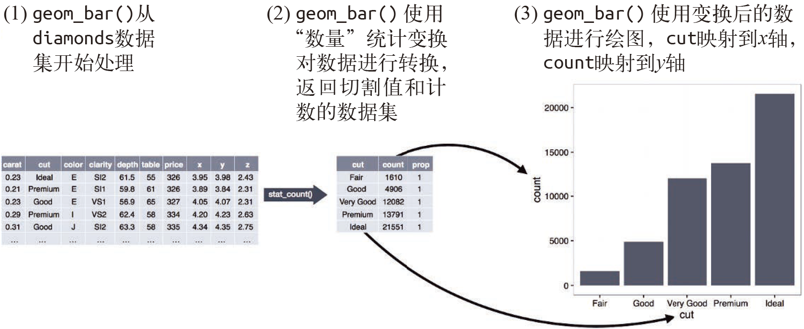
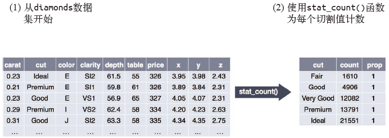
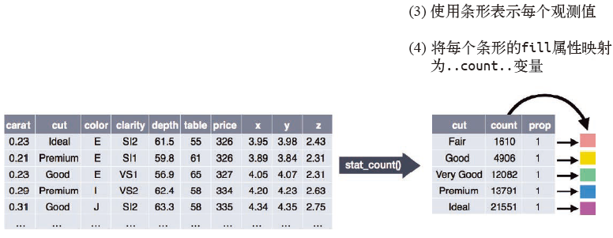
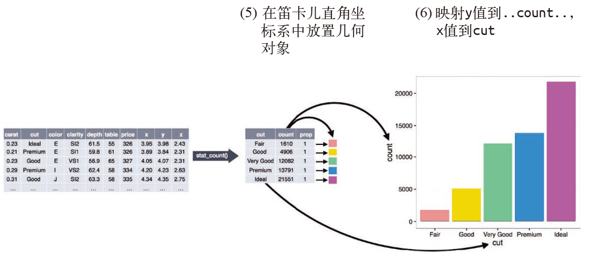

# Data visualisation | 数据可视化

## Introduction | 简介

> "The simple graph has brought more information to the data analyst’s mind 
> than any other device." --- John Tukey
> 简单的图形对数据分析者的启示比任何其他方法都要多

This chapter will teach you how to visualise your data using ggplot2. R has several systems for making graphs, but ggplot2 is one of the most elegant and most versatile. ggplot2 implements the __grammar of graphics__, a coherent system for describing and building graphs. With ggplot2, you can do more faster by learning one system and applying it in many places.

本章将教你如何使用 ggplot2 进行数据可视化。R 有好几种绘图工具，但 ggplot2 是其中最优雅、功能最全面的一个。ggplot2 实现了图形语法，这是一套用来描述和构建图形的连贯性语法规则。掌握 ggplot2 后，你便可以在多个场景中使用，从而显著提高工作效率。

If you'd like to learn more about the theoretical underpinnings of ggplot2 before you start, I'd recommend reading "The Layered Grammar of Graphics", <http://vita.had.co.nz/papers/layered-grammar.pdf>.

在开始学习之前，如果想要了解 ggplot2 背后的更多理论基础，推荐你读一读“A Layered Grammar of Graphics”。

### Prerequisites | 准备工作

This chapter focusses on ggplot2, one of the core members of the tidyverse. To access the datasets, help pages, and functions that we will use in this chapter, load the tidyverse by running this code:

本章重点讨论 tidyverse 的一个核心 R 包——ggplot2。为了访问本章用到的数据集、帮助页面和函数，需要先运行以下代码来加载 tidyverse：

```{r setup}
library(tidyverse)
```

That one line of code loads the core tidyverse; packages which you will use in almost every data analysis. It also tells you which functions from the tidyverse conflict with functions in base R (or from other packages you might have loaded). 

这一行代码加载了tidyverse 的核心 R 包。在几乎所有的数据分析任务中，你都会用到这些R 包。这行代码还会告诉你 tidyverse 中的哪些函数与基础 R 包（或者已加载的其他 R 包） 中的函数有冲突。

If you run this code and get the error message "there is no package called ‘tidyverse’", you'll need to first install it, then run `library()` once again.

如果运行这行代码时出现错误消息“there is no package called‘tidyverse’”，那么你需要先安装 tidyverse，然后再运行 library() 函数：

```{r eval = FALSE}
if(!requireNamespace("tidyverse", quietly = TRUE)){
  install.packages("tidyverse")
}
library(tidyverse)
```

You only need to install a package once, but you need to reload it every time you start a new session.

R 包只需安装一次，但每次开始新会话时都要重新加载。

If we need to be explicit about where a function (or dataset) comes from, we'll use the special form `package::function()`. For example, `ggplot2::ggplot()` tells you explicitly that we're using the `ggplot()` function from the ggplot2 package.

如果想要明确指出某个函数（或数据集）的来源，那么可以使用特殊语法形式package::function()。例如，ggplot2::ggplot() 明确指出了我们使用的是 ggplot2 包中的ggplot() 函数。

## First steps | 第一步

Let's use our first graph to answer a question: Do cars with big engines use more fuel than cars with small engines? You probably already have an answer, but try to make your answer precise. What does the relationship between engine size and fuel efficiency look like? Is it positive? Negative? Linear? Nonlinear?

我们使用第一张图来回答问题：大引擎汽车比小引擎汽车更耗油吗？你可能已经有了答案，但应该努力让答案更精确一些。引擎大小与燃油效率之间是什么关系？是正相关，还是负相关？是线性关系，还是非线性关系？

### The `mpg` data frame | mpg数据框

You can test your answer with the `mpg` __data frame__ found in ggplot2 (aka  `ggplot2::mpg`). A data frame is a rectangular collection of variables (in the columns) and observations (in the rows). `mpg` contains observations collected by the US Environmental Protection Agency on 38 models of car. 

你可以使用 ggplot2 包中的 mpg 数据框（即 ggplot2::mpg）来检验自己的答案。数据框是变量（列）和观测（行）的矩形集合。mpg 包含了由美国环境保护协会收集的 38 种车型的观测数据。

```{r}
mpg
```

Among the variables in `mpg` are:

mpg 中包括如下变量。

1. `displ`, a car's engine size, in litres. displ：引擎大小，单位为升。

1. `hwy`, a car's fuel efficiency on the highway, in miles per gallon (mpg). 
  A car with a low fuel efficiency consumes more fuel than a car with a high 
  fuel efficiency when they travel the same distance. 

hwy：汽车在高速公路上行驶时的燃油效率，单位为英里 / 加仑（mpg）。与燃油效率高的汽车相比，燃油效率低的汽车在行驶相同距离时要消耗更多燃油。

To learn more about `mpg`, open its help page by running `?mpg`.

要想了解更多关于 mpg 的信息，可以使用 ?mpg 命令打开其帮助页面。

### Creating a ggplot | 创建ggplot图形

To plot `mpg`, run this code to put `displ` on the x-axis and `hwy` on the y-axis:

为了绘制 mpg 的图形，运行以下代码将 displ 放在 x 轴，hwy 放在 y 轴：

```{r}
ggplot(data = mpg) + 
  geom_point(mapping = aes(x = displ, y = hwy))
```

The plot shows a negative relationship between engine size (`displ`) and fuel efficiency (`hwy`). In other words, cars with big engines use more fuel. Does this confirm or refute your hypothesis about fuel efficiency and engine size?

上图显示出引擎大小（displ）和燃油效率（hwy）之间是负相关关系。换句话说，大引擎汽车更耗油。这张图是证实了你对燃油效率和引擎大小之间关系的假设，还是推翻了它？

With ggplot2, you begin a plot with the function `ggplot()`. `ggplot()` creates a coordinate system that you can add layers to. The first argument of `ggplot()` is the dataset to use in the graph. So `ggplot(data = mpg)` creates an empty graph, but it's not very interesting so I'm not going to show it here.

在 ggplot2 中，你可以使用 ggplot() 函数开始绘图。ggplot() 创建了一个坐标系，你可以在它上面添加图层。ggplot() 的第一个参数是要在图中使用的数据集。ggplot(data = mpg) 会创建一张空白图，因为这张图没什么意思，所以就不在这里展示了。

You complete your graph by adding one or more layers to `ggplot()`. The function `geom_point()` adds a layer of points to your plot, which creates a scatterplot. ggplot2 comes with many geom functions that each add a different type of layer to a plot. You'll learn a whole bunch of them throughout this chapter.

向 ggplot() 中添加一个或多个图层就可以完成这张图。函数 geom_point() 向图中添加一个点层，这样就可以创建一张散点图。ggplot2 中包含了多种几何对象函数，每种函数都可以向图中添加不同类型的图层。你将在本章中学到大量的几何对象函数。

Each geom function in ggplot2 takes a `mapping` argument. This defines how variables in your dataset are mapped to visual properties. The `mapping` argument is always paired with `aes()`, and the `x` and `y` arguments of `aes()` specify which variables to map to the x and y axes. ggplot2 looks for the mapped variables in the `data` argument, in this case, `mpg`.

ggplot2 中的每个几何对象函数都有一个 mapping 参数。这个参数定义了如何将数据集中的变量映射为图形属性。mapping 参数总是与 aes() 函数成对出现，aes() 函数的 x 参数和 y 参数分别指定了映射到 x 轴的变量与映射到 y 轴的变量。ggplot2 在 data 参数中寻找映射变量，本例中就是 mpg。

### A graphing template | 绘图模板

Let's turn this code into a reusable template for making graphs with ggplot2. To make a graph, replace the bracketed sections in the code below with a dataset, a geom function, or a collection of mappings.

我们将上面的代码转换为一个可重用的 ggplot2 绘图模板。要想生成一张图，将以下代码中的尖括号部分替换为数据集、几何对象函数或映射集合即可：

```{r eval = FALSE}
ggplot(data = <DATA>) + 
  <GEOM_FUNCTION>(mapping = aes(<MAPPINGS>))
```

The rest of this chapter will show you how to complete and extend this template to make different types of graphs. We will begin with the `<MAPPINGS>` component.

本章其余内容将向你展示如何完成并扩展这个模板，以制作出各种类型的图。我们将从<MAPPINGS> 部分开始。

### Exercises | 练习

1.  Run `ggplot(data = mpg)`. What do you see?运行 ggplot(data = mpg)，你会看到什么？

1.  How many rows are in `mpg`? How many columns?数据集 mpg 中有多少行？多少列？

1.  What does the `drv` variable describe?  Read the help for `?mpg` to find
    out.

变量 drv 的意义是什么？使用 ?mpg 命令阅读帮助文件以找出答案。
     
1.  Make a scatterplot of `hwy` vs `cyl`. 使用 hwy 和 cyl 绘制一张散点图。

1.  What happens if you make a scatterplot of `class` vs `drv`? Why is
    the plot not useful? 
    
如果使用 class 和 drv 绘制散点图，会发生什么情况？为什么这张图没什么用处？

## Aesthetic mappings | 图形属性映射

> "The greatest value of a picture is when it forces us to notice what we
> never expected to see." --- John Tukey
> 图片的最大价值在于促使我们发现从未预料到的事情。

In the plot below, one group of points (highlighted in red) seems to fall outside of the linear trend. These cars have a higher mileage than you might expect. How can you explain these cars? 

下图中有一组点（显示为红色）似乎位于线性趋势之外。这些汽车比预期具有更高的里程数。如何解释这种现象呢？

```{r, echo = FALSE}
ggplot(data = mpg, mapping = aes(x = displ, y = hwy)) +
  geom_point() + 
  geom_point(data = dplyr::filter(mpg, displ > 5, hwy > 20), colour = "red", size = 2.2)
```

Let's hypothesize that the cars are hybrids. One way to test this hypothesis is to look at the `class` value for each car. The `class` variable of the `mpg` dataset classifies cars into groups such as compact, midsize, and SUV. If the outlying points are hybrids, they should be classified as compact cars or, perhaps, subcompact cars (keep in mind that this data was collected before hybrid trucks and SUVs became popular).

我们可以假设这些汽车是混合动力车。检验这种假设的一个方法是查看每辆汽车的 class 值。mpg 数据集中的 class 变量对汽车进行了分类，比如小型、中型和 SUV。如果那些离群点是混合动力车，那么它们应该分类为小型车，也可能是微型车（注意，这份数据是在混合动力车和 SUV 流行前收集的）。

You can add a third variable, like `class`, to a two dimensional scatterplot by mapping it to an __aesthetic__. An aesthetic is a visual property of the objects in your plot. Aesthetics include things like the size, the shape, or the color of your points. You can display a point (like the one below) in different ways by changing the values of its aesthetic properties. Since we already use the word "value" to describe data, let's use the word "level" to describe aesthetic properties. Here we change the levels of a point's size, shape, and color to make the point small, triangular, or blue:

可以向二维散点图中添加第三个变量，比如 class，方式是将它映射为图形属性。图形属性是图中对象的可视化属性，其中包括数据点的大小、形状和颜色。通过改变图形属性的值，可以用不同的方式来显示数据点（如下图所示）。因为已经使用“value”这个词来表示数据的值，所以下面使用“level”（水平）这个词来表示图形属性的值。我们来改变一个点的大小、形状和颜色的水平，分别让它变小、变为三角形和变为蓝色，如下所示。

```{r, echo = FALSE, asp = 1/4}
ggplot() +
  geom_point(aes(1, 1), size = 20) +
  geom_point(aes(2, 1), size = 10) + 
  geom_point(aes(3, 1), size = 20, shape = 17) + 
  geom_point(aes(4, 1), size = 20, colour = "blue") + 
  scale_x_continuous(NULL, limits = c(0.5, 4.5), labels = NULL) + 
  scale_y_continuous(NULL, limits = c(0.9, 1.1), labels = NULL) + 
  theme(aspect.ratio = 1/3)
```

You can convey information about your data by mapping the aesthetics in your plot to the variables in your dataset. For example, you can map the colors of your points to the `class` variable to reveal the class of each car.

通过将图中的图形属性映射为数据集中的变量，可以传达出数据的相关信息。例如，可以将点的颜色映射为变量 class，从而揭示每辆汽车的类型：

```{r}
ggplot(data = mpg) + 
  geom_point(mapping = aes(x = displ, y = hwy, color = class))
```

(If you prefer British English, like Hadley, you can use `colour` instead of `color`.)

（如果你更喜欢英式英语，就像 Hadley 一样，那么可以使用 colour 代替 color。）

To map an aesthetic to a variable, associate the name of the aesthetic to the name of the variable inside `aes()`. ggplot2 will automatically assign a unique level of the aesthetic (here a unique color) to each unique value of the variable, a process known as __scaling__. ggplot2 will also add a legend that explains which levels correspond to which values.

要想将图形属性映射为变量，需要在函数 aes() 中将图形属性名称和变量名称关联起来。ggplot2 会自动为每个变量值分配唯一的图形属性水平（本例中是唯一的颜色），这个过程称为标度变换。ggplot2 还会添加一个图例，以表示图形属性水平和变量值之间的对应关系。

The colors reveal that many of the unusual points are two-seater cars. These cars don't seem like hybrids, and are, in fact, sports cars! Sports cars have large engines like SUVs and pickup trucks, but small bodies like midsize and compact cars, which improves their gas mileage. In hindsight, these cars were unlikely to be hybrids since they have large engines.

颜色揭示出的信息是，那些离群点多数是双座汽车。这些汽车不像是混合动力车；实际上，它们是跑车！跑车像 SUV 和皮卡一样配有大引擎，但车身却类似于中型车和小型车， 这样就提高了它的里程数。现在想来，这些车不会是混合动力的，因为它们具有大引擎。

In the above example, we mapped `class` to the color aesthetic, but we could have mapped `class` to the size aesthetic in the same way. In this case, the exact size of each point would reveal its class affiliation. We get a _warning_ here, because mapping an unordered variable (`class`) to an ordered aesthetic (`size`) is not a good idea.

在上例中，我们将 class 映射为颜色，但也可以用同样的方式将其映射为点的大小。在下面的示例中，每个点的实际大小表示其所属的类别。这里我们收到一条警告信息，因为将无序变量（class）映射为有序图形属性（size）可不是好主意。

```{r}
ggplot(data = mpg) + 
  geom_point(mapping = aes(x = displ, y = hwy, size = class))
```

Or we could have mapped `class` to the _alpha_ aesthetic, which controls the transparency of the points, or to the shape aesthetic, which controls the shape of the points.

或者我们也可以将 class 映射为控制数据点透明度的 alpha 图形属性，还可以将其映射为点的形状

```{r out.width = "50%", fig.align = 'default', warning = FALSE, fig.asp = 1/2, fig.cap =""}
# Left | 左图
ggplot(data = mpg) + 
  geom_point(mapping = aes(x = displ, y = hwy, alpha = class))

# Right | 右图
ggplot(data = mpg) + 
  geom_point(mapping = aes(x = displ, y = hwy, shape = class))
```

What happened to the SUVs? ggplot2 will only use six shapes at a time. By default, additional groups will go unplotted when you use the shape aesthetic.

SUV 怎么了？ ggplot2 只能同时使用 6 种形状。默认情况下，当使用这种图形属性时，多出的变量值将不会出现在图中。

For each aesthetic, you use `aes()` to associate the name of the aesthetic with a variable to display. The `aes()` function gathers together each of the aesthetic mappings used by a layer and passes them to the layer's mapping argument. The syntax highlights a useful insight about `x` and `y`: the x and y locations of a point are themselves aesthetics, visual properties that you can map to variables to display information about the data.

对你所使用的每个图形属性来说，函数 aes() 都可以将其名称与一个待显示变量关联起来。aes() 将图层中使用的每个图形属性映射集合在一起，然后传递给该图层的映射参数。这一语法强调了关于 x 和 y 的重要信息：数据点的 x 轴位置和 y 轴位置本身就是图形属性， 即可以映射为变量来表示数据信息的可视化属性。

Once you map an aesthetic, ggplot2 takes care of the rest. It selects a reasonable scale to use with the aesthetic, and it constructs a legend that explains the mapping between levels and values. For x and y aesthetics, ggplot2 does not create a legend, but it creates an axis line with tick marks and a label. The axis line acts as a legend; it explains the mapping between locations and values.

一旦映射了图形属性，ggplot2 会处理好其余的事情。它会为图形属性选择一个合适的标度，并创建图例来表示图形属性水平和变量值之间的映射关系。ggplot2 不会为 x 和 y 这两个图形属性创建图例，而会创建带有刻度标记和标签的坐标轴。坐标轴就相当于图例，可以体现出位置和变量值之间的映射关系。

You can also _set_ the aesthetic properties of your geom manually. For example, we can make all of the points in our plot blue:

还可以手动为几何对象设置图形属性。例如，我们可以让图中的所有点都为蓝色：

```{r}
ggplot(data = mpg) + 
  geom_point(mapping = aes(x = displ, y = hwy), color = "blue")
```

Here, the color doesn't convey information about a variable, but only changes the appearance of the plot. To set an aesthetic manually, set the aesthetic by name as an argument of your geom function; i.e. it goes _outside_ of `aes()`. You'll need to pick a level that makes sense for that aesthetic:

此时颜色不会传达关于变量的信息，只是改变图的外观。要想手动设置图形属性，需要按名称进行设置，将其作为几何对象函数的一个参数。这也就是说，需要在函数 aes() 的外部进行设置。此外，还需要为这个图形属性选择一个有意义的值。

* The name of a color as a character string. 颜色名称是一个字符串。

* The size of a point in mm. 点的大小用毫米表示。

* The shape of a point as a number, as shown in Figure \@ref(fig:shapes). 点的形状是一个数值，如图 1-1 所示。

```{r shapes, echo = FALSE, out.width = "75%", fig.asp = 1/3, fig.cap="R has 25 built in shapes that are identified by numbers. 用数值进行标识的 R 的 25 种内置形状。There are some seeming duplicates: for example, 0, 15, and 22 are all squares. The difference comes from the interaction of the `colour` and `fill` aesthetics. The hollow shapes (0--14) have a border determined by `colour`; the solid shapes (15--20) are filled with `colour`; the filled shapes (21--24) have a border of `colour` and are filled with `fill`.有些形状相同，比如 0、15 和 22 都是正方形。形状之间的区别在于 color 和 fill 这两个图形属性。空心形状（0~14）的边界颜色由color 决定；实心形状（15~20）的填充颜色由 color 决定；填充形状（21~24）的边界颜色由 color 决定，填充颜色由 fill 决定。", warning = FALSE}
shapes <- tibble(
  shape = c(0, 1, 2, 5, 3, 4, 6:19, 22, 21, 24, 23, 20),
  x = (0:24 %/% 5) / 2,
  y = (-(0:24 %% 5)) / 4
)
ggplot(shapes, aes(x, y)) + 
  geom_point(aes(shape = shape), size = 5, fill = "red") +
  geom_text(aes(label = shape), hjust = 0, nudge_x = 0.15) +
  scale_shape_identity() +
  expand_limits(x = 4.1) +
  scale_x_continuous(NULL, breaks = NULL) + 
  scale_y_continuous(NULL, breaks = NULL, limits = c(-1.2, 0.2)) + 
  theme_minimal() +
  theme(aspect.ratio = 1/2.75)
```

### Exercises | 练习

1.  What's gone wrong with this code? Why are the points not blue? 以下这段代码有什么错误？为什么点不是蓝色的？

    ```{r}
    ggplot(data = mpg) + 
      geom_point(mapping = aes(x = displ, y = hwy, color = "blue"))
    ```
    
1.  Which variables in `mpg` are categorical? Which variables are continuous? 
    (Hint: type `?mpg` to read the documentation for the dataset). How
    can you see this information when you run `mpg`?
    
mpg 中的哪些变量是分类变量？哪些变量是连续变量？（提示：输入 ?mpg 来阅读这个数据集的文档。）当调用 mpg 时，如何才能看到这些信息？

1.  Map a continuous variable to `color`, `size`, and `shape`. How do
    these aesthetics behave differently for categorical vs. continuous
    variables? 
    
将一个连续变量映射为 color、size 和 shape。对分类变量和连续变量来说，这些图形属性的表现有什么不同？
    
1.  What happens if you map the same variable to multiple aesthetics? 
如果将同一个变量映射为多个图形属性，会发生什么情况？

1.  What does the `stroke` aesthetic do? What shapes does it work with?
    (Hint: use `?geom_point`)

stroke 这个图形属性的作用是什么？它适用于哪些形状？（提示：使用 ?geom_point 命令。）
    
1.  What happens if you map an aesthetic to something other than a variable 
    name, like `aes(colour = displ < 5)`?  Note, you'll also need to specify x and y.
    
如果将图形属性映射为非变量名对象，比如 aes(color = displ < 5)，会发生什么情况？

## Common problems | 常见问题

As you start to run R code, you're likely to run into problems. Don't worry --- it happens to everyone. I have been writing R code for years, and every day I still write code that doesn't work! 

当开始运行R 代码时，你很可能会遇到问题。不用担心，每个人都会遇到问题。我已经编写R 代码多年了，但还是每天都会写出不能正常运行的代码。

Start by carefully comparing the code that you're running to the code in the book. R is extremely picky, and a misplaced character can make all the difference. Make sure that every `(` is matched with a `)` and every `"` is paired with another `"`. Sometimes you'll run the code and nothing happens. Check the left-hand of your console: if it's a `+`, it means that R doesn't think you've typed a complete expression and it's waiting for you to finish it. In this case, it's usually easy to start from scratch again by pressing ESCAPE to abort processing the current command.

首先，将你需要运行的代码与书中的代码进行仔细对比。R 极其挑剔，即使一个字母放错了位置，也可能会造成问题。确保每个 ( 都有一个 ) 与之匹配，并且每个 " 后面都跟着另一个 "。有时运行了代码却什么也没有发生。检查一下控制台左侧：如果有一个+ 号，那么说明 R 认为你没有输入完整的表达式，正在等待你完成输入。这种情况下，按Esc 键中止当前执行的命令就可以重新开始。

One common problem when creating ggplot2 graphics is to put the `+` in the wrong place: it has to come at the end of the line, not the start. In other words, make sure you haven't accidentally written code like this:

创建 ggplot2 图形时的一个常见问题是将+ 号放错了位置：+ 必须放在一行代码的末尾，而不是开头。换句话说，请确保你没有粗心地写出以下这样的代码：

```R
ggplot(data = mpg) 
+ geom_point(mapping = aes(x = displ, y = hwy))
```

If you're still stuck, try the help. You can get help about any R function by running `?function_name` in the console, or selecting the function name and pressing F1 in RStudio. Don't worry if the help doesn't seem that helpful - instead skip down to the examples and look for code that matches what you're trying to do.

如果还是有问题，那么可以看看帮助页面。通过在控制台中运行? 函数名，或者在 RStudio 中选定函数名称后按 F1 键，你可以获得任何 R 函数的帮助信息。如果帮助页面看上去没什么用，也不要着急，你可以跳过这些帮助信息，向下找到示例部分，并查看与你的需求相匹配的代码。

If that doesn't help, carefully read the error message. Sometimes the answer will be buried there! But when you're new to R, the answer might be in the error message but you don't yet know how to understand it. Another great tool is Google: try googling the error message, as it's likely someone else has had the same problem, and has gotten help online.

如果还是没什么用，那么再仔细阅读一下错误消息。有时答案就隐藏在其中！但如果你是 R 语言新手，那么即使答案就在错误消息中，你也很难理解。另一个非常好的工具就是Google：试着搜索一下错误消息，因为别人很可能也遇到过同样的问题，并在网上得到了答案。

## Facets | 分面

One way to add additional variables is with aesthetics. Another way, particularly useful for categorical variables, is to split your plot into __facets__, subplots that each display one subset of the data. 

添加额外变量的一种方法是使用图形属性。另一种方法是将图分割成多个分面，即可以显示数据子集的子图。这种方法特别适合添加分类变量。

To facet your plot by a single variable, use `facet_wrap()`. The first argument of `facet_wrap()` should be a formula, which you create with `~` followed by a variable name (here "formula" is the name of a data structure in R, not a synonym for "equation"). The variable that you pass to `facet_wrap()` should be discrete. 

要想通过单个变量对图进行分面，可以使用函数 facet_wrap()。其第一个参数是一个公式，创建公式的方式是在 ~ 符号后面加一个变量名（这里所说的“公式”是R 中的一种数据结构，不是数学意义上的公式）。传递给 facet_wrap() 的变量应该是离散型的。

```{r}
ggplot(data = mpg) + 
  geom_point(mapping = aes(x = displ, y = hwy)) + 
  facet_wrap(~ class, nrow = 2)
```

To facet your plot on the combination of two variables, add `facet_grid()` to your plot call. The first argument of `facet_grid()` is also a formula. This time the formula should contain two variable names separated by a `~`. 

要想通过两个变量对图进行分面，需要在绘图命令中加入函数 facet_grid()。这个函数的第一个参数也是一个公式，但该公式包含由 ~ 隔开的两个变量名。

```{r}
ggplot(data = mpg) + 
  geom_point(mapping = aes(x = displ, y = hwy)) + 
  facet_grid(drv ~ cyl)
```

If you prefer to not facet in the rows or columns dimension, use a `.` instead of a variable name, e.g. `+ facet_grid(. ~ cyl)`.

如果不想在行或列的维度进行分面，你可以使用 . 来代替变量名，例如 + facet_grid(. ~ cyl)。

### Exercises | 练习

1.  What happens if you facet on a continuous variable? 如果使用连续变量进行分面，会发生什么情况？

1.  What do the empty cells in plot with `facet_grid(drv ~ cyl)` mean?
    How do they relate to this plot?
    
在使用 facet_grid(drv ~ cyl) 生成的图中，空白单元的意义是什么？它们和以下代码生成的图有什么关系？
    
    ```{r, eval = FALSE}
    ggplot(data = mpg) + 
      geom_point(mapping = aes(x = drv, y = cyl))
    ```

1.  What plots does the following code make? What does `.` do? 以下代码会绘制出什么图？ . 的作用是什么？

    ```{r eval = FALSE}
    ggplot(data = mpg) + 
      geom_point(mapping = aes(x = displ, y = hwy)) +
      facet_grid(drv ~ .)
    
    ggplot(data = mpg) + 
      geom_point(mapping = aes(x = displ, y = hwy)) +
      facet_grid(. ~ cyl)
    ```

1.  Take the first faceted plot in this section: 查看本节的第一个分面图：

    ```{r, eval = FALSE}
    ggplot(data = mpg) + 
      geom_point(mapping = aes(x = displ, y = hwy)) + 
      facet_wrap(~ class, nrow = 2)
    ```
    
    What are the advantages to using faceting instead of the colour aesthetic?
    What are the disadvantages? How might the balance change if you had a 
    larger dataset?
    
    与使用图形属性相比，使用分面的优势和劣势分别是什么？如果有一个更大的数据集， 你将如何权衡这两种方法的优劣？
    
1.  Read `?facet_wrap`. What does `nrow` do? What does `ncol` do? What other
    options control the layout of the individual panels? Why doesn't
    `facet_grid()` have `nrow` and `ncol` arguments?
    
阅读 ?facet_wrap 的帮助页面。nrow 和 ncol 的功能分别是什么？还有哪些选项可以控制分面的布局？为什么函数 facet_grid() 没有变量 nrow 和 ncol ？

1.  When using `facet_grid()` you should usually put the variable with more
    unique levels in the columns. Why?

在使用函数 facet_grid() 时，一般应该将具有更多唯一值的变量放在列上。为什么这么做呢？

## Geometric objects | 几何对象

How are these two plots similar? 
以下两张图的相似程度有多大？

```{r echo = FALSE, out.width = "50%", fig.align="default", message = FALSE}
ggplot(data = mpg) + 
  geom_point(mapping = aes(x = displ, y = hwy))

ggplot(data = mpg) + 
  geom_smooth(mapping = aes(x = displ, y = hwy))
```

Both plots contain the same x variable, the same y variable, and both describe the same data. But the plots are not identical. Each plot uses a different visual object to represent the data. In ggplot2 syntax, we say that they use different __geoms__.

两张图有同样的 x 变量和 y 变量，而且描述的是同样的数据。但这两张图并不一样，它们各自使用不同的可视化对象来表示数据。在 ggplot2 语法中，我们称它们使用了不同的几何对象。

A __geom__ is the geometrical object that a plot uses to represent data. People often describe plots by the type of geom that the plot uses. For example, bar charts use bar geoms, line charts use line geoms, boxplots use boxplot geoms, and so on. Scatterplots break the trend; they use the point geom. As we see above, you can use different geoms to plot the same data. The plot on the left uses the point geom, and the plot on the right uses the smooth geom, a smooth line fitted to the data. 

几何对象是图中用来表示数据的几何图形对象。我们经常根据图中使用的几何对象类型来描述相应的图。例如，条形图使用了条形几何对象，折线图使用了直线几何对象，箱线图使用了矩形和直线几何对象。散点图打破了这种趋势，它们使用点几何对象。如上面的两幅图所示，我们可以使用不同的几何对象来表示同样的数据。左侧的图使用了点几何对象，右侧的图使用了平滑曲线几何对象，以一条平滑曲线来拟合数据。

To change the geom in your plot, change the geom function that you add to `ggplot()`. For instance, to make the plots above, you can use this code:

要想改变图中的几何对象，需要修改添加在 ggplot() 函数中的几何对象函数。举例来说， 要想绘制出上图，你可以使用以下代码：

```{r eval = FALSE}
# left | 左图
ggplot(data = mpg) + 
  geom_point(mapping = aes(x = displ, y = hwy))

# right | 右图
ggplot(data = mpg) + 
  geom_smooth(mapping = aes(x = displ, y = hwy))
```

Every geom function in ggplot2 takes a `mapping` argument. However, not every aesthetic works with every geom. You could set the shape of a point, but you couldn't set the "shape" of a line. On the other hand, you _could_ set the linetype of a line. `geom_smooth()` will draw a different line, with a different linetype, for each unique value of the variable that you map to linetype.

ggplot2 中的每个几何对象函数都有一个 mapping 参数。但是，不是每种图形属性都适合每种几何对象。你可以设置点的形状，但不能设置线的“形状”，而可以设置线的线型。geom_smooth() 函数可以按照不同的线型绘制出不同的曲线，每条曲线对应映射到线型的变量的一个唯一值：

```{r message = FALSE}
ggplot(data = mpg) + 
  geom_smooth(mapping = aes(x = displ, y = hwy, linetype = drv))
```

Here `geom_smooth()` separates the cars into three lines based on their `drv` value, which describes a car's drivetrain. One line describes all of the points with a `4` value, one line describes all of the points with an `f` value, and one line describes all of the points with an `r` value. Here, `4` stands for four-wheel drive, `f` for front-wheel drive, and `r` for rear-wheel drive.

根据表示汽车驱动系统的 drv 变量的值，这里的 geom_smooth() 函数分别用 3 条曲线来表示汽车。一条线表示 drv 值为 4 的所有汽车，一条线表示 drv 值为 f 的所有汽车，另一条线表示 drv 值为 r 的所有汽车。其中 4 表示四轮驱动，f 表示前轮驱动，r 表示后轮驱动。

If this sounds strange, we can make it more clear by overlaying the lines on top of the raw data and then coloring everything according to `drv`. 

如果你觉得这有些难以理解，我们可以将这些曲线覆盖在原始数据上，并按照 drv 值对所有的点和线进行着色，这样你就能看得更清楚一些了。

```{r echo = FALSE, message = FALSE}
ggplot(data = mpg, mapping = aes(x = displ, y = hwy, color = drv)) + 
  geom_point() +
  geom_smooth(mapping = aes(linetype = drv))
```

Notice that this plot contains two geoms in the same graph! If this makes you excited, buckle up. We will learn how to place multiple geoms in the same plot very soon.

注意，我们刚才在同一张图中使用了两种几何对象，多么激动人心！稍安勿躁，我们将在下一节中学习如何在同一张图中放置多个几何对象。

ggplot2 provides over 40 geoms, and extension packages provide even more (see <https://exts.ggplot2.tidyverse.org/gallery/> for a sampling). The best way to get a comprehensive overview is the ggplot2 cheatsheet, which you can find at <http://rstudio.com/resources/cheatsheets>. To learn more about any single geom, use help: `?geom_smooth`.

ggplot2 提供了 30 多种几何对象，其扩展包甚至提供了更多（可以在 https://www.ggplot2- exts.org 查看更多样例）。如果想全面地了解这些对象，最好的方式是学习 ggplot2 速查表（参见 http://rstudio.com/cheatsheets）。如果想掌握更多关于某个几何对象的知识，那么可以使用帮助，如 ?geom_smooth。

Many geoms, like `geom_smooth()`, use a single geometric object to display multiple rows of data. For these geoms, you can set the `group` aesthetic to a categorical variable to draw multiple objects. ggplot2 will draw a separate object for each unique value of the grouping variable. In practice, ggplot2 will automatically group the data for these geoms whenever you map an aesthetic to a discrete variable (as in the `linetype` example). It is convenient to rely on this feature because the group aesthetic by itself does not add a legend or distinguishing features to the geoms.

和 geom_smooth() 一样，很多几何对象函数使用单个几何对象来表示多行数据。你可以将这些几何对象的 group 图形属性设置为一个分类变量，这样 ggplot2 就会为这个分类变量的每个唯一值绘制一个独立的几何对象。实际上，只要将一个图形属性映射为一个离散变量（如上个示例中的 linetype），ggplot2 就会自动对数据进行分组来绘制多个几何对象。这个功能非常方便，因为按照图形属性的这种分组不用添加图例，也不用为几何对象添加区分特征：

```{r, fig.width = 3, fig.align = 'default', out.width = "33%", message = FALSE}
ggplot(data = mpg) +
  geom_smooth(mapping = aes(x = displ, y = hwy))
              
ggplot(data = mpg) +
  geom_smooth(mapping = aes(x = displ, y = hwy, group = drv))
    
ggplot(data = mpg) +
  geom_smooth(
    mapping = aes(x = displ, y = hwy, color = drv),
    show.legend = FALSE
  )
```

To display multiple geoms in the same plot, add multiple geom functions to `ggplot()`:

要想在同一张图中显示多个几何对象，可以向 ggplot() 函数中添加多个几何对象函数：

```{r, message = FALSE}
ggplot(data = mpg) + 
  geom_point(mapping = aes(x = displ, y = hwy)) +
  geom_smooth(mapping = aes(x = displ, y = hwy))
```

This, however, introduces some duplication in our code. Imagine if you wanted to change the y-axis to display `cty` instead of `hwy`. You'd need to change the variable in two places, and you might forget to update one. You can avoid this type of repetition by passing a set of mappings to `ggplot()`. ggplot2 will treat these mappings as global mappings that apply to each geom in the graph.  In other words, this code will produce the same plot as the previous code:

但是，这样代码就产生了一些重复。假如你想将 y 轴上的变量从 hwy 改成 cty，那么就要在两个地方修改这个变量，但你或许会漏掉一处。避免这种重复的方法是将一组映射传递给 ggplot() 函数。ggplot2 会将这些映射作为全局映射应用到图中的每个几何对象中。换句话说，以下代码将绘制出与上面代码同样的图：

```{r, eval = FALSE}
ggplot(data = mpg, mapping = aes(x = displ, y = hwy)) + 
  geom_point() + 
  geom_smooth()
```

If you place mappings in a geom function, ggplot2 will treat them as local mappings for the layer. It will use these mappings to extend or overwrite the global mappings _for that layer only_. This makes it possible to display different aesthetics in different layers.

如果将映射放在几何对象函数中，那么 ggplot2 会将其看作这个图层的局部映射，它将使用这些映射扩展或覆盖全局映射，但仅对该图层有效。这样一来，我们就可以在不同的图层中显示不同的图形属性：

```{r, message = FALSE}
ggplot(data = mpg, mapping = aes(x = displ, y = hwy)) + 
  geom_point(mapping = aes(color = class)) + 
  geom_smooth()
```

You can use the same idea to specify different `data` for each layer. Here, our smooth line displays just a subset of the `mpg` dataset, the subcompact cars. The local data argument in `geom_smooth()` overrides the global data argument in `ggplot()` for that layer only.

同理，你也可以为不同的图层指定不同的数据。下图中的平滑曲线表示的只是 mpg 数据集的一个子集，即微型车。geom_smooth() 函数中的局部数据参数覆盖了 ggplot() 函数中的全局数据参数，当然仅对这个图层有效：

```{r, message = FALSE}
ggplot(data = mpg, mapping = aes(x = displ, y = hwy)) + 
  geom_point(mapping = aes(color = class)) + 
  geom_smooth(data = filter(mpg, class == "subcompact"), se = FALSE)
```

(You'll learn how `filter()` works in the chapter on data transformations: for now, just know that this command selects only the subcompact cars.)

（你将在下一章中学习 filter() 函数的用法，现在只需要知道这个命令仅选取出微型车就够了。）

### Exercises | 练习

1.  What geom would you use to draw a line chart? A boxplot? 
    A histogram? An area chart?
    
在绘制折线图、箱线图、直方图和分区图时，应该分别使用哪种几何对象？

1.  Run this code in your head and predict what the output will look like.
    Then, run the code in R and check your predictions.

在脑海中运行以下代码，并预测会有何种输出。接着在 R 中运行代码，并检查你的预测是否正确。
    
    ```{r, eval = FALSE}
    ggplot(data = mpg, mapping = aes(x = displ, y = hwy, color = drv)) + 
      geom_point() + 
      geom_smooth(se = FALSE)
    ```

1.  What does `show.legend = FALSE` do?  What happens if you remove it?  
    Why do you think I used it earlier in the chapter?
    
show.legend = FALSE 的作用是什么？删除它会发生什么情况？你觉得我为什么要在本章前面的示例中使用这句代码？

1.  What does the `se` argument to `geom_smooth()` do?

geom_smooth() 函数中的 se 参数的作用是什么？

1.  Will these two graphs look different? Why/why not?

以下代码生成的两张图有什么区别吗？为什么？

    ```{r, eval = FALSE}
    ggplot(data = mpg, mapping = aes(x = displ, y = hwy)) + 
      geom_point() + 
      geom_smooth()
    
    ggplot() + 
      geom_point(data = mpg, mapping = aes(x = displ, y = hwy)) + 
      geom_smooth(data = mpg, mapping = aes(x = displ, y = hwy))
    ```

1.  Recreate the R code necessary to generate the following graphs.自己编写 R 代码来生成以下各图。
    
    ```{r echo = FALSE, fig.width = 3, out.width = "50%", fig.align = "default", message = FALSE}
    ggplot(data = mpg, mapping = aes(x = displ, y = hwy)) + 
      geom_point() + 
      geom_smooth(se = FALSE)
    ggplot(data = mpg, mapping = aes(x = displ, y = hwy)) + 
      geom_smooth(aes(group = drv), se = FALSE) +
      geom_point()
    ggplot(data = mpg, mapping = aes(x = displ, y = hwy, color = drv)) + 
      geom_point() + 
      geom_smooth(se = FALSE)
    ggplot(data = mpg, mapping = aes(x = displ, y = hwy)) + 
      geom_point(aes(color = drv)) + 
      geom_smooth(se = FALSE)
    ggplot(data = mpg, mapping = aes(x = displ, y = hwy)) + 
      geom_point(aes(color = drv)) +
      geom_smooth(aes(linetype = drv), se = FALSE)
    ggplot(data = mpg, mapping = aes(x = displ, y = hwy)) + 
      geom_point(size = 4, colour = "white") + 
      geom_point(aes(colour = drv))
    ```

## Statistical transformations | 统计变换

Next, let's take a look at a bar chart. Bar charts seem simple, but they are interesting because they reveal something subtle about plots. Consider a basic bar chart, as drawn with `geom_bar()`. The following chart displays the total number of diamonds in the `diamonds` dataset, grouped by `cut`. The `diamonds` dataset comes in ggplot2 and contains information about ~54,000 diamonds, including the `price`, `carat`, `color`, `clarity`, and `cut` of each diamond. The chart shows that more diamonds are available with high quality cuts than with low quality cuts. 

接下来我们看一下条形图。条形图虽然简单，但很有意思，因为它可以揭示出图形中的一些微妙信息。我们看一下用 geom_bar() 函数就可以绘制的基本条形图。下面的条形图显示了 diamonds 数据集中按照 cut 变量分组的各种钻石的总数量。diamonds 数据集是 ggplot2 的内置数据集，包含大约 54 000 颗钻石的信息，每颗钻石具有 price、carat、color、clarity 和 cut 变量。条形图显示，高质量切割钻石的数量要比低质量切割钻石的数量多：

```{r}
ggplot(data = diamonds) + 
  geom_bar(mapping = aes(x = cut))
```

On the x-axis, the chart displays `cut`, a variable from `diamonds`. On the y-axis, it displays count, but count is not a variable in `diamonds`! Where does count come from? Many graphs, like scatterplots, plot the raw values of your dataset. Other graphs, like bar charts, calculate new values to plot:

条形图 x 轴显示的是 cut，这是 diamonds 数据集中的一个变量。y 轴显示的是 count，但count 不是 diamonds 中的变量！那么 count 来自哪里呢？很多图形绘制的是数据集的原始数据，比如散点图。另外一些图形则可以绘制那些计算出的新数据，比如条形图。

* bar charts, histograms, and frequency polygons bin your data 
  and then plot bin counts, the number of points that fall in each bin.
  
条形图、直方图和频率多边形图可以对数据进行分箱，然后绘制出分箱数量和落在每个分箱的数据点的数量。

* smoothers fit a model to your data and then plot predictions from the
  model.

平滑曲线会为数据拟合一个模型，然后绘制出模型预测值。

* boxplots compute a robust summary of the distribution and then display a 
  specially formatted box.
  
箱线图可以计算出数据分布的多种摘要统计量，并显示一个特殊形式的箱体。

The algorithm used to calculate new values for a graph is called a __stat__, short for statistical transformation. The figure below describes how this process works with `geom_bar()`.

绘图时用来计算新数据的算法称为 stat（statistical transformation，统计变换）。下图描述了
geom_bar() 函数的统计变换过程

```{r, echo = FALSE, out.width = "100%"}
knitr::include_graphics("images/visualization-stat-bar.png")
```

```{r, echo = FALSE, out.width = "100%"}

```

You can learn which stat a geom uses by inspecting the default value for the `stat` argument. For example, `?geom_bar` shows that the default value for `stat` is "count", which means that `geom_bar()` uses `stat_count()`. `stat_count()` is documented on the same page as `geom_bar()`, and if you scroll down you can find a section called "Computed variables". That describes how it computes two new variables: `count` and `prop`.

通过查看 stat 参数的默认值，你可以知道几何对象函数使用了哪种统计变换。例如，?geom_bar 显示出 stat 的默认值是 count，这说明 geom_bar() 使用 stat_count() 函数进行统计变换。stat_count() 在文档中与 geom_bar() 位于同一页，如果继续向下看，你可以发现名为“Computed variables”的一节，它告诉我们 stat_count() 会计算出两个新变量：count 和 prop。

You can generally use geoms and stats interchangeably. For example, you can recreate the previous plot using `stat_count()` instead of `geom_bar()`:

通常来说，几何对象函数和统计变换函数可以互换使用。例如，你可以使用 stat_count()
替换 geom_bar() 来重新生成前面那张图

```{r}
ggplot(data = diamonds) + 
  stat_count(mapping = aes(x = cut))
```

This works because every geom has a default stat; and every stat has a default geom. This means that you can typically use geoms without worrying about the underlying statistical transformation. There are three reasons you might need to use a stat explicitly:

可以这样做的原因是，每个几何对象函数都有一个默认统计变换，每个统计变换函数都有一个默认几何对象。一般情况下，这意味着你在使用几何对象函数时不用担心底层的统计变换。想要显式使用某种统计变换的 3 个原因如下。

1.  You might want to override the default stat. In the code below, I change 
    the stat of `geom_bar()` from count (the default) to identity. This lets 
    me map the height of the bars to the raw values of a $y$ variable. 
    Unfortunately when people talk about bar charts casually, they might be
    referring to this type of bar chart, where the height of the bar is already
    present in the data, or the previous bar chart where the height of the bar
    is generated by counting rows.

你可能想要覆盖默认的统计变换。在以下代码中，我们将 geom_bar() 函数的统计变换从计数（默认值）修改为标识。这样我们就可以将条形的高度映射为 y 轴变量的初始值。遗憾的是，当随意说起条形图时，人们指的可能就是这种条形图，其中条形高度已经存在于数据中，而不是像前一个图一样，条形高度由对行进行计数来生成：
    
    ```{r, warning = FALSE}
    demo <- tribble(
      ~cut,         ~freq,
      "Fair",       1610,
      "Good",       4906,
      "Very Good",  12082,
      "Premium",    13791,
      "Ideal",      21551
    )
    
    ggplot(data = demo) +
      geom_bar(mapping = aes(x = cut, y = freq), stat = "identity")
    ```
    
    (Don't worry that you haven't seen `<-` or `tribble()` before. You might be
    able to guess at their meaning from the context, and you'll learn exactly
    what they do soon!)
    
（你还不知道 <- 和 tibble() 的含义？别担心，根据上下文就能猜出它们的含义，而且你很快就会学习它们了。）

1.  You might want to override the default mapping from transformed variables
    to aesthetics. For example, you might want to display a bar chart of
    proportion, rather than count:
    
你可能想要覆盖从统计变换生成的变量到图形属性的默认映射。例如，你或许想显示一张表示比例（而不是计数）的条形图：
    
    ```{r}
    ggplot(data = diamonds) + 
      geom_bar(mapping = aes(x = cut, y = stat(prop), group = 1))
    ```

    To find the variables computed by the stat, look for the help section
    titled "computed variables".
    
    如果想要找出由统计变换计算出的变量，可以查看帮助文件中的“Computed variables” 一节。
    
1.  You might want to draw greater attention to the statistical transformation
    in your code. For example, you might use `stat_summary()`, which
    summarises the y values for each unique x value, to draw 
    attention to the summary that you're computing:
    
你可能想要在代码中强调统计变换。例如，你可以使用 stat_summary() 函数将人们的注意力吸引到你计算出的那些摘要统计量上。stat_summary() 函数为 x 的每个唯一值计算 y 值的摘要统计：
    
    ```{r}
    ggplot(data = diamonds) + 
      stat_summary(
        mapping = aes(x = cut, y = depth),
        fun.min = min,
        fun.max = max,
        fun = median
      )
    ```
    
ggplot2 provides over 20 stats for you to use. Each stat is a function, so you can get help in the usual way, e.g. `?stat_bin`. To see a complete list of stats, try the ggplot2 cheatsheet.

ggplot2 提供了 20 多个统计变换以供你使用。每个统计变换都是一个函数，因此你可以按照通用方式获得帮助，例如 ?stat_bin。如果想要查看全部的统计变换，可以使用 ggplot2 速查表。

### Exercises | 练习

1.  What is the default geom associated with `stat_summary()`? How could
    you rewrite the previous plot to use that geom function instead of the 
    stat function?
    
stat_summary() 函数的默认几何对象是什么？不使用统计变换函数的话，如何使用几何对象函数重新生成以上的图？

1.  What does `geom_col()` do? How is it different to `geom_bar()`?

geom_col() 函数的功能是什么？它和 geom_bar() 函数有何不同？

1.  Most geoms and stats come in pairs that are almost always used in 
    concert. Read through the documentation and make a list of all the 
    pairs. What do they have in common?

多数几何对象和统计变换都是成对出现的，总是配合使用。仔细阅读文档，列出所有成对的几何对象和统计变换。它们有什么共同之处？

1.  What variables does `stat_smooth()` compute? What parameters control
    its behaviour?
    
stat_smooth() 函数会计算出什么变量？哪些参数可以控制它的行为？

1.  In our proportion bar chart, we need to set `group = 1`. Why? In other
    words what is the problem with these two graphs?
    
在比例条形图中，我们需要设定 group = 1，这是为什么呢？换句话说，以下两张图会有什么问题？
    
    ```{r, eval = FALSE}
    ggplot(data = diamonds) + 
      geom_bar(mapping = aes(x = cut, y = after_stat(prop)))
    ggplot(data = diamonds) + 
      geom_bar(mapping = aes(x = cut, fill = color, y = after_stat(prop)))
    ```
  

## Position adjustments | 位置调整

There's one more piece of magic associated with bar charts. You can colour a bar chart using either the `colour` aesthetic, or, more usefully, `fill`:

条形图还有一项神奇的功能，你可以使用 color 或者 fill（这个更有用）图形属性来为条形图上色：

```{r out.width = "50%", fig.align = "default"}
ggplot(data = diamonds) + 
  geom_bar(mapping = aes(x = cut, colour = cut))
ggplot(data = diamonds) + 
  geom_bar(mapping = aes(x = cut, fill = cut))
```

Note what happens if you map the fill aesthetic to another variable, like `clarity`: the bars are automatically stacked. Each colored rectangle represents a combination of `cut` and `clarity`.

注意，如果将 fill 图形属性映射到另一个变量（如 clarity），那么条形会自动分块堆叠起来。每个彩色矩形表示 cut 和 clarity 的一种组合。

```{r}
ggplot(data = diamonds) + 
  geom_bar(mapping = aes(x = cut, fill = clarity))
```

The stacking is performed automatically by the __position adjustment__ specified by the `position` argument. If you don't want a stacked bar chart, you can use one of three other options: `"identity"`, `"dodge"` or `"fill"`.

这种堆叠是由 position 参数设定的位置调整功能自动完成的。如果不想生成堆叠式条形图，你还可以使用以下 3 种选项之一："identity"、"fill" 和 "dodge"。

*   `position = "identity"` will place each object exactly where it falls in 
    the context of the graph. This is not very useful for bars, because it
    overlaps them. To see that overlapping we either need to make the bars
    slightly transparent by setting `alpha` to a small value, or completely
    transparent by setting `fill = NA`.
    
position = "identity" 将每个对象直接显示在图中。这种方式不太适合条形图，因为条形会彼此重叠。为了让重叠部分能够显示出来，我们可以设置alpha 参数为一个较小的数，从而使得条形略微透明；或者设定 fill = NA，让条形完全透明：
    
    ```{r out.width = "50%", fig.align = "default"}
    ggplot(data = diamonds, mapping = aes(x = cut, fill = clarity)) + 
      geom_bar(alpha = 1/5, position = "identity")
    ggplot(data = diamonds, mapping = aes(x = cut, colour = clarity)) + 
      geom_bar(fill = NA, position = "identity")
    ```
    
    The identity position adjustment is more useful for 2d geoms, like points,
    where it is the default.
    
    标识位置调整更适合 2D 几何对象，比如，点的标识位置调整是默认设置。
    
*   `position = "fill"` works like stacking, but makes each set of stacked bars
    the same height. This makes it easier to compare proportions across 
    groups.
    
position = "fill" 的效果与堆叠相似，但每组堆叠条形具有同样的高度，因此这种条形图可以非常轻松地比较各组间的比例：

    ```{r}
    ggplot(data = diamonds) + 
      geom_bar(mapping = aes(x = cut, fill = clarity), position = "fill")
    ```

*   `position = "dodge"` places overlapping objects directly _beside_ one 
    another. This makes it easier to compare individual values.
    
position = "dodge" 将每组中的条形依次并列放置，这样可以非常轻松地比较每个条形表示的具体数值：

    ```{r}
    ggplot(data = diamonds) + 
      geom_bar(mapping = aes(x = cut, fill = clarity), position = "dodge")
    ```

There's one other type of adjustment that's not useful for bar charts, but it can be very useful for scatterplots. Recall our first scatterplot. Did you notice that the plot displays only 126 points, even though there are 234 observations in the dataset?

此外还有一种位置调整，虽然不适合条形图，但非常适合散点图。回忆一下我们的第一张散点图。你是否发现，虽然数据集中有 234 个观测值，但散点图中只显示了 126 个点？

```{r echo = FALSE}
ggplot(data = mpg) + 
  geom_point(mapping = aes(x = displ, y = hwy))
```

The values of `hwy` and `displ` are rounded so the points appear on a grid and many points overlap each other. This problem is known as __overplotting__. This arrangement makes it hard to see where the mass of the data is. Are the data points spread equally throughout the graph, or is there one special combination of `hwy` and `displ` that contains 109 values? 

因为 hwy 和 displ 的值都进行了舍入取整，所以这些点显示在一个网格上时，很多点彼此重叠了。这个问题称为过绘制。点的这种排列方式很难看出数据的聚集模式。数据点是均匀地分布在图中，还是存在 hwy 和 displ 的特殊组合，其中包括了 109 个点？

You can avoid this gridding by setting the position adjustment to "jitter".  `position = "jitter"` adds a small amount of random noise to each point. This spreads the points out because no two points are likely to receive the same amount of random noise.

通过将位置调整方式设为“抖动”，可以避免这种网格化排列。position = "jitter" 为每个数据点添加一个很小的随机扰动，这样就可以将重叠的点分散开来，因为不可能有两个点会收到同样的随机扰动：

```{r}
ggplot(data = mpg) + 
  geom_point(mapping = aes(x = displ, y = hwy), position = "jitter")
```

Adding randomness seems like a strange way to improve your plot, but while it makes your graph less accurate at small scales, it makes your graph _more_ revealing at large scales. Because this is such a useful operation, ggplot2 comes with a shorthand for `geom_point(position = "jitter")`: `geom_jitter()`.

添加随机性来改善图形似乎是一种奇怪的方式，然而尽管这种方式会损失图形的精确性， 但可以大大提高图形的启发性。因为这种操作的用处非常大，所以 ggplot2 提供了 geom_ point(position = "jitter") 的一种快速实现方式：geom_jitter()。

To learn more about a position adjustment, look up the help page associated with each adjustment: `?position_dodge`, `?position_fill`, `?position_identity`, `?position_jitter`, and `?position_stack`.

要想了解有关位置调整的更多信息，可以查看每种调整方式的帮助页面：?position_ dodge、?position_fill、?position_identity、?position_jitter 和 ?position_stack。

### Exercises | 练习

1.  What is the problem with this plot? How could you improve it?
以下图形有什么问题？应该如何改善？

    ```{r}
    ggplot(data = mpg, mapping = aes(x = cty, y = hwy)) + 
      geom_point()
    ```

1.  What parameters to `geom_jitter()` control the amount of jittering?
geom_jitter() 使用哪些参数来控制抖动的程度？

1.  Compare and contrast `geom_jitter()` with `geom_count()`.
对比 geom_jitter() 与 geom_count()。

1.  What's the default position adjustment for `geom_boxplot()`? Create
    a visualisation of the `mpg` dataset that demonstrates it.
    
geom_boxplot() 函数的默认位置调整方式是什么？创建 mpg 数据集的可视化表示来演示一下。

## Coordinate systems | 坐标系

Coordinate systems are probably the most complicated part of ggplot2. The default coordinate system is the Cartesian coordinate system where the x and y positions act independently to determine the location of each point. There are a number of other coordinate systems that are occasionally helpful.

坐标系可能是 ggplot2 中最复杂的部分。默认的坐标系是笛卡儿直角坐标系，可以通过其独立作用的 x 坐标和 y 坐标找到每个数据点。偶尔也会用到一些其他类型的坐标系。

*   `coord_flip()` switches the x and y axes. This is useful (for example),
    if you want horizontal boxplots. It's also useful for long labels: it's
    hard to get them to fit without overlapping on the x-axis.
    
coord_flip() 函数可以交换 x 轴和 y 轴。当想要绘制水平箱线图时，这非常有用。它也非常适合使用长标签，但要想在 x 轴上不重叠地安排好它们是非常困难的：
    
    ```{r fig.width = 3, out.width = "50%", fig.align = "default"}
    ggplot(data = mpg, mapping = aes(x = class, y = hwy)) + 
      geom_boxplot()
    ggplot(data = mpg, mapping = aes(x = class, y = hwy)) + 
      geom_boxplot() +
      coord_flip()
    ```

*   `coord_quickmap()` sets the aspect ratio correctly for maps. This is very
    important if you're plotting spatial data with ggplot2 (which unfortunately
    we don't have the space to cover in this book).
    
coord_quickmap() 函数可以为地图设置合适的纵横比。当使用 ggplot2 绘制空间数据时， 这个函数特别重要（遗憾的是本书不涉及空间数据）：

    ```{r fig.width = 3, out.width = "50%", fig.align = "default", message = FALSE}
    nz <- map_data("nz")

    ggplot(nz, aes(long, lat, group = group)) +
      geom_polygon(fill = "white", colour = "black")

    ggplot(nz, aes(long, lat, group = group)) +
      geom_polygon(fill = "white", colour = "black") +
      coord_quickmap()
    ```

*   `coord_polar()` uses polar coordinates. Polar coordinates reveal an 
    interesting connection between a bar chart and a Coxcomb chart.
    
coord_polar() 函数使用极坐标系。极坐标系可以揭示出条形图和鸡冠花图间的一种有趣联系：
    
    ```{r fig.width = 3, out.width = "50%", fig.align = "default", fig.asp = 1}
    bar <- ggplot(data = diamonds) + 
      geom_bar(
        mapping = aes(x = cut, fill = cut), 
        show.legend = FALSE,
        width = 1
      ) + 
      theme(aspect.ratio = 1) +
      labs(x = NULL, y = NULL)
    
    bar + coord_flip()
    bar + coord_polar()
    ```

### Exercises | 练习

1.  Turn a stacked bar chart into a pie chart using `coord_polar()`. 使用 coord_polar() 函数将堆叠式条形图转换为饼图。

1.  What does `labs()` do? Read the documentation. labs() 函数的功能是什么？阅读一下文档。

1.  What's the difference between `coord_quickmap()` and `coord_map()`? coord_quickmap() 函数和 coord_map() 函数的区别是什么？

1.  What does the plot below tell you about the relationship between city
    and highway mpg? Why is `coord_fixed()` important? What does 
    `geom_abline()` do?
    
下图表明城市和公路燃油效率之间有什么关系？为什么 coord_fixed() 函数很重要？geom_abline() 函数的作用是什么？
    
    ```{r, fig.asp = 1, out.width = "50%"}
    ggplot(data = mpg, mapping = aes(x = cty, y = hwy)) +
      geom_point() + 
      geom_abline() +
      coord_fixed()
    ```

## The layered grammar of graphics | 图形分层语法

In the previous sections, you learned much more than how to make scatterplots, bar charts, and boxplots. You learned a foundation that you can use to make _any_ type of plot with ggplot2. To see this, let's add position adjustments, stats, coordinate systems, and faceting to our code template:

在前面几节中，你学到的绝不仅仅是如何绘制散点图、条形图和箱线图，而是使用 ggplot2 绘制任何类型图形的基础知识。为了说明这一点，我们向前面的代码模板中添加位置调整、统计变换、坐标系和分面：

```
ggplot(data = <DATA>) + 
  <GEOM_FUNCTION>(
     mapping = aes(<MAPPINGS>),
     stat = <STAT>, 
     position = <POSITION>
  ) +
  <COORDINATE_FUNCTION> +
  <FACET_FUNCTION>
```

Our new template takes seven parameters, the bracketed words that appear in the template. In practice, you rarely need to supply all seven parameters to make a graph because ggplot2 will provide useful defaults for everything except the data, the mappings, and the geom function.

新模板有 7 个参数，即模板中尖括号内的部分。实际上，绘图时几乎不需要提供所有的 7 个参数，因为除了数据、映射和几何对象函数，ggplot2 为所有其他参数提供了非常有用的默认设置。

The seven parameters in the template compose the grammar of graphics, a formal system for building plots. The grammar of graphics is based on the insight that you can uniquely describe _any_ plot as a combination of a dataset, a geom, a set of mappings, a stat, a position adjustment, a coordinate system, and a faceting scheme. 

模板中的 7 个参数一同组成了图形语法，即用于建立图形的一个正式语法系统。你可以将任何图形精确地描述为数据集、几何对象、映射集合、统计变换、位置调整、坐标系和分面模式的一个组合，图形语法正是基于这样的深刻理解构建出来的。

To see how this works, consider how you could build a basic plot from scratch: you could start with a dataset and then transform it into the information that you want to display (with a stat).

为了说明图形语法的工作方式，我们看一下如何从头开始构建一个基本图形：首先需要有一个数据集，然后（通过统计变换）将其转换为想要显示的信息。

```{r, echo = FALSE, out.width = "100%"}
knitr::include_graphics("images/visualization-grammar-1.png")
```

```{r, echo = FALSE, out.width = "100%"}

```

Next, you could choose a geometric object to represent each observation in the transformed data. You could then use the aesthetic properties of the geoms to represent variables in the data. You would map the values of each variable to the levels of an aesthetic.

接下来，你可以选择一个几何对象来表示转换后的数据中的每个观测值，然后选择几何对象的图形属性来表示数据中的变量，这会将每个变量的值映射为图形属性的水平。

```{r, echo = FALSE, out.width = "100%"}
knitr::include_graphics("images/visualization-grammar-2.png")
```

```{r, echo = FALSE, out.width = "100%"}

```

You'd then select a coordinate system to place the geoms into. You'd use the location of the objects (which is itself an aesthetic property) to display the values of the x and y variables. At that point, you would have a complete graph, but you could further adjust the positions of the geoms within the coordinate system (a position adjustment) or split the graph into subplots (faceting). You could also extend the plot by adding one or more additional layers, where each additional layer uses a dataset, a geom, a set of mappings, a stat, and a position adjustment.

下一步是选择放置几何对象的坐标系。你可以使用对象位置（对象本身的一个图形属性） 来显示 x 变量和 y 变量的值。这样就生成了一张完整的图。但你还可以进一步调整几何对象在坐标系中的位置（位置调整），或者将图划分为多个子图（分面）。你还可以通过添加一个或多个附加图层对图进行扩展，其中每个附加图层都使用一个数据集、一个几何对象、一个映射集合、一个统计变换和一个位置调整。

```{r, echo = FALSE, out.width = "100%"}
knitr::include_graphics("images/visualization-grammar-3.png")
```

```{r, echo = FALSE, out.width = "100%"}

```

You could use this method to build _any_ plot that you imagine. In other words, you can use the code template that you've learned in this chapter to build hundreds of thousands of unique plots.

你可以使用这种方法构建你能够想象到的任何图形。换句话说，你可以使用在本章中学到的代码模板来构建成千上万种独特的图形。
