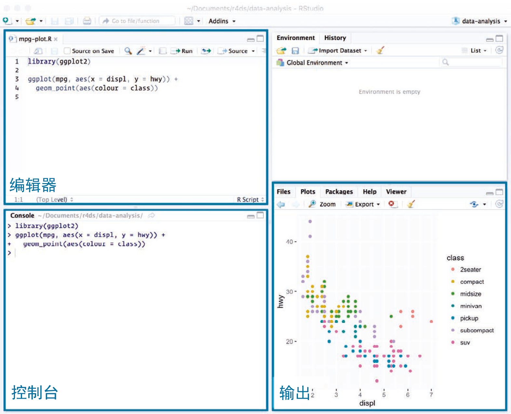

# Workflow: scripts | 工作流：脚本

So far you've been using the console to run code. That's a great place to start, but you'll find it gets cramped pretty quickly as you create more complex ggplot2 graphics and dplyr pipes. To give yourself more room to work, it's a great idea to use the script editor. Open it up either by clicking the File menu, and selecting New File, then R script, or using the keyboard shortcut Cmd/Ctrl + Shift + N. Now you'll see four panes:

迄今为止，我们一直使用 RStudio 控制台来运行代码。这是一个非常好的开始，但如果需要创建更复杂的 ggplot2 图形或者 dplyr 管道，你很快就会发现控制台非常不方便。为了拓展工作空间，我们应该使用 RStudio 脚本编辑器。要想打开脚本编辑器，可以点击 File 菜单，选择 New File，接着选择 R Script；也可以使用组合键 Ctrl+Shift+N。现在你可以看到 4 个窗格。

```{r echo = FALSE, out.width = "75%"}
knitr::include_graphics("diagrams/rstudio-editor.png")
```

```{r echo = FALSE, out.width = "75%"}

```

The script editor is a great place to put code you care about. Keep experimenting in the console, but once you have written code that works and does what you want, put it in the script editor. RStudio will automatically save the contents of the editor when you quit RStudio, and will automatically load it when you re-open. Nevertheless, it's a good idea to save your scripts regularly and to back them up.

如果你很重视一段代码，那么脚本编辑器就是存放这段代码的绝好位置。你可以在控制台中不断调试，一旦代码正常运行并输出预期结果，你就可以将其放在脚本编辑器中。当退出 RStudio 时，它会自动保存编辑器中的内容，并在重新打开时自动加载编辑器中的内容。尽管如此，我们还是应该定时保存脚本，并做好备份。

## Running code | 运行代码

The script editor is also a great place to build up complex ggplot2 plots or long sequences of dplyr manipulations. The key to using the script editor effectively is to memorise one of the most important keyboard shortcuts: Cmd/Ctrl + Enter. This executes the current R expression in the console. For example, take the code below. If your cursor is at █, pressing Cmd/Ctrl + Enter will run the complete command that generates `not_cancelled`. It will also move the cursor to the next statement (beginning with `not_cancelled %>%`). That makes it easy to run your complete script by repeatedly pressing Cmd/Ctrl + Enter.

脚本编辑器还非常适合建立复杂的 ggplot2 图形或较长的 dplyr 操作序列。有效使用脚本编辑器的关键是记住最重要的快捷键之一：Ctrl+Enter。这组快捷键会在控制台中执行当前的 R 语句。例如，输入以下代码后，如果光标在 █ 处，那么按 Ctrl+Enter 会运行生成 not_ cancedlled 的完整命令，并将光标移到下一个语句（即以 not_cancelled %>% 开头的语句）。因此，重复按 Ctrl+Enter 就可以轻松运行整个脚本：

```{r, eval = FALSE}
library(dplyr)
library(nycflights13)

not_cancelled <- flights %>%
  filter(!is.na(dep_delay)█, !is.na(arr_delay))

not_cancelled %>% 
  group_by(year, month, day) %>% 
  summarise(mean = mean(dep_delay))
```

Instead of running expression-by-expression, you can also execute the complete script in one step: Cmd/Ctrl + Shift + S. Doing this regularly is a great way to check that you've captured all the important parts of your code in the script. 

除了按照语句顺序运行，还可以一次性运行整个脚本：Ctrl+Shift+S。定期运行整个脚本是非常好的做法，可以让你确认脚本中所有重要的代码都没有问题。

I recommend that you always start your script with the packages that you need. That way, if you share your code with others, they can easily see what packages they need to install. Note, however, that you should never include `install.packages()` or `setwd()` in a script that you share. It's very antisocial to change settings on someone else's computer!

我们建议你一直将所需要 R 包的语句放在脚本开头。这样一来，如果将代码分享给别人，他们就可以很容易地知道需要安装哪些R 包。但注意，永远不要在分享的脚本中包括install.packages() 函数或 setwd() 函数。这种改变他人计算机设置的行为会引起众怒的。

When working through future chapters, I highly recommend starting in the editor and practicing your keyboard shortcuts. Over time, sending code to the console in this way will become so natural that you won't even think about it.

在后续章节的学习中，我们强烈建议你使用脚本编辑器，并练习使用快捷键。随着时间的推移，利用这种方式向控制台发送代码会让人感到得心应手，如同行云流水。s

## RStudio diagnostics | RStudio自动诊断

The script editor will also highlight syntax errors with a red squiggly line and a cross in the sidebar:

脚本编辑器还会利用红色波浪线和边栏的红叉来高亮显示语法错误：

```{r echo = FALSE, out.width = NULL}
knitr::include_graphics("screenshots/rstudio-diagnostic.png")
```

Hover over the cross to see what the problem is:
将鼠标移到红叉上就可以看到错误提示：

```{r echo = FALSE, out.width = NULL}
knitr::include_graphics("screenshots/rstudio-diagnostic-tip.png")
```

RStudio will also let you know about potential problems:
RStudio 还能找出潜在的代码问题：

```{r echo = FALSE, out.width = NULL}
knitr::include_graphics("screenshots/rstudio-diagnostic-warn.png")
```

## Exercises | 练习

1.  Go to the RStudio Tips twitter account, <https://twitter.com/rstudiotips>
    and find one tip that looks interesting. Practice using it!
    
    访问 RStudio 技巧的 twitter 账号 @rstudiotips（https://twitter.com/rstudiotips），选择一个有趣的小技巧，并实践一下！

1.  What other common mistakes will RStudio diagnostics report?  Read
    <https://support.rstudio.com/hc/en-us/articles/205753617-Code-Diagnostics> to 
    find out.
    
    RStudio 自动诊断程序还会通报哪些其他常见错误？阅读 https://support.rstudio.com/hc/ en-us/articles/205753617-Code-Diagnostics 来找出答案。
    
