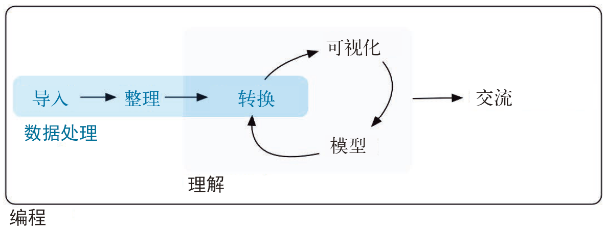

# (PART) Wrangle | 数据处理 {-}

# Introduction | 引言 {#wrangle-intro}

In this part of the book, you'll learn about data wrangling, the art of getting your data into R in a useful form for visualisation and modelling. Data wrangling is very important: without it you can't work with your own data! There are three main parts to data wrangling:

我们将在这一部分介绍数据处理。数据处理是一门艺术，将数据以合适的形式导入R，从而进行可视化和建模。数据处理非常重要：没有这个过程，就无法使用数据进行工作！数据处理包括 3 个重要环节。

```{r echo = FALSE, out.width = "75%"}
knitr::include_graphics("diagrams/data-science-wrangle.png")
```

```{r echo = FALSE, out.width = "75%"}

```

This part of the book proceeds as follows:
这一部分的内容安排如下。

*   In [tibbles], you'll learn about the variant of the data frame that we use
    in this book: the __tibble__.  You'll learn what makes them different
    from regular data frames, and how you can construct them "by hand".
    
    tibble章将介绍数据框的一种变体：tibble。我们会在本书中使用这种数据结构。你将会了解 tibble 和普通数据框的区别，以及如何“手工”构造 tibble。

*   In [data import], you'll learn how to get your data from disk and into R.
    We'll focus on plain-text rectangular formats, but will give you pointers 
    to packages that help with other types of data.
    
    数据导入章将介绍如何从磁盘读取数据并导入R。我们重点关注矩形格式的纯文本文件，但会给出一些指示，表明哪些包可以处理其他类型的数据。

*   In [tidy data], you'll learn about tidy data, a consistent way of storing
    your data that makes transformation, visualisation, and modelling easier.
    You'll learn the underlying principles, and how to get your data into a 
    tidy form.

Data wrangling also encompasses data transformation, which you've already learned a little about. Now we'll focus on new skills for three specific types of data you will frequently encounter in practice:

*   [Relational data] will give you tools for working with multiple
    interrelated datasets. 将介绍一些工具，以处理具有多种相关关系的数据集。
    
*   [Strings] will introduce regular expressions, a powerful tool for
    manipulating strings. 将介绍正则表达式，即处理字符串的一种强大工具。

*   [Factors] are how R stores categorical data. They are used when a variable
    has a fixed set of possible values, or when you want to use a non-alphabetical
    ordering of a string.
    
    将展示 R 如何保存分类数据。当一个变量的取值范围是有限集合，或者我们不想按字母顺序排列字符串时，就可以使用分类数据。
    
*   [Dates and times] will give you the key tools for working with 
    dates and date-times.
    
    将介绍处理日期和日期时间型数据的核心工具。
